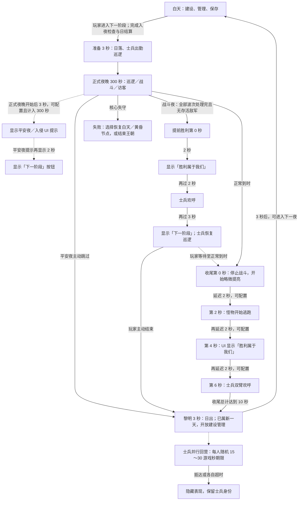

# 昼夜完整流程、收尾时间线与归营

本文描述当前实现。默认值：准备 3 秒，正式夜晚 300 秒，收尾 10 秒，黎明 3 秒。普通白天没有倒计时，由玩家主动进入下一夜。

## 流程图

归营分支不会阻塞黎明、白天建设或下一夜。进入下一夜时，重新准备出勤。

## 默认时间表

以下以准备开始为第 0 秒，且不暂停、不加速、不提前结束：

| 总经过时间 | 状态与行为 |
| --- | --- |
| 0～3 秒 | 准备。方向光降低并调整方向，士兵按批次出勤巡逻。 |
| 第 3 秒 | 正式夜晚立即开始，没有额外等待阶段。 |
| 第 6 秒 | 正式夜晚开始满 3 秒，显示平安夜或入侵提示。提示延迟包含在正式夜晚 300 秒内。 |
| 第 8 秒 | 若为平安夜，提示已显示满 2 秒，才显示“下一阶段”按钮。 |
| 第 303 秒 | 正式夜晚结束，开始 10 秒收尾。停止攻击，清理在途伤害，取消未入场波次及访客互动，自动收取特殊掉落。 |
| 第 303～305 秒 | 收尾略微提亮。怪物暂不逃跑，士兵暂不欢呼。 |
| 第 305 秒 | 收尾满 2 秒，怪物开始逃跑。 |
| 第 307 秒 | 再过 2 秒，UI 显示“胜利属于我们”。 |
| 第 309 秒 | 再过 2 秒，士兵开始手臂欢呼，持续到收尾结束。 |
| 第 313 秒 | 收尾结束，剩余敌军按逃离处理；结算战损与收益、自动归档战报。进入新一天的黎明，同时开始士兵归营。 |
| 第 313～316 秒 | 3 秒日出，已经允许建设、管理和保存；回合数在第 313 秒增加。 |
| 第 316 秒起 | 普通白天，可主动进入下一夜；未完成归营的士兵继续独立归营。 |

夜晚进度条总时长 = 准备 3 + 正式夜晚 300 + 收尾 10 = **313 秒**。黎明不计入夜晚进度条。

### 提前结束与例外

- 平安夜主动跳过：立即清理访客和战利品并结算，直接进入 3 秒黎明；跳过整个收尾，不播放胜利提示或欢呼。
- 平安夜自然到时：正常执行 10 秒收尾；没有怪物时，逃跑节点没有实际对象，后续提示和欢呼照常执行。
- 战斗夜提前消灭所有敌军且波次全部完成：从最后一个敌人倒下起，2 秒显示“胜利属于我们”，再过 2 秒士兵欢呼，再过 3 秒结束欢呼并显示“下一阶段”。玩家点击后直接进入黎明，不重复播放自然到时的收尾；未点击则士兵恢复巡逻，并继续沿原夜晚时钟运行。
- 战斗夜仍有待出现波次或存活敌军：不能主动跳过战斗。
- 战报不需要确认，进入黎明后可查看当前结算结果和历史记录。
- 暂停冻结游戏计时、收尾事件、日落日出、动画和归营期限。平安夜 2×只影响正式夜晚的游戏时间；收尾恢复 1×，黎明和归营按白天 1×。
- 入夜检查、损失确认、任务容量冲突、存档检查点和失败恢复沿用既有流程；它们不是额外的定时昼夜阶段。

## 配置入口

### 流程时间和归营

唯一配置资源：`Assets/Landsong/ECSContent/World/GameContentSet.asset`，字段：`Night` 与 `DayReturn`。`GameWorldTemplate.prefab` 上的 `NightSettingsAuthoring` 只负责引用正式内容集合并烘焙 ECS 组件，不保存流程数值；地图及其生成场景不得覆盖这些字段。

| 字段 | 默认值 | 含义 |
| --- | --- | --- |
| Night.NightPreparationSeconds | 3 | 准备和日落时长 |
| Night.NightSeconds | 300 | 完整正式夜晚时长 |
| Night.NightClosureSeconds | 10 | 收尾总时长，包含下述三段延迟 |
| Night.RetreatDelaySeconds | 2 | 收尾开始到怪物逃跑的延迟 |
| Night.VictoryCaptionDelaySeconds | 2 | 怪物开始逃跑到胜利提示的延迟 |
| Night.CelebrationDelaySeconds | 2 | 胜利提示到士兵欢呼的延迟 |
| Night.VictoryAdvanceDelaySeconds | 3 | 提前胜利欢呼到“下一阶段”出现的延迟 |
| Night.WaveIntervalSeconds | 15 | 未填写自定义 WaveTimes 时的最大波次间隔 |
| Night.DawnSeconds | 3 | 黎明／日出时长，属于白天 |
| DayReturn.MinimumSeconds | 15 | 每名士兵归营随机期限的下限 |
| DayReturn.MaximumSeconds | 30 | 每名士兵归营随机期限的上限 |

自然到时的收尾三段延迟分别填写，按顺序相加，默认触发点为 2、4、6 秒。提前胜利不包含怪物撤离节点，因此默认触发点为 2 秒提示、4 秒欢呼、7 秒按钮与恢复巡逻。收尾三段延迟合计必须不超过收尾总时长；正式夜晚至少 10 秒，其余阶段和延迟可设为非负有限秒数。默认波次间隔必须为正数且小于正式夜晚时长。

### UI 提示

资源：`Assets/Landsong/ECSContent/Presentation/Night/LandsongNightCaptions.asset`。

- NightCaptionDelay：正式夜晚开始后的提示延迟，默认 **3 秒**。
- PeacefulAdvanceDelay：平安夜提示出现到“下一阶段”按钮出现的延迟，默认 **2 秒**。
- PeacefulNightCaption：平安夜提示，默认“今晚似乎是个平安夜”。
- InvasionNightCaption：入侵夜提示，默认“今晚有敌军来袭”。
- VictoryNightCaption：收尾胜利提示，默认“胜利属于我们”。

平安夜／入侵提示出现后持续至正式夜晚退出；平安夜的“下一阶段”按钮在提示出现满 2 秒后才显示。提前胜利提示从最后一个敌人倒下起计时，自然到时则沿用收尾节点；进入黎明时消失。UI 延迟只读取权威阶段时钟，不额外延长正式夜晚。

### 光照

场景：`Assets/Landsong/Scenes/Game.unity`，对象：`ECS Game Host`，字段：`昼夜光照`，显式绑定 Sun。

| 字段 | 默认值 | 说明 |
| --- | --- | --- |
| NightIntensityRatio | 0.12 | 正式夜晚为场景白天主光强度的 12% |
| ClosureIntensityRatio | 0.30 | 收尾为白天强度的 30%，实际值限制为不低于夜晚 |
| HorizonElevation | 8° | 日落／日出方向的太阳高度 |
| HorizonAzimuthOffset | 65° | 日落／日出相对白天的方位偏移 |

准备按准备时长完成日落；收尾开始后按第一段“怪物逃跑延迟”平滑提亮，再保持收尾亮度；黎明按黎明时长继续变亮并恢复白天方向。每次阶段切换都从上一帧实际显示的强度和方向开始插值，避免边界闪动。平安夜跳过时，从当前夜间亮度和方向直接开始日出，不先闪到收尾亮度。方向光在场景解绑时恢复原始配置。

平安夜跳过后，“下一阶段”按钮会在黎明的 3 秒内隐藏，黎明结束后重新出现。这段等待由 `GameContentSet.Night.DawnSeconds` 决定，不受士兵 15～30 秒归营期限影响。

## 士兵动画和归营

庆祝源文件：`Assets/Landsong/Art/Animations/庆祝Victory.fbx`。

动画器：从正式 `militia` Definition 的 `Prefab → SoldierAnimationAuthoring.VisualPrefab → Animator.runtimeAnimatorController` 直接引用取得。

- 使用独立的 `Celebration Arms` Override 层。
- 遮罩仅包含左右手臂和手指，排除根、身体、头部、腿部。
- Victory 片段循环播放；提前胜利时从第 4 秒播放至第 7 秒，随后释放双臂层并恢复巡逻；自然到时仍在收尾欢呼节点激活。基础层负责身体／腿部待机和移动，不启用根运动。
- 庆祝优先于举火把的手臂姿势；开始归营时释放庆祝层，恢复已有移动与装备动画。
- `Landsong → 动画 → 配置士兵双臂庆祝` 可单独更新庆祝片段与层，不重建士兵模型或装备挂点。

黎明开始时，幸存士兵和英雄通过既有 DBP、导航和避障回营。正常抵达立即隐藏；道路阻断时会重新寻路或寻找其他友方驻地；每人独立随机 15～30 游戏秒后兜底视为归营成功，保留持久身份。3 秒日出结束后，归营可以继续发生在普通白天。

巡逻范围仍取所属建筑 `PlacementAndVisuals.SpawnExclusionPadding`，单位为移动力，遵循道路等通行成本；出生点匹配驻地 Surface 与 Elevation。

## 实现边界、存档和验证

这是已有架构上的局部扩展，整体为轻至中等工作量，不是重度重构：

- NightSettings 定义阶段时长和收尾节点。
- NightOps 负责权威阶段切换、清理、结算和行为状态。
- UI 与 NightLightingController 读取同一条阶段时间线。
- SoldierAnimationSystem 将欢呼状态映射到 Rukhanka 双臂层。
- 归营继续独立于阶段结束条件，保持白天建设流程畅通。

快照版本为 **v33**：昼夜配置新增提前胜利按钮延迟与默认波次间隔，并继续保存黎明光照起点。旧快照不兼容；本次没有删除旧存档。读取白天存档会保留黎明进度，同时将临时归营表现视为已经完成。

验证仅使用 Unity 编辑器，不执行玩家构建。验证入口：

- VerifyNightFlow：阶段时长、跳过分支、收尾行为节点、结算与归营。
- VerifyNightLighting：收尾提亮、正常／跳过日出、暂停和恢复。
- VerifySoldierAnimations：Rukhanka 烘焙、双臂遮罩、庆祝参数和原有装备动画。
- VerifyPersistenceContracts：显式存档字段与恢复契约。
- SceneFlowLightingPlay：实际 Game 光照、庆祝层、黎明 HUD、归营和场景清理。

报告及截图位于 `Library/LandsongEcs/`。
