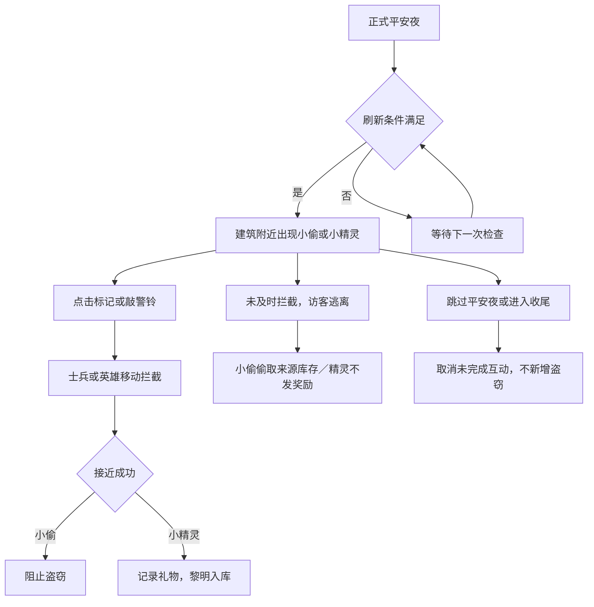

# 平安夜访客、掉落与战报

本文按当前代码及资源配置整理。完整昼夜时序见 [夜晚阶段与归营](夜晚阶段与归营.md)。

## 访客是什么

访客是正式平安夜中出现的限时互动单位，用于提供巡逻、调度和取舍玩法。目前配置了小偷和小精灵两类，资源名称仍标注“占位”，共用一个预制体。规则已经实现，专属外观和动画尚不能视为完成。

当前访客系统不负责白天的城市氛围人群，也不负责入侵夜的敌军战斗。

| 类型 | 接近成功 | 正常逃离或超时 |
| --- | --- | --- |
| 小偷 | 阻止本次盗窃；当前没有额外抓捕奖励 | 从绑定的来源建筑库存中扣除合格物品 |
| 小精灵 | 获得金币 ×5，登记到夜间奖励账，黎明入库 | 错过奖励，不扣资源 |

## 玩家怎么玩

1. 进入正式平安夜，满足条件后在建筑附近出现访客，并提示玩家。
2. 访客沿短路线向城市外围移动；场景标记显示类型、剩余秒数和响应状态。
3. 点击标记派士兵或英雄拦截，也可以使用附近建筑的警铃调度。
4. 响应单位实际移动到抓捕半径内才算成功。点击本身不会立即完成互动。
5. 访客成功、逃离或取消后离场，释放响应单位，本次结果记入战报。

点击优先使用能够及时赶到的已选英雄，否则选择可行的友方响应单位。警铃按覆盖范围调度，且不会自动征用当前选中的英雄。

士兵必须存活、已出勤、能够移动且没有归营；英雄也需要符合出勤和移动条件。同一单位不能同时认领两个访客。玩家下达新的移动、召回等命令会打断响应，之后可在条件允许时重新指派。

**普通巡逻经过访客身边不会自动完成抓捕。** 当前成功判断要求该单位已被指派为响应者。拦截不走攻击伤害流程，也不增加战斗经验。暂停会冻结计时；暂停或情报模式下不能派出响应，情报模式本身不暂停世界。

## 刷新规则与当前参数

全局规则在 `Assets/Landsong/ECSContent/World/GameWorldTemplate.prefab` 的 `PeacefulRulesAuthoring` 上配置。

| 参数 | 当前值 | 含义 |
| --- | --- | --- |
| MaximumPerNight | 3 | 每个平安夜最多生成 3 个访客 |
| MaximumConcurrent | 2 | 同时最多存在 2 个访客 |
| TheftValueBudget | 15 | 全夜累计盗窃价值上限，不等于固定 15 个物品或金币 |
| FirstOpportunity | 2.5 秒 | 首次刷新检查时间，仍受出现窗口限制 |
| Interval | 2.5 秒 | 刷新检查间隔 |

单类配置位于 `Assets/Landsong/ECSContent/Definitions/Opportunity/`：

- `night.visitor.asset`：小偷。
- `night.fairy.asset`：小精灵。

两类当前均为：权重 100、每夜最多 2 个、出现窗口 15%～50%、速度 1.2、最低剩余夜晚响应时间 4 秒、抓捕半径 1.2、响应半径 25、目标路线长度 8，允许士兵和英雄响应。半径与路线长度是空间距离，并非建筑巡逻的道路移动力预算。

当前窗口按包含准备和收尾的夜晚总时长计算。总时长为 313 秒时，是从准备开始算约 47～157 秒；实际还取决于刷新检查时机。首次检查 2.5 秒不代表 2.5 秒时就出现访客。调度器也限制只在夜晚总进度前半段刷新。

刷新还要求：

- 来源建筑正常运作。小偷要求该建筑当前有可盗取库存，小精灵不要求库存。
- 同一建筑不能同时存在两个访客。
- 建筑外存在合法出生点和向外逃离路线。
- 有未被其他访客占用、理论上能及时拦截的士兵或英雄，并为玩家预留 1 秒反应时间。

来源建筑等权抽取，不因库存格多而获得更高权重。条件不满足会跳过这次尝试，所以每夜 3 个只是上限；两类相同权重也不保证实际各占一半。

## 盗窃与奖励结算

小偷出现时不扣资源、不预留赃物。只有正常逃离或超时，才从绑定来源建筑当时可用的库存中按物品盗窃权重选择一种，并立即扣除。扣除量受现有数量、单次盗窃数量上限、全夜剩余盗窃价值预算共同限制。来源已空、没有合格物品或预算不足时，损失可以为零。

物品配置入口为物品定义的 `Theft`：

- `Protection`：任务专用、唯一、绑定等保护标记；受保护物品不可被偷。
- `Weight`：选择该物品类型的权重。
- `Maximum`：单次最多盗取数量。
- `UnitValue`：每件物品消耗的盗窃价值预算。

不可堆叠、不可用、库存为零的物品不参与。普通资源被任务要求，不会自动变成受保护的任务专用品。

实时离场通知不公开被盗物品明细，详细损失在白天战报中查看。小精灵礼物则先记账，在黎明结算入库；满仓部分进入待存放。奖励结构支持物品、蓝图、增益和特性，但目前小精灵仅配置金币 ×5。

## 与收尾、跳过平安夜的关系

进入夜晚收尾，或玩家跳过平安夜直接进入黎明，都会取消尚未完成的访客互动，不追加盗窃。没有合格响应单位、路线被阻断等取消情形，也不扣资源。

已经发生的盗窃不会因跳过而退回；已经取得的小精灵礼物仍会在黎明结算。

因此当前玩法取舍是：继续停留争取礼物，同时承担小偷逃离的风险；选择跳过则放弃后续机会并结束剩余风险。这是现有规则，不是额外设计建议。

## 实现边界与扩展

核心逻辑在 `PeacefulOperations.cs`；响应单位复用现有 ECS 命令、DBP 和 Navigation。访客自身使用四邻格、检查高度与建筑占用的短逃离路线，并非与战斗单位完全相同的导航实现。

增加已有两类的数值或奖励变体，可以新增定义并登记到 `OpportunityCatalog.asset`。商人交易、难民入城、任务对话等具有新交互方式的访客，需要新增行为和界面逻辑，当前尚未实现。

## 敌人掉落与战报

敌人普通奖励直接记入夜间奖励账；只有 SpecialDrop 生成场景拾取物。特殊掉落有落点、稀有度光柱、点击区域和标记。点击拾取不要求单位接近；进入收尾时自动收取遗留掉落。找不到合法落点时直接记入奖励账。逃跑、未生成和强制清场不触发击杀奖励。

默认流程是准备 3 秒、正式夜晚 300 秒、收尾 10 秒、黎明 3 秒。自然到时的收尾开始变亮；默认第 2 秒敌人逃跑、第 4 秒提示“胜利属于我们”、第 6 秒士兵手臂层庆祝。若战斗提前全灭敌军，则从最后一个敌人倒下起第 2 秒显示胜利提示、第 4 秒欢呼、第 7 秒结束欢呼并显示“下一阶段”；玩家不点击时士兵继续巡逻。平安夜选择跳过时直接进入黎明，不播放收尾。黎明属于白天，允许建设管理，士兵同步开始归营；归营不阻塞流程。

战报在黎明自动结算、保存为历史，不需要确认后才进入白天。战报记录单位伤亡、建筑和库存损失、访客结果、收益及溢出等；来源名称保留快照。已支付的供奉只展示，不重复扣款。奖励先按来源和条目去重，黎明提交损失后再入库，满仓进入待存放；下一夜前继续使用既有待存放损失确认。

表现制作参见 [表现与语言制作](../音频与本地化/表现与语言制作.md)。
