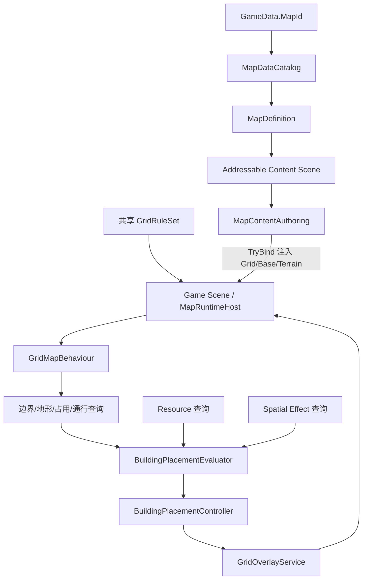

# AI_地图系统

> 最后核对：2026-07-13
> 状态：地图与建筑放置基础重构已完成并通过用户 Play Mode 验收。本文是后续 AI / 开发者维护地图、格子规则、地图加载、初始建筑、放置预览、资源连接和空间范围效果的首要交接入口。

本文只描述当前仓库的真实实现。完整决策过程保留在 [README_地图系统与建筑放置重构.md](README_地图系统与建筑放置重构.md)，策划创建地图的操作步骤见 [开发_创建地图.md](../开发_创建地图.md)，建筑能力配置见 [AI_添加建筑规则.md](建筑系统/AI_添加建筑规则.md)。

## 1. 本轮结果

重构已经达成以下目标：

- 地图不再以“包含全部运行时组件的整图 Prefab”作为运行入口。
- Game Scene 只保留一份公共 Runtime Host；每张地图使用独立、可直接编辑的 Additive Content Scene。
- Base、静态地形、运行时占用和 Overlay 的事实来源已经分开。
- 初始建筑直接使用 Content Scene 中的建筑 Prefab Instance 作为可视化模板，不需要 Marker/Placement 辅助组件。
- 放置预览使用建筑完整 footprint，实际占用和视觉反馈一致。
- Overlay 按 Channel + Owner 动态分层，不同系统不再争用同一张 Highlight Tilemap。
- Resource 消费者在放置阶段显示行动力可达范围、可用提供点、最终提供点和最终路径；没有提供点不阻止放置。
- Buff/美化范围已经有通用 Definition、模块、预览和运行时查询框架。
- 建筑根对象不存在旋转放置或旋转存档语义。

## 2. 阅读和事实来源

修改前至少读取与任务对应的入口：

| 任务 | 必读入口 |
| --- | --- |
| 地图加载/卸载 | `LSScenes.cs`、`MapContentSceneLoader.cs`、`MapRuntimeHost.cs` |
| Content Scene/初始建筑 | `MapContentAuthoring.cs`、`MapAuthoringWindow.cs` |
| 边界/地形/占用/通行 | `GridMapBehaviour.cs`、`GridRuleSet.cs`、`GridTerrainLayer.cs` |
| Overlay | `GridOverlayDefinitions.cs`、`GridOverlayService.cs` |
| 建筑放置 | `BuildingPlacementController.cs`、`BuildingPlacementEvaluator.cs` |
| Resource 连接 | `BuildingConnectionContracts.cs`、`BuildingResourceProviderSystem.cs` |
| Buff/美化 | `BuildingSpatialEffects.cs` |
| 存档恢复 | `GameRuntimeSnapshotService.cs`、`LSScenes.cs` |

事实优先级：

1. 当前代码和序列化资产。
2. 本文。
3. `开发_创建地图.md` 的操作说明。
4. 原重构规格中的历史方案和决策记录。

历史规格第 1～14 节包含重构前现状，不可把其中“当前只有一张 Highlight Tilemap”“地图通过整图 Prefab 加载”等描述重新当成现状。

## 3. 当前资产位置

当前实际配置：

- Game Scene：`Assets/Landsong/Scenes/Game.unity`
- Content Scene：`Assets/Landsong/Scenes/MapScenes/TestMap.unity`
- MapDefinition：`Assets/Landsong/Objects/SO/MapDef/MapDefinition.asset`
- 当前稳定 Map ID：`Map_Test01`
- MapCatalog：`Assets/Landsong/Objects/SO/MapCatalog.asset`
- 全局 GridRuleSet：`Assets/Landsong/Objects/GridRuleSet/GridRuleSet.asset`
- Overlay Channel：`Assets/Landsong/Objects/SO/GridOverlayChannel`
- 建筑 Prefab：`Assets/Landsong/Objects/Prefabs/建筑`

当前 MapCatalog 只登记一张地图。旧 `Assets/Landsong/Objects/Prefabs/Map` 整图 Prefab 已退出新架构，不要恢复到运行时加载链。

## 4. 总体架构



四条边界：

- `MapDefinition`：地图身份和展示信息。
- `MapContentAuthoring`：每张地图独有的静态内容和初始建筑模板。
- `MapRuntimeHost + GridMapBehaviour`：所有地图共用的运行时规则、占用与服务绑定。
- `GridOverlayService`：临时格子视觉，不属于地图静态内容，也不是规则数据。

## 5. 地图身份与加载链

### 5.1 MapDefinition / MapCatalog

`MapDefinition` 保存：

- 稳定 `mapId`
- 显示名称、图标、描述
- Addressable Content Scene 引用

`mapId` 是目录和存档主键。显示名称可以修改，`mapId` 不应因改名而变化。

`MapDataCatalog`：

- 通过 `mapId` 查找 MapDefinition。
- 拒绝重复 ID，并输出错误。
- 不保存 Grid 或地图 Prefab。

### 5.2 进入游戏的顺序

`LoadScene_Game.OnTargetSceneLoaded()` 的关键顺序：

1. 从 `GameData.MapId` 查 MapDefinition。
2. `MapContentSceneLoader` 以 Additive 模式加载 Content Scene。
3. 在该 Scene 中查找唯一 `MapContentAuthoring`。
4. `MapRuntimeHost.TryBind(...)` 校验 Grid 几何并注入内容。
5. 刷新相机边界。
6. 恢复存档中的运行时建筑。
7. 如果是第一次创建该地图，生成全部初始建筑并立即保存第一次快照。

任何关键步骤失败都应中止进入游戏，不能静默回退到第一张地图或旧整图 Prefab。

### 5.3 卸载

`MapContentSceneLoader.UnloadRoutine()` 会先调用 `MapRuntimeHost.Unbind()`：

- 清理全部运行时 Overlay Tilemap。
- 解除 GridMap 对 Content 的引用。
- 再卸载 Addressable Scene。

新增跨场景服务时不要让它长期缓存旧 Content Scene 的 Tilemap/Transform。

## 6. MapRuntimeHost 与 GridMapBehaviour

### 6.1 为什么只有 Host 配置 GridRuleSet

`MapRuntimeHost` 是 Game Scene 的配置入口，持有全项目唯一 `GridRuleSet`。绑定 Content 时把 RuleSet 注入 `GridMapBehaviour`。

`GridMapBehaviour` 不在 Inspector 再保存第二份 RuleSet，原因是：

- 避免两个引用不一致。
- 确保所有地图共享规则。
- Content Scene 不需要知道运行时规则资产。

所以正确关系是：

```text
MapRuntimeHost.ruleSet（Inspector 唯一配置）
    └─ TryBind 时传给 GridMapBehaviour.BindContent(...)
```

### 6.2 Host 的绑定责任

`MapRuntimeHost` 必须引用：

- Game Scene 中的 `GridMapBehaviour`
- 共享 `GridRuleSet`
- `GridOverlayService`
- 可选的运行时建筑父节点

Host 同时负责：

- 拒绝多个 Active Host。
- 校验 Game Grid 与 Content Grid 几何兼容。
- 绑定/解绑 Content。
- 原子生成初始建筑并在失败时回滚。

### 6.3 GridMapBehaviour 的责任

`GridMapBehaviour` 是运行时查询入口：

- Base 边界查询。
- Terrain Key 查询。
- 完整 footprint 放置合法性。
- 运行时占用字典和 Occupancy 视觉。
- 地形/建筑通行代价。
- Grid/World/Screen 坐标转换。
- `OccupancyVersion`，供放置评估缓存失效。

不要再向它加入每种玩法的特例 Tilemap 字段。

## 7. Content Scene 与 Tilemap 真相

### 7.1 MapContentAuthoring

每张 Content Scene 必须且只能有一个 `MapContentAuthoring`，配置：

- `Unity Grid`
- `Base Tilemap`
- `Terrain Layers`
- 初始建筑 Gizmo 和吸附容差

Content Scene 禁止放：

- Camera、UI、EventSystem
- GameSystem、MapRuntimeHost、GridMapBehaviour
- Occupancy Tilemap
- 手工创建的 Overlay Tilemap

### 7.2 Base Tilemap

Base 同时是：

- 地表视觉底层。
- 地图逻辑边界。

有 Base Tile 才是地图格；没有 Base Tile 就是越界。不要再创建一张重复的“陆地逻辑 Tilemap”。未被替换主地形的 Base 格自动使用 `GridRuleSet.DefaultTerrainKey`，当前通常是 `陆地`。

### 7.3 Terrain Layers

`MapContentAuthoring.terrainLayers` 是所有静态逻辑地形层的唯一列表。每项包含：

- 稳定 Terrain Key
- Tilemap 引用
- 是否替换默认主地形

规则：

- 水域、障碍：通常 `Replace Default Terrain Key = true`。
- 道路、高级道路：通常为 `false`，作为附加标签降低行动力消耗。
- 未登记的 Tilemap 只负责视觉，不参与放置或寻路。
- 多个替换层重叠时，列表后面的层决定最终主地形；应尽量避免这种重叠。

### 7.4 一键生成基础 Tilemap

`MapContentAuthoring` 的 Odin 按钮会创建/复用：

- `Base Tilemap`
- `水域 Tilemap`
- `障碍 Tilemap`

并自动登记水域和障碍。它不会自动创建道路或装饰层。

如果 Scene 中存在多个 Grid，按钮拒绝猜测，需要先手动绑定目标 Grid。

### 7.5 当前障碍语义

障碍层当前做到：

- 保留 Base，因此仍属于地图。
- 把主地形替换为 `障碍`。
- 普通要求 `陆地` 的建筑因 `TerrainMismatch` 无法放置。

障碍层当前没有做到：

- 不会让 `GridMapBehaviour.CanTraverse()` 返回 false。
- 不会自动阻断 Resource 路径。

当前通行只检查 Base 边界和运行时占用；道路规则只改变行动力消耗。如果未来需要山体阻断通行，应在共享 `GridRuleSet` 增加逐地形 `Traversable` 规则，并同时修改运行时查询、放置预览和所有地图回归，不要只在某张 Scene 写特例。

## 8. 初始建筑

### 8.1 策划形式

把真实建筑 Prefab Instance 放在 `MapContentAuthoring` 层级下，可用空的 `Initial Buildings` 子节点整理。

不再使用：

- `InitialBuildingMarker`
- `InitialBuildingPlacement`

这些类型已删除，不保留兼容。

### 8.2 对齐和 Gizmo

`MapContentAuthoring` 根据建筑 Definition 的完整 Size，从建筑视觉中心反推占地 origin：

- 青色 Gizmo：预览和实际 footprint 对齐。
- 橙色 Gizmo：未对齐。

“吸附初始建筑到格子”会修正位置并把建筑根旋转设为单位旋转。

### 8.3 运行时协议

- Content Scene Awake 时模板 GameObject 会被禁用，不会自行注册成真实建筑。
- 新游戏首次进入时，Host 先预检全部模板，再通过 `BuildingService` 创建真实实例。
- 任一模板失败，全部回滚。
- 首次生成成功后立即写存档，并关闭 `RequiresInitialMapSetup`。
- 读档只恢复 `BuildingInstances`，不会再次生成模板。

地图必须提供默认 Resource 点时，把家族为 `building.player_home`、配置了 `isResourceProviderPoint = true` 的 `PlayerHomeRuntime` 模板放入 Content Scene。当前 TestMap 已完成迁移。

## 9. 放置合法性与完整占地

`BuildingPlacementEvaluator` 使用 `BuildingDefinition.CreateFootprint(origin)` 生成完整 footprint，并调用 `GridMapBehaviour.CanOccupy(...)`。

通用合法性只包含：

1. Size 有效。
2. 每个占地格都有 Base Tile。
3. 全局 `DefaultBuildable` 为 true。
4. 每个占地格满足全部 `RequiredTerrainKeys`。
5. 没有运行时占用冲突。

`CanConfirm` 只等于上述空间合法性。以下情况不阻止放置：

- 没有 Resource 提供点。
- Buff 范围内当前没有目标建筑。
- 美化范围内当前没有其他建筑。

项目没有建筑旋转：

- 放置请求不带 rotation。
- footprint 不旋转 Size。
- 建筑快照不保存 rotation。
- Prefab 根对象使用单位旋转；美术朝向放在子对象。

## 10. Resource 连接

### 10.1 配置入口

`ResourceConnection` 是运行时 `BuildingConnectionQueryResult`，不是 Inspector 字段。

消费者声明方式：

- 建筑类实现 `IBuildingConnectionConsumer`；或
- 启用的建筑模块实现 `IBuildingConnectionConsumerModule`。

当前已知消费者：

- `ResidentialHousing`：同一个家族脚本在全部运营等级声明 Resource 消费。
- 任何当前施工回合含费用的建筑：由 `BuildingBase` 的施工阶段直接声明；放置预评估也读取家族 Construction，因此不需要施工模块或施工 Prefab。
- `BM_资源加工`：模块声明。

`buildingActionPower` 是寻路预算，不是消费者开关。只设置行动力而没有上述声明，不会生成连接查询或 Overlay。

### 10.2 提供点

默认提供点通过 `BuildingBase` 配置：

- `isResourceProviderPoint`
- `resourceProviderPriority`

需要动态可用性时实现 `IBuildingResourceProviderOperationalState`。当前：

- PlayerHome 是基础、低优先级 Resource 点。
- Market 优先级更高，但只有满岗位时可提供。

Resource 点表示“消费者可以访问全局 Inventory”，不是独立本地仓库，也没有容量/品类库存。

### 10.3 查询和选点

放置 Ghost 与已落地建筑共用 `ResourceConsumerProbe`：

- 起点：消费者完整 footprint。
- 预算：`BuildingActionPower`。
- 路径代价：GridMap 地形代价和运行时占用阻力。
- 提供点必须已放置、同一 GridMap、启用、非拆除并可运营。

最终选择顺序：

1. `resourceProviderPriority` 更高。
2. 同优先级时行动力代价更低。
3. 完全并列时稳定键决胜。

查询返回：

- 全部可达节点。
- 全部可达提供点。
- 最终提供点。
- 到最终提供点的路径。

### 10.4 放置与运行时区别

- 放置时找不到提供点：仍可确认，Overlay 只缺少最终点/路径。
- 运行时需要拉取库存时找不到提供点：业务失败，不扣库存，不推进施工/加工。

含费用施工阶段的当前行为：

- `BuildingFamilyDefinition.Construction` 有任一费用时，放置预评估显示 Resource 范围。
- 同一 Runtime 实例在施工回合扣料前调用 `TrySelectProvider(...)`。
- 失败时状态为 `BS_无法连接资源点`，不扣材料、不推进施工进度。
- 成功后原子扣除全局库存，并调用 `RecordProvidedResource(...)`。
- 居民房全部运营等级共用 `ResidentialHousing`，不再存在高等级丢失 Resource 消费能力的问题。

## 11. 空间 Buff 与美化

### 11.1 数据结构

`BuildingSpatialEffectDefinition` 保存：

- 稳定 Effect ID
- 显示名
- Kind：`ProductionPercent` / `Beauty`
- TargetFilter：`AnyBuilding` / `Farmland` / `Cell`
- 曼哈顿 Range
- Value
- StackingRule：`NoStack` / `Additive` / `HighestValue`

建筑通过 `BM_空间效果源` 引用一个或多个 Definition。

### 11.2 范围语义

- 从来源完整 footprint 向外计算。
- 受 Base 边界裁剪。
- 忽略建筑和静态地形障碍。
- 不做 Resource 寻路，也不看当前范围内有几个目标建筑。

### 11.3 当前规则

- 生产百分比可按 `NoStack` 或 `Additive` 结算；农田收获已接入查询。
- 美化值属于格子，同格取最高值。
- 多格建筑取所有占地格美化值的算术平均并向下取整。

框架已经完成，但当前仓库尚未创建实际灌溉坊/装饰物 Definition，也没有建筑 Prefab 挂载 `BM_空间效果源`。因此在配置具体资产前，Buff Overlay 为空是正常结果。

## 12. GridOverlayService

### 12.1 Channel Definition

`GridOverlayChannelDefinition` 直接保存：

- 必填且稳定的 `ChannelId`
- 必填 `TileBase`
- `sortingOrder`

`GridOverlayStyle` 已删除。没有 ChannelId 或 TileBase 的 Definition 无效，`AcquireOwner(...)` 会返回 null。

当前资产使用 C1～C11：

| 资产语义 | 当前 ID |
| --- | --- |
| 合法 footprint | C1 |
| 非法 footprint | C2 |
| 道路路径 | C3 |
| 拆除目标 | C4 |
| Resource 可达范围 | C5 |
| 可用 Resource 点 | C6 |
| 最终 Resource 点 | C7 |
| 最终 Resource 路径 | C8 |
| Buff 范围 | C9 |
| 选择 footprint | C10 |
| 已落地建筑可达范围 | C11 |

目录中的 `C.asset` 没有 ID 和瓦片，是无效资产，不要绑定。

### 12.2 Owner 生命周期

使用方式：

```csharp
var handle = overlayService.AcquireOwner(channel, "stable-owner-key");
handle?.SetCells(cells, priority);
// 结束时
handle?.Dispose();
```

规则：

- 一个系统只清理自己的 owner。
- 不直接操作运行时生成的 Overlay Tilemap。
- 不调用 `ClearAll()` 处理单一效果；`ClearAll()` 只用于地图解绑/服务销毁。
- 同一 Channel/Cell 多 owner 冲突时先比 priority，再用稳定 owner key 决胜。
- 不同 Channel 使用独立运行时 Tilemap，通过 `sortingOrder` 控制跨通道视觉层级。
- ChannelId 必须全局唯一；同一 ID 注册不同资产会抛异常。

### 12.3 动态创建

第一次使用 Channel 时，服务在绑定的 Content Grid 下创建：

```text
Overlay_<ChannelId>
├─ Tilemap
└─ TilemapRenderer
```

这些对象是运行时临时层，不保存进 Content Scene。

## 13. 建筑放置 Overlay

`BuildingPlacementController` 当前绑定 9 个通道：

1. 合法 footprint
2. 非法 footprint
3. 道路路径
4. 拆除目标
5. Resource 可达范围
6. 可用 Resource 点
7. 最终 Resource 点
8. 最终 Resource 路径
9. Buff 范围

更新顺序：

1. 清理上一候选位置的 owner handles。
2. 绘制完整 footprint 红/绿。
3. 如果 Evaluation 有 ResourceConnection，提交可达格、提供点和最终路径。
4. 合并全部 SpatialEffectPreview 的 AffectedCells，提交 Buff 通道。
5. UI 文本显示占地、最终提供点/代价和效果说明。

如果只看到 footprint：

- 先确认正在放置的 Prefab 是否真的声明 Resource 消费者或空间效果源。
- 再检查通道绑定和 Definition 有效性。
- 不要先修改 OverlayService；大多数情况是 Evaluation 没有生成对应数据。

## 14. 编辑器工作流

### 14.1 地图工具

菜单：`Landsong > 地图 > 地图目录与校验`

功能：

- 打开 Content Scene。
- 校验 MapDefinition 和 Content Scene。
- 登记到 MapCatalog。
- 从指定地图进入正常 Start -> Game 流程。

### 14.2 静态校验覆盖

当前窗口检查：

- Map ID 和 Scene 引用。
- Content Scene 中唯一 MapContentAuthoring。
- Grid/Base/Terrain 绑定。
- Base 非空。
- 初始建筑均在 Authoring 层级下。
- 初始建筑 Definition、吸附、Base 越界和互相重叠。

静态校验不完全覆盖：

- 初始建筑完整地形要求（运行时 Host 再检查）。
- Addressables 构建后的加载。
- Overlay 视觉排序。
- Resource 提供点动态运营状态。
- Buff 运行时数值。

所以必须执行“从当前地图开始 Play”。

## 15. 扩展流程

### 15.1 新增地图

1. 创建 Content Scene。
2. 添加唯一 `MapContentAuthoring`。
3. 使用按钮生成 Base/水域/障碍。
4. 绘制 Base 和 Terrain Layers。
5. 放置并吸附初始建筑。
6. 创建 MapDefinition，设稳定 Map ID 并绑定 Addressable Scene。
7. 登记 MapCatalog。
8. 校验并从该地图 Play。

详细操作以 [开发_创建地图.md](../开发_创建地图.md) 为准。

### 15.2 新增地形标签

1. 在 `GridTerrainKeys` 增加稳定 Key（如果它是项目级内置概念）。
2. 在 Content Scene 添加 Tilemap 并登记 Terrain Layer。
3. 决定是替换主地形还是附加标签。
4. 如需特殊行动力，在共享 GridRuleSet 加规则。
5. 修改建筑 RequiredTerrainKeys 或相关查询。
6. 回归全部地图。

当前没有逐地形 Buildable/Traversable 字段。需要这类能力时应扩展 RuleSet 数据模型，不要把 Key 名硬编码到 `CanOccupy()` / `CanTraverse()`。

### 15.3 新增 Overlay 效果

1. 创建唯一 Channel Definition，填写稳定 ID、TileBase、sortingOrder。
2. 在拥有该效果的业务组件绑定 Channel。
3. 使用稳定 owner key 获取 handle。
4. 只提交坐标集合；规则计算不写在 OverlayService。
5. 在状态结束、地图切换和组件销毁时 Dispose。
6. 验证与既有通道重叠时的排序。

如果只是同一语义的新调用方，应复用已有 Channel，而不是复制一个相同 ID 的资产。

### 15.4 新增 Resource 消费者

1. 建筑类实现 `IBuildingConnectionConsumer`，或模块实现 `IBuildingConnectionConsumerModule`。
2. 返回稳定类型 `BuildingConnectionTypes.Resource`。
3. 配置 `buildingActionPower`。
4. 真正扣全局库存前调用 `TrySelectProvider(...)`。
5. 成功后按需调用 `RecordProvidedResource(...)`。
6. 验证无提供点仍能放置，但运行时不消费/不推进。

### 15.5 新增 Resource 提供点

1. 配置 `isResourceProviderPoint = true` 和优先级。
2. 如果有开工条件，实现 `IBuildingResourceProviderOperationalState`。
3. 如果要按经手资源结算，实现 `IBuildingResourceProvisionAccounting`。
4. 不增加局部库存，除非未来玩法明确改变当前全局库存模型。

### 15.6 新增 Buff 建筑

1. 创建有效 `BuildingSpatialEffectDefinition`。
2. 配置 Kind、TargetFilter、Range、Value、StackingRule。
3. Prefab 添加 `BM_空间效果源` 并绑定 Definition。
4. 如果是新 Kind，补运行时结算和目标过滤。
5. 验证放置范围与落地后效果使用同一 Definition。

## 16. 存档边界

- `GameData.MapId` 是地图身份。
- 建筑快照保存 `FamilyId + InstanceId + Stage + Level + StyleId + ConstructionProgress`、origin 和家族/模块状态，不保存 rotation 或等级 Prefab。
- 静态 Tilemap 不写入存档；它来自 MapId 对应 Content Scene。
- 新游戏初始建筑生成后立即进入普通建筑快照。
- 旧存档不兼容是已确认规则，不增加旧 MapName、整图 Prefab 或 rotation 迁移分支。

修改 MapId、FamilyId、Content Scene Base 边界或初始建筑时，都可能让现有开发存档失效。项目未发布，按项目原则删除旧存档重新验证。

## 17. 并行维护与冲突边界

### 17.1 高冲突文件

以下文件影响多个系统，修改前应在并行任务之间明确唯一负责人：

| 文件/资产 | 影响 |
| --- | --- |
| `GridMapBehaviour.cs` | 放置、地形、占用、寻路、相机边界、初始建筑 |
| `MapRuntimeHost.cs` | Content 绑定、规则注入、初始建筑 |
| `BuildingPlacementController.cs` | 输入、Ghost、道路、拆除、全部放置 Overlay |
| `LSScenes.cs` | 场景切换、地图加载、存档恢复时序 |
| `GameRuntimeSnapshotService.cs` | 所有运行时建筑恢复 |
| `Game.unity` | Host/Grid/Overlay 公共引用 |
| `GameSystem.prefab` | Placement/Selection 通道和全局服务引用 |
| `MapCatalog.asset` | 全部地图目录 |
| Addressables Settings/Groups | 地图 Scene 和 Catalog 构建入口 |

不要让两个并行任务同时编辑同一个 Unity Scene/Prefab/YAML 资产后再依赖文本自动合并。

### 17.2 较安全的并行边界

在约定稳定接口后，可以相对独立地并行：

- 不同 Content Scene 的 Tilemap 内容。
- 不同 MapDefinition（最后由单一任务登记 Catalog）。
- 不同 BuildingSpatialEffectDefinition。
- 不同建筑家族脚本、Family/ModuleSet/Presentation/Runtime Prefab（最后由单一任务更新 BuildingCatalog）。
- 新 Overlay Channel 资产（最后由单一任务完成 GameSystem Prefab 引用）。

### 17.3 提交交接要求

每次涉及本系统的开发，交接必须说明：

- 修改了哪条事实来源：Base、Terrain、Occupancy、RuleSet、Connection、Spatial Effect 或 Overlay。
- 是否需要用户补 Inspector/Scene/Prefab/Addressables 绑定。
- 是否改变 MapId、FamilyId、StyleId、ChannelId、EffectId 等稳定 ID。
- 是否改变加载/恢复/初始建筑时序。
- Runtime/Editor 编译结果和 Play Mode 验收项。
- 是否同步更新本文和对应建筑/地图指南。

## 18. 已知限制和后续事项

当前基础架构完成，但仍有以下明确边界：

- 只有一张已登记测试地图 `Map_Test01`。
- 障碍地形只阻止普通陆地建筑放置，不阻断路径。
- GridRuleSet 只有全局 `DefaultBuildable`，没有逐地形/逐格 Buildable。
- GridRuleSet 没有逐地形 Traversable。
- 当前 Overlay Channel 的 sortingOrder 都是 0；现有视觉已可用，但增加更多重叠语义前应制定并回归明确排序表。
- 目录中存在无效 `C.asset`，不能绑定；清理前先确认没有引用。
- 当前没有具体 `BM_空间效果源` / Buff Definition 资产，所以 Buff 框架不会自行显示内容。
- 当前没有建筑 Prefab 使用 `BM_资源加工`。
- 建筑表现资源仍待按 `Document/建筑系统/建筑Prefab与表现资源回填指南.md` 回填；缺 View 不影响地图占格和连接规则。
- 项目已有 Unity Test Framework，但没有地图/建筑放置自动化测试程序集，当前主要依赖编译、编辑器校验和 Play Mode 回归。

## 19. 排错速查

### 地图加载失败

检查：

- GameData.MapId 是否存在于 MapCatalog。
- MapDefinition 是否有效且 Scene 是 Addressable。
- Content Scene 是否恰好一个 MapContentAuthoring。
- Host 引用是否完整。
- Game Grid 与 Content Grid 几何是否一致。

### 地图看得见但不能放建筑

检查：

- Base 是否真的有 Tile。
- RuleSet.DefaultBuildable。
- Terrain Layer 是否误替换主地形。
- BuildingDefinition.RequiredTerrainKeys。
- Occupancy 字典是否已有占用。

### 视觉是水，逻辑却是陆地

Water Tilemap 没登记到 Terrain Layers，或 `Replace Default Terrain Key` 配错。

### 初始建筑不出现

检查：

- 是否在 MapContentAuthoring 层级下。
- 是否吸附且不重叠/越界。
- 是否测试新游戏。
- `RequiresInitialMapSetup` 是否已被旧开发存档关闭。

### 只有红/绿 footprint，没有 Resource/Buff

检查建筑能力声明，而不是先查地图：

- Resource：消费者接口/模块是否存在且启用。
- Buff：`BM_空间效果源` 和 Definition 是否有效。
- 通道资产是否有 ID、TileBase 并已绑定控制器。

### Occupancy/Overlay 与地图偏移

比较 Game Grid 和 Content Grid 的 Cell Size、Gap、Layout、Swizzle、Transform。Host 正常情况下应拒绝不兼容绑定；如果运行中仍错位，检查是否有脚本在绑定后修改 Grid Transform。

## 20. 验证清单

代码改动后至少执行：

```powershell
dotnet build Assembly-CSharp.csproj --no-restore --nologo
dotnet build Assembly-CSharp-Editor.csproj --no-restore --nologo
```

地图/资产改动后在 Unity 执行：

- 地图窗口“校验当前地图”。
- “从当前地图开始 Play”。
- 新游戏初始建筑生成和首次保存。
- 退出后读档，不重复生成初始建筑。
- 多格建筑 footprint 与实际占用。
- 陆地/水域/障碍放置。
- Resource 可达范围、提供点、最终路径。
- 无提供点仍可放置，运行时不消费。
- 多 Overlay 重叠和退出放置后的 owner 清理。
- 如果配置了空间效果，预览范围与实际结算一致。

## 21. 本轮最终验证记录

- Runtime 工程编译：0 error；存在两个与本轮无关的 `UIPanel_Setting.ToggleToGO` CS0649 警告。
- Editor 工程编译：0 error / 0 warning。
- Unity 对新增消费者接口执行了完整程序集重编译。
- 用户确认地图与放置重构目的达到，Resource 连接预览链路工作正常。
