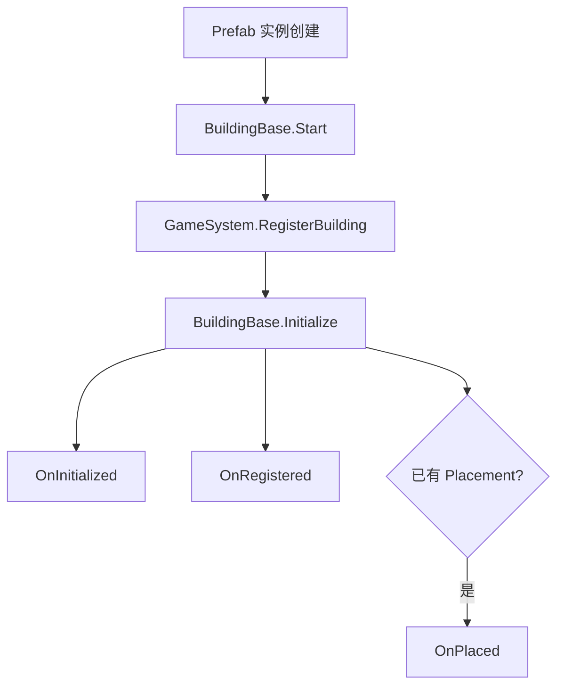
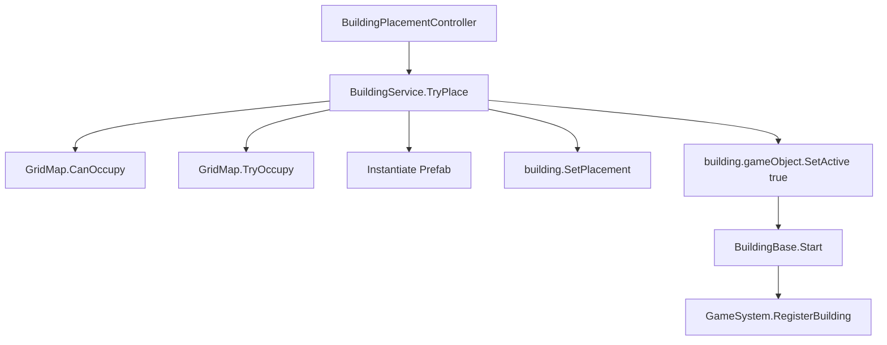
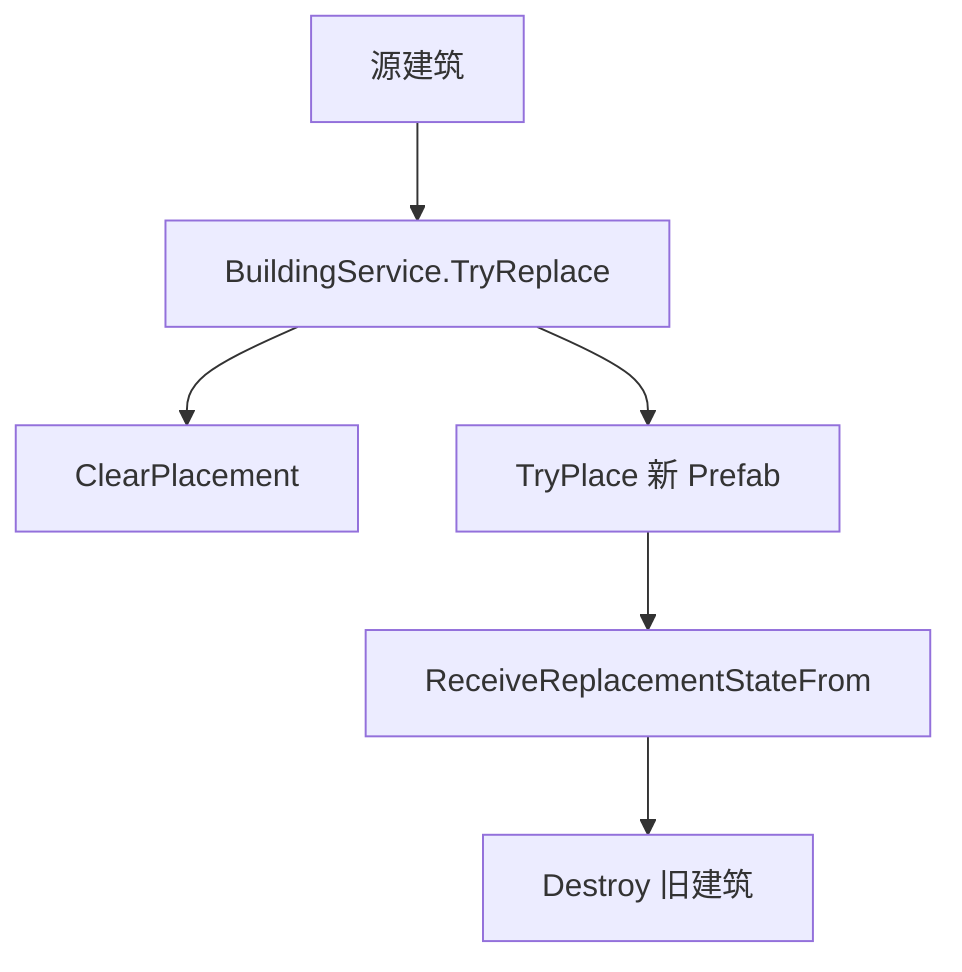

# AI_添加建筑规则

> 项目级入口见 [AI_开发原则.md](AI_开发原则.md)。本文件只规定建筑系统的实现和交付规则；查看现有建筑与 Prefab 配置时继续阅读 [建筑说明.md](建筑说明.md)。涉及占地、地形、资源连接、初始建筑、放置 Overlay 或空间效果时，必须同时阅读 [AI_地图系统.md](AI_地图系统.md)。

本文档给后续 AI / 开发者修改 Landsong 建筑系统时使用。它不是玩家教程，而是**当前仓库实现下的入口索引、职责边界、修改约束与交付清单**。

如果旧文档、历史讨论、旧脚本命名与当前实现冲突，以**仓库当前代码和 Prefab 配置**为准。

## 目的

- 为新增建筑、扩展建筑玩法、修复建筑逻辑提供统一入口。
- 约束“什么放到 `BuildingBase`、什么放到 `BuildingDefinition`、什么做成模块、什么留在具体建筑脚本”。
- 避免修改时破坏 `SerializeReference` 模块列表、Prefab 绑定、存档恢复和运行时替换流程。

## 前置条件

开始修改前，至少先阅读这些入口文件：

- `Assets/Landsong/Scripts/BuildingSystem/BuildingBase.cs`
- `Assets/Landsong/Scripts/BuildingSystem/BuildingDefinition.cs`
- `Assets/Landsong/Scripts/BuildingSystem/BuildingModules.cs`
- `Assets/Landsong/Scripts/BuildingSystem/BuildingService.cs`
- `Assets/Landsong/Scripts/BuildingSystem/BuildingAvailabilityEvaluator.cs`
- `Assets/Landsong/Scripts/BuildingSystem/BuildingPlacementController.cs`
- `Assets/Landsong/Scripts/BuildingSystem/BuildingPlacementEvaluator.cs`
- `Assets/Landsong/Scripts/BuildingSystem/BuildingConnectionContracts.cs`
- `Assets/Landsong/Scripts/BuildingSystem/BuildingResourceProviderSystem.cs`
- `Assets/Landsong/Scripts/BuildingSystem/BuildingProcessingModule.cs`
- `Assets/Landsong/Scripts/BuildingSystem/BuildingSpatialEffects.cs`
- `Assets/Landsong/Scripts/BuildingSystem/BuildingJobSystem.cs`
- `Assets/Landsong/Scripts/BuildingSystem/BuildingResourceInterfaces.cs`
- `Assets/Landsong/Scripts/BuildingSystem/BuildingFunctionBlockInterfaces.cs`
- `Assets/Landsong/Scripts/BuildingSystem/BuildingRuntimeStatusCatalog.cs`
- `Assets/Landsong/Scripts/BuildingSystem/BuildingSaveDataRegistry.cs`
- `Assets/Landsong/Scripts/Grid/GridMapBehaviour.cs`
- `Assets/Landsong/Scripts/Grid/GridOverlayService.cs`

如果要改具体建筑，再补读对应脚本和 Prefab，例如：

- `Assets/Landsong/Scripts/BuildingSystem/Buildings/LumberCabin.cs`
- `Assets/Landsong/Scripts/BuildingSystem/Buildings/BuildingUnderConstruction.cs`
- `Assets/Landsong/Scripts/BuildingSystem/Buildings/ResidentialHousingLV1.cs`
- `Assets/Landsong/Scripts/BuildingSystem/Buildings/PlayerHomeLV1.cs`
- `Assets/Landsong/Scripts/BuildingSystem/Buildings/FishingHutBuilding.cs`

## 最高优先级规则

### 编码规范
建筑的字段名使用[labelText("{中文名}")]

### 不要误判当前架构

当前项目不是“纯继承”也不是“纯组件化”，而是三层组合：

- `BuildingBase`：统一生命周期、放置状态、模块入口、公共存档、公共 UI 入口。
- `BuildingDefinition`：Prefab 级静态定义。
- `BM_*` 模块：多个建筑可复用、但不是所有建筑都需要的能力。
- 具体建筑脚本：真正的每回合玩法逻辑。

### 不要把特例字段塞进 `BuildingBase` 或 `BuildingDefinition`

下列内容通常不应该放进 `BuildingBase` / `BuildingDefinition`：

- 当前工人数
- 当前人口
- 当前经验
- 当前生产进度
- 当前作物
- 连续失败次数
- 上回合异常状态
- 自动开关的建筑实例状态

这些都属于**具体建筑运行时状态**，应留在建筑脚本或模块状态中。

### 不要绕过 `BuildingService`

运行时放置、替换、拆除、批量道路放置统一走：

- `BuildingService.TryPlace(...)`
- `BuildingService.TryPlaceBatch(...)`
- `BuildingService.TryReplace(...)`
- `BuildingService.Demolish(...)`
- `BuildingService.Remove(...)`

不要在建筑脚本里手写：

- `Instantiate(newPrefab)` 然后自己占格
- `Destroy(oldBuilding)` 再手工补注册
- 直接改 Grid 占用状态

### 不要重命名已有模块类型

`buildingModules` 使用的是 `SerializeReference`。  
模块状态恢复还会通过模块托管类型名进行匹配。

因此：

- **不要通过重命名模块类来做中文显示**
- **不要随意改已有模块的 C# 全名**
- 如果必须改，必须同步处理旧 Prefab 和存档迁移

### 不要假设存在 `ModuleDisplayName`

当前 `BuildingModuleBase` 只有这些稳定入口：

- `IsEnabled`
- `ModuleDescription`
- `Normalize()`
- `AppendFunctionBlockEntries(...)`
- `ToString()` 返回类型名

当前代码里**没有** `ModuleDisplayName` 属性。  
如果要改善检查器可读性，请优先通过：

- 类名本身
- `ModuleDescription`
- 字段的 `[LabelText("中文名")]`
- 文档与注释

而不是凭空使用不存在的 API。

### 没有明确要求时，涉及到以下部分由用户自行完成

没有用户明确要求时，不主动改这些资产：

- Prefab
- Scene
- ScriptableObject
- Catalog 资产
- Addressables 配置

如果确实需要代码新增字段，请在交付说明里写清楚需要在 Unity Editor 手工补哪些绑定。

## 核心实现细节

### 建筑生命周期

建筑真正的运行时入口在 `BuildingBase`：



关键点：

- `Start()` 默认会调用 `Landsong.GameSystem.Instance.RegisterBuilding(this)`。
- `Initialize()` 会设置 `GameSystem`、标记已初始化，并触发 `OnInitialized / OnRegistered / OnPlaced`。
- `SetPlacement(...)` 只写放置信息，不负责注册。
- `ProcessTurn()` 是统一回合入口；`OnTurn()` 成功后会尝试自动升级。
- `OnDestroy()` 会清理占格并注销建筑，业务拆除逻辑应写在 `OnDemolished()`。

### 放置、替换与拆除

放置主流程：



替换主流程：



约束：

- 等级升级本质上是**替换 Prefab**，不是在同一实例里硬切“当前等级”。
- 施工态建筑升级成完工建筑，也应优先复用替换流程。
- 项目没有建筑旋转概念。建筑根 Transform、占地、放置请求、替换和存档都不保存旋转；美术朝向只能放在 Prefab 子对象中。
- 放置合法性只由完整 footprint 的地图边界、全局可建造开关、地形要求和占用冲突决定。
- 资源连接和 Buff 是附加预览信息，不改变 `CanConfirm`；不要把“找不到资源点”重新塞进通用放置合法性。
- 需要扩展放置规则时先扩展 `BuildingPlacementEvaluator` 或对应领域查询，不要在 `BuildingPlacementController` 内复制业务算法。

### 回合与模块数据流

当前回合职责分配：

- 具体建筑脚本负责 `OnTurn()` 的业务逻辑。
- `BM_资源产出` 负责周期、产量表、上回合产出记录。
- `BM_岗位运营` 负责岗位吸引、补贴、招工/离职、就业人口和岗位运行时存档；生产/作物/市场等具体业务仍留在建筑脚本。
- `BM_施工材料消耗` 负责按施工阶段扣除材料并暴露本回合/上回合消耗。
- `BM_等级升级` 负责施工或运营经验、升级条件、升级成本、目标 Prefab 与自动升级。
- `BM_科技点产出` 负责保存每回合科技点数值和上回合结果。
- `BuildingJobSystem` 负责岗位吸引力与稳定工人数公式。
- `BuildingAvailabilityEvaluator` 负责建造菜单可见/可用状态。

### 资源提供点与供给归属

- `isResourceProviderPoint` 只表示建筑具备作为提供点的静态资格；消费者实际选点必须调用 `BuildingResourceProviderSystem.TrySelectProvider(...)`，不要自行遍历建筑后只判断“存在任意资源点”。
- `ResourceConnection` 不是 Prefab 上的序列化字段，而是 `BuildingPlacementEvaluator` / `BuildingResourceProviderSystem` 根据消费者能力生成的查询结果。
- 建筑通过实现 `IBuildingConnectionConsumer`，或挂载启用且实现 `IBuildingConnectionConsumerModule` 的模块来声明所需连接类型。当前内置类型是稳定 ID `Resource`，接口允许未来增加 `Electricity` 等类型。
- `buildingActionPower` 只定义寻路预算；它不会自动把建筑变成 Resource 消费者。没有消费者声明时，即使行动力大于 0，也不会生成资源范围 Overlay。
- 统一选点规则是：可达提供点中先选 `resourceProviderPriority` 更高者；同优先级时选路径行动力代价更低者；完全并列时由稳定键决胜。
- 有开工条件的提供点应实现 `IBuildingResourceProviderOperationalState`，未开工时不会参与选点。
- 需要统计实际供给的提供点应实现 `IBuildingResourceProvisionAccounting`；由 `TurnService` 在回合开始清账、所有建筑处理完成后结算，不能在自身 `OnTurn()` 里提前结算。
- 消费者允许在没有提供点时放置，但真正从全局库存拉取资源前必须再次调用 `TrySelectProvider(...)`。查询失败时不应扣库存或推进生产/施工进度。
- 放置 Ghost 和已落地建筑必须共用同一个 `ResourceConsumerProbe` 查询，确保可达格、可用提供点、最终提供点和最终路径一致。

### 空间效果与 Buff 范围

- 可复用范围效果使用 `BuildingSpatialEffectDefinition` + `BM_空间效果源`，不要只在放置 UI 中增加一个半径字段。
- `BuildingSpatialEffectDefinition` 保存稳定 Effect ID、效果类型、目标过滤、曼哈顿半径、效果数值和叠加规则。
- 当前范围从来源建筑的完整 footprint 向外计算，受 Base 地图边界限制，但忽略建筑、水域和障碍，不使用资源连接寻路。
- 运行时结算与放置预览必须读取同一份 Definition；新增效果类型时同时检查 `BuildingSpatialEffectService` 的预览、目标过滤和结算分支。
- 产量百分比支持 `NoStack` / `Additive`；美化值属于格子并使用 `HighestValue`。多格建筑的最终美化值为全部占地格美化值平均后向下取整。

### 存档规则

所有有运行时状态的建筑，都应通过 `CaptureBuildingData()` / `RestoreBuildingData(...)` 保存自身状态。

同时，`BuildingBase` 已经会统一保存这些公共模块状态：

- `BM_等级升级`
- `BM_资源产出`
- 所有实现 `IBuildingModuleStateSerializer` 的模块状态

新增建筑数据类时：

```csharp
[Serializable]
[BuildingDataTypeId("building.example")]
private sealed class ExampleBuildingData : BuildingDataBase
{
    public int CurrentProgress;
    public bool AutoEnabled;
}
```

规则：

- `BuildingDataTypeId` 必须是**稳定字符串**。
- 不要用类名当存档 ID。
- 不要把可由 Prefab 静态配置重建出来的内容重复存档。

### UI 数据出口

建筑详情和状态读取统一来自以下入口：

- `GetOverviewInfo()`
- `GetRuntimeStatuses()`
- `GetFunctionBlockEntries()`
- `IBuildingResourceConsumptionSource`
- `IBuildingResourceProductionSource`
- `IBuildingTaxSource`
- `IBuildingTechnologyPointSource`
- `IBuildingWorkforceFundingSource`
- `IBuildingResourceProviderOperationalState`
- `IBuildingResourceProvisionAccounting`

不要在 UI 层硬写：

```csharp
if (building is LumberCabin) { ... }
else if (building is ResidentialHousingLV1) { ... }
```

应由建筑脚本或模块把结构化数据准备好。

## 现有模块说明

### `BM_资源产出`

用途：

- 按工人数和产量表决定每次产出多少资源
- 维护生产周期 `productionIntervalTurns`
- 保存 `productionProgress`
- 暴露 `CurrentResourceProductions / LastResourceProductions`

适合场景：

- 伐木
- 捕鱼
- 农田成熟收获
- 工坊生产

### `BM_岗位运营`

用途：

- 为需要雇工的建筑提供统一的岗位吸引、自动补贴、招工/离职和就业人口同步
- 通过 `IBuildingModuleStateSerializer` 保存工人、补贴开关和目标稳定工人
- 通过 `BuildingWorkforceUtility.TryGetSource(...)` 向岗位 UI、资源产出模块和全局人口统计暴露岗位来源

约束：

- 新建筑优先挂载此模块，不要在具体建筑脚本重复实现 `IBuildingWorkforceFundingSource`。
- 建筑 `OnTurn()` 只调用模块的岗位处理，再执行自己的生产、作物或结算业务。
- 本项目不保留旧版本存档兼容；迁移既有建筑时应删除旧岗位字段和旧岗位存档数据。模块类型名仍不可随意变更。

### `BM_附近人口岗位吸引`

用途：

- 为岗位建筑提供“附近人口带来的就业吸引力加成”

当前字段：

- `populationSearchRadius`
- `attractionPerNearbyPopulation`

### `BM_库存格容量`

用途：

- 建筑存在时提供额外容量
- 由 `GameSystem` 聚合后影响全局库存格数

### `BM_科技点产出`

用途：

- 建筑成功完成回合后提供科技点
- 记录上回合科技点
- 自带模块状态序列化

### `BM_等级升级`

用途：

- 保存升级经验
- 检查升级条件与升级消耗
- 使用目标 Prefab 替换当前建筑

关键参数：

- `autoUpgradeEnabled`
- `currentExperience`
- `requiredExperience`
- `upgradeTargetPrefab`
- `upgradeCondition`
- `upgradeCosts`

### `BM_施工材料消耗`

用途：

- 为通用在建建筑配置逐回合施工材料
- 自动声明需要一个 `Resource` 提供点，放置时会生成行动力范围、提供点和最终路径预览
- 只在材料足够且成功扣除后允许施工进度前进
- 暴露当前阶段预计消耗与上次成功消耗
- 通过 `IBuildingModuleStateSerializer` 保存上次成功施工阶段

关键约束：

- 与 `BM_等级升级` 配合使用，每成功扣料一次增加 1 点升级经验
- 每回合扣料前必须选到可达 Resource 提供点；没有提供点时不扣材料、不增加经验，但这不阻止最初放置
- 扣料成功后通过 `BuildingResourceProviderSystem.RecordProvidedResource(...)` 记录最终提供点的实际供给
- `turnCosts` 的阶段数至少应覆盖 `BM_等级升级.requiredExperience`
- 施工材料放在本模块；完工瞬间仍需额外支付的费用才放在 `BM_等级升级.upgradeCosts`
- 不要在具体建筑脚本里再保存一份施工进度

### `BM_资源加工`

用途：

- 把一项或多项全局库存输入原子地加工为一项或多项输出
- 自动声明需要 `Resource` 连接
- 配置生产周期和最低工人数
- 保存加工进度，并暴露当前/上次消耗与产出
- 成功加工后把实际消耗记到最终 Resource 提供点

关键约束：

- 输入与输出必须都至少有一项有效配置。
- 找不到 Resource 提供点、工人不足或库存事务失败时，不完成本轮加工；已完成的周期进度按模块现有规则保留。
- 不要先逐项扣输入再逐项加输出；统一使用 `Inventory.TryExchangeItems(...)` 的原子事务。

### `BM_空间效果源`

用途：

- 在建筑 Prefab 上绑定一个或多个 `BuildingSpatialEffectDefinition`
- 为放置预览提供 Buff 范围和说明
- 为农田产量、美化值等运行时查询提供同一份效果定义

关键约束：

- 模块本身不保存另一份半径或数值，全部读取 Definition。
- Effect ID 必须稳定且非空，数值必须大于 0。
- 当前项目已有框架，但仍需为具体灌溉坊/装饰物创建效果资产并在 Prefab 检查器中绑定。

## 具体建筑实现模式

### 只需要静态差异

如果新建筑只是这些东西不同：

- 名字
- 图标
- 尺寸
- 建造成本
- 菜单分类
- 模块参数

优先做法：

- 复用现有脚本
- 改 Prefab 上的 `BuildingDefinition`
- 改 `buildingModules` 参数

例如当前伐木小屋 LV1 / LV2 就更接近这种模式。

### 等级脚本决策

同一玩法机制的多个等级必须共用一个不带等级后缀的脚本，例如 `LumberCabin` 与 `Market`。等级 Prefab 通过 `BuildingDefinition`、`BM_岗位运营`、`BM_资源产出`、`BM_等级升级` 等配置表达差异。

只有回合状态机、领域注册责任、存档模型或独立交互流程实质分叉时，才拆为不同脚本；施工态与完工态属于这种例外。不要仅因 Prefab 名称为 LV1/LV2 创建 `XXXLV1` / `XXXLV2` 脚本。

### 需要独立回合逻辑

如果新建筑有这些差异：

- 独立消耗/生产规则
- 独立人口/岗位/税收逻辑
- 独立异常状态
- 独立运行时存档
- 独立详情面板说明

应创建新的 `BuildingBase` 子类。

例如：

- `ResidentialHousingLV1`
- `LumberCabin`
- `FishingHutBuilding`

## 配置参数清单

### `BuildingDefinition` 应配置什么

必须优先检查这些项：

- `buildingId`
- `displayName`
- `category`
- `icon`
- `size`
- `requiredTerrainKeys`
- `movementResistance`
- `placementCosts`
- `visibleCondition`
- `blueprintInitiallyLocked`
- `hideWhenBlueprintLocked`
- `buildMenuSortOrder`
- `maxBuildCount`
- `buildLimitGroupId`
- `isDevelopmentCompleted`
- `useUniqueDetailPanel`
- `uniqueDetailPanel`

### 建筑蓝图解锁的唯一流程

- 建造菜单中的每个建筑都固定以 `BuildingBlueprintService.IsUnlocked(buildingId)` 作为可用资格，不再存在 `availableCondition`。
- `blueprintInitiallyLocked = false` 表示新游戏和旧存档迁移时自动把该建筑蓝图写入服务；这是普通基础建筑的默认配置。
- `blueprintInitiallyLocked = true` 表示开局不拥有蓝图，必须配置至少一个科技、任务、远征、天赋或传承解锁来源。
- `hideWhenBlueprintLocked` 决定未获得蓝图时隐藏，还是显示为不可建造。
- `BuildingBlueprintService` 是唯一运行时解锁状态，并由存档快照保存和恢复。
- 科技、远征、天赋、传承等来源只负责调用 `BuildingBlueprintService.Unlock(buildingId)`。
- 科技来源使用 `TechnologyEffect_UnlockBuildingBlueprint`，不要再用 `visibleCondition` 配置同一个科技作为蓝图解锁判断。
- `visibleCondition` 只处理与蓝图无关的菜单显示规则；它不能让一个未拥有蓝图的建筑变为可用。
- `GameCondition_TechnologyUnlocked` 仍可用于建筑升级等非建造菜单蓝图规则。

### 建筑 Prefab 上常见运行时参数

视建筑脚本而定，常见参数包括：

- `maxWorkers`
- `initialWorkersOnPlaced`
- `baseJobAttraction`
- `singleRecruitCost`
- `foodItemId`
- `growthIntervalTurns`
- `taxIntervalTurns`
- `consumptionFailureDecayThreshold`
- `isResourceProviderPoint`
- `resourceProviderPriority`
- `buildingActionPower`

其中 `buildingActionPower` 只有在建筑本体或启用模块声明了连接消费者能力时才会参与资源范围查询。提供点使用 `isResourceProviderPoint / resourceProviderPriority`；消费者不要配置第二份“搜索半径”。

## 示例

### 新增一个“生产型岗位建筑”的推荐写法

```csharp
public sealed class ExampleWorkshop : BuildingBase
{
    protected override void OnRegistered()
    {
        EnsureBuildingModule<BM_岗位运营>().Bind(this);
    }

    protected override void OnPlaced()
    {
        EnsureBuildingModule<BM_岗位运营>().OnPlaced(this);
    }

    protected override bool OnTurn()
    {
        var inventory = GameSystem?.Inventory;
        if (inventory == null)
        {
            return false;
        }

        var workforce = EnsureBuildingModule<BM_岗位运营>();
        if (!workforce.ProcessTurn(this))
        {
            return false;
        }

        var result = EnsureBuildingModule<BM_资源产出>()
            .TryAdvanceProductionCycle(this, inventory, workforce.CurrentWorkers, workforce.MaxWorkers);

        if (result.ProducedResources && TryGetModule<BM_等级升级>(out var levelModule))
        {
            levelModule.AddExperience(1);
        }

        return result.Succeeded;
    }
}
```

### 新增一个“施工态 -> 完工态”建筑

复用 `BuildingUnderConstruction`：

- 在在建 Prefab 上使用 `BuildingUnderConstruction`
- 配置 `BM_施工材料消耗.turnCosts`
- 配置 `BM_等级升级.requiredExperience` 与 `upgradeTargetPrefab`
- 通常保持 `BM_等级升级.autoUpgradeEnabled = true`
- 配置 `BuildingBase.buildingActionPower`；`BM_施工材料消耗` 会自动声明 Resource 连接，不需要额外的 `ResourceConnection` 字段
- 达到阈值后由 `BuildingBase.ProcessTurn()` 调用升级模块并走 `BuildingService.TryReplace(...)`
- 不要为每种建筑新建 `XXX_LV0` 施工脚本，也不要在同一个实例里把脚本切成完工类型

## 编辑器与使用步骤

### 新建筑接入步骤

1. 复制一个最接近的建筑 Prefab。
2. 决定是复用现有脚本，还是创建新的 `BuildingBase` 子类。
3. 填写 `BuildingDefinition`。
4. 配置 `buildingModules`。
5. 如果有运行时状态，补 `BuildingDataBase` 数据类和 `[BuildingDataTypeId(...)]`。
6. 确保 `GetOverviewInfo()`、`GetRuntimeStatuses()`、`GetFunctionBlockEntries()` 能提供 UI 所需信息。
7. 把 Prefab 加入 `BuildingCatalog.asset`。
8. 在 Unity Editor 验证：
   - 放置是否成功
   - 完整 footprint 的红/绿反馈是否与实际占用一致
   - Resource 消费者是否显示可达范围、可用提供点、最终提供点和路径
   - 空间效果源是否显示 Buff 范围，并与落地后的运行时效果一致
   - 详情面板是否正常
   - 模块是否仍可在 Inspector 中显示
   - 存档恢复是否正常
   - 升级替换是否保留需要的状态

## 排错

### 建筑放不下

先查：

- `BuildingDefinition.size`
- `requiredTerrainKeys`
- `movementResistance`
- `GridMap.CanOccupy(...)`
- `BuildingService.TryPlace(...)` 返回的失败原因

如果只是没有 Resource 提供点但占地合法，建筑仍应允许放置；此时应排查资源连接预览和运行时异常状态，而不是修改 `CanOccupy()`。

### 建筑能显示但不能建造

先查：

- `visibleCondition`
- 是否已经通过 `BuildingBlueprintService` 获得蓝图
- `blueprintInitiallyLocked / hideWhenBlueprintLocked`
- `isDevelopmentCompleted`
- `maxBuildCount / buildLimitGroupId`
- `placementCosts`
- `BuildingAvailabilityEvaluator`

### 模块丢失或 Prefab 打开报错

先查：

- 最近是否改过模块类名
- 最近是否改过模块所在命名空间
- 最近是否从 `SerializeReference` 列表删除过类型

### 升级没有触发

先查：

- 是否真的在成功产出后增加了经验
- `BM_等级升级.requiredExperience`
- `BM_施工材料消耗.turnCosts` 是否覆盖全部施工阶段
- `upgradeTargetPrefab`
- `upgradeCondition`
- `upgradeCosts`
- `BuildingService.CanReplace(...)`

### 建筑详情不显示资源/功能块

先查：

- 是否实现了对应接口
- 是否重写了 `GetFunctionBlockEntries()`
- 是否忘记调用 `AppendBuildingModuleFunctionBlockEntries(ref entries)`

### 放置时没有资源范围

先查：

- 建筑是否实现 `IBuildingConnectionConsumer`，或是否挂载启用的 `IBuildingConnectionConsumerModule`
- 是否误以为只配置 `buildingActionPower` 就会自动成为消费者
- `BuildingPlacementController` 的 C5～C8 Overlay 通道是否绑定且有效
- 地图是否存在同一 `GridMap` 上已放置、启用且处于可运营状态的提供点

即使当前没有提供点，只要消费者声明有效，仍应显示 `BuildingActionPower` 可达格；只会缺少最终提供点和路径。

### 放置时没有 Buff 范围

先查：

- Prefab 是否挂载启用的 `BM_空间效果源`
- 模块是否绑定有效的 `BuildingSpatialEffectDefinition`
- Effect ID、数值和目标过滤是否有效
- `BuildingPlacementController.buffRangeChannel` 是否绑定有效通道

## 变更记录

### 2026-07-06

- 按当前 `main` 分支实现重写整份规则文档。
- 删除对 `ModuleDisplayName` 的错误依赖说明。
- 补充 `BuildingBase` 公共模块存档边界。
- 当时明确了居民房施工态与完工态的职责分工；该施工态实现现已由通用 `BuildingUnderConstruction` 取代。
- 明确 `LumberCabin` 当前是共享脚本而非 `LumberCabinLV1/LV2` 两个类。
- 补充 `BuildingAvailabilityEvaluator`、`BuildingCatalog.asset` 与 `GameSystem.prefab` 的接入要求。

### 2026-07-10

- 用通用 `BuildingUnderConstruction` 替代居民房专用 `ResidentialHousingLV0`。
- 新增 `BM_施工材料消耗`，并明确它与 `BM_等级升级` 的施工职责边界。

### 2026-07-13

- 回写地图/放置重构后的建筑契约：完整 footprint、无旋转、结构化放置评估和多通道 Overlay。
- 补充通用 Resource 消费者/提供点声明、`BuildingActionPower` 语义、虚拟消费者查询和最终路径规则。
- `BM_施工材料消耗` 现在自动要求 Resource 连接；居民房施工态无提供点时不扣材料、不增加经验，但仍允许放置。
- 补充 `BM_资源加工`、`BM_空间效果源` 和 `BuildingSpatialEffectDefinition` 的配置与运行时边界。
