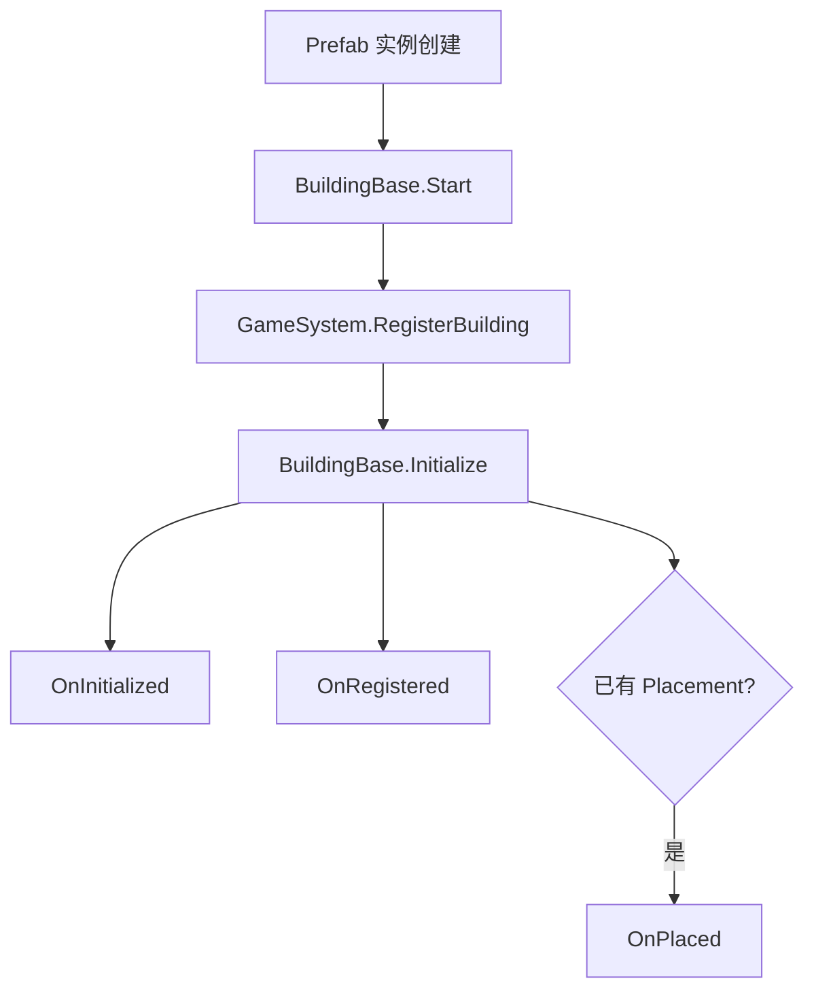
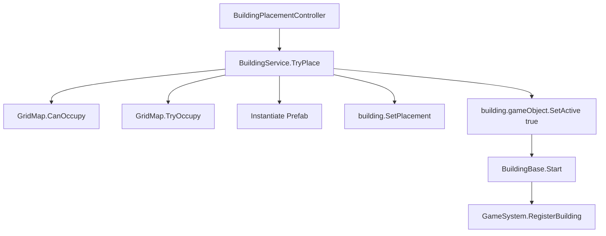
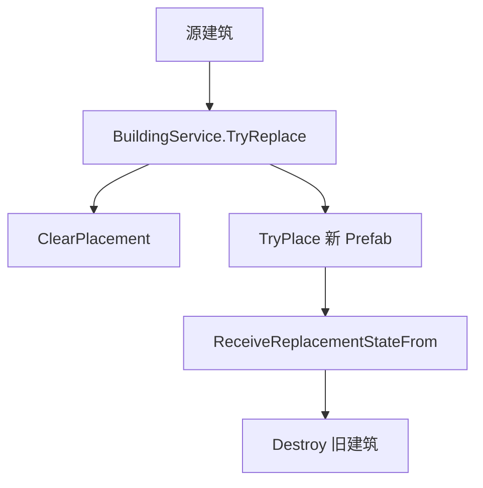

# AI_添加建筑规则

本文档给后续 AI / 开发者修改 Landsong 建筑系统时使用。它不是玩家教程，而是**当前仓库实现下的入口索引、职责边界、修改约束与交付清单**。

如果旧文档、历史讨论、旧脚本命名与当前实现冲突，以**仓库当前代码和 Prefab 配置**为准。

## 目的

- 为新增建筑、扩展建筑玩法、修复建筑逻辑提供统一入口。
- 约束“什么放到 `BuildingBase`、什么放到 `BuildingDefinition`、什么做成模块、什么留在具体建筑脚本”。
- 避免修改时破坏 `SerializeReference` 模块列表、Prefab 绑定、存档恢复和运行时替换流程。

## 前置条件

开始修改前，至少先阅读这些入口文件：

- `Assets/Landsong/Scripts/BuildingSystem/BuildingBase.cs`
- `Assets/Landsong/Scripts/BuildingSystem/BuildingDefinition.cs`
- `Assets/Landsong/Scripts/BuildingSystem/BuildingModules.cs`
- `Assets/Landsong/Scripts/BuildingSystem/BuildingService.cs`
- `Assets/Landsong/Scripts/BuildingSystem/BuildingAvailabilityEvaluator.cs`
- `Assets/Landsong/Scripts/BuildingSystem/BuildingPlacementController.cs`
- `Assets/Landsong/Scripts/BuildingSystem/BuildingJobSystem.cs`
- `Assets/Landsong/Scripts/BuildingSystem/BuildingResourceInterfaces.cs`
- `Assets/Landsong/Scripts/BuildingSystem/BuildingFunctionBlockInterfaces.cs`
- `Assets/Landsong/Scripts/BuildingSystem/BuildingRuntimeStatusCatalog.cs`
- `Assets/Landsong/Scripts/BuildingSystem/BuildingSaveDataRegistry.cs`

如果要改具体建筑，再补读对应脚本和 Prefab，例如：

- `Assets/Landsong/Scripts/BuildingSystem/Buildings/LumberCabin.cs`
- `Assets/Landsong/Scripts/BuildingSystem/Buildings/ResidentialHousingLV0.cs`
- `Assets/Landsong/Scripts/BuildingSystem/Buildings/ResidentialHousingLV1.cs`
- `Assets/Landsong/Scripts/BuildingSystem/Buildings/PlayerHomeLV1.cs`
- `Assets/Landsong/Scripts/BuildingSystem/Buildings/FishingHutBuilding.cs`

## 最高优先级规则

### 编码规范
建筑的字段名使用[labelText("{中文名}")]

### 不要误判当前架构

当前项目不是“纯继承”也不是“纯组件化”，而是三层组合：

- `BuildingBase`：统一生命周期、放置状态、模块入口、公共存档、公共 UI 入口。
- `BuildingDefinition`：Prefab 级静态定义。
- `BM_*` 模块：多个建筑可复用、但不是所有建筑都需要的能力。
- 具体建筑脚本：真正的每回合玩法逻辑。

### 不要把特例字段塞进 `BuildingBase` 或 `BuildingDefinition`

下列内容通常不应该放进 `BuildingBase` / `BuildingDefinition`：

- 当前工人数
- 当前人口
- 当前经验
- 当前生产进度
- 当前作物
- 连续失败次数
- 上回合异常状态
- 自动开关的建筑实例状态

这些都属于**具体建筑运行时状态**，应留在建筑脚本或模块状态中。

### 不要绕过 `BuildingService`

运行时放置、替换、拆除、批量道路放置统一走：

- `BuildingService.TryPlace(...)`
- `BuildingService.TryPlaceBatch(...)`
- `BuildingService.TryReplace(...)`
- `BuildingService.Demolish(...)`
- `BuildingService.Remove(...)`

不要在建筑脚本里手写：

- `Instantiate(newPrefab)` 然后自己占格
- `Destroy(oldBuilding)` 再手工补注册
- 直接改 Grid 占用状态

### 不要重命名已有模块类型

`buildingModules` 使用的是 `SerializeReference`。  
模块状态恢复还会通过模块托管类型名进行匹配。

因此：

- **不要通过重命名模块类来做中文显示**
- **不要随意改已有模块的 C# 全名**
- 如果必须改，必须同步处理旧 Prefab 和存档迁移

### 不要假设存在 `ModuleDisplayName`

当前 `BuildingModuleBase` 只有这些稳定入口：

- `IsEnabled`
- `ModuleDescription`
- `Normalize()`
- `AppendFunctionBlockEntries(...)`
- `ToString()` 返回类型名

当前代码里**没有** `ModuleDisplayName` 属性。  
如果要改善检查器可读性，请优先通过：

- 类名本身
- `ModuleDescription`
- 字段的 `[LabelText("中文名")]`
- 文档与注释

而不是凭空使用不存在的 API。

### 没有明确要求时，涉及到以下部分由用户自行完成

没有用户明确要求时，不主动改这些资产：

- Prefab
- Scene
- ScriptableObject
- Catalog 资产
- Addressables 配置

如果确实需要代码新增字段，请在交付说明里写清楚需要在 Unity Editor 手工补哪些绑定。

## 核心实现细节

### 建筑生命周期

建筑真正的运行时入口在 `BuildingBase`：



关键点：

- `Start()` 默认会调用 `Landsong.GameSystem.Instance.RegisterBuilding(this)`。
- `Initialize()` 会设置 `GameSystem`、标记已初始化，并触发 `OnInitialized / OnRegistered / OnPlaced`。
- `SetPlacement(...)` 只写放置信息，不负责注册。
- `ProcessTurn()` 是统一回合入口；`OnTurn()` 成功后会尝试自动升级。
- `OnDestroy()` 会清理占格并注销建筑，业务拆除逻辑应写在 `OnDemolished()`。

### 放置、替换与拆除

放置主流程：



替换主流程：



约束：

- 等级升级本质上是**替换 Prefab**，不是在同一实例里硬切“当前等级”。
- 施工态建筑升级成完工建筑，也应优先复用替换流程。

### 回合与模块数据流

当前回合职责分配：

- 具体建筑脚本负责 `OnTurn()` 的业务逻辑。
- `BM_资源产出` 负责周期、产量表、上回合产出记录。
- `BM_等级升级` 负责升级条件、升级成本、目标 Prefab 与自动升级。
- `BM_科技点产出` 负责保存每回合科技点数值和上回合结果。
- `BuildingJobSystem` 负责岗位吸引力与稳定工人数公式。
- `BuildingAvailabilityEvaluator` 负责建造菜单可见/可用状态。

### 存档规则

所有有运行时状态的建筑，都应通过 `CaptureBuildingData()` / `RestoreBuildingData(...)` 保存自身状态。

同时，`BuildingBase` 已经会统一保存这些公共模块状态：

- `BM_等级升级`
- `BM_资源产出`
- 所有实现 `IBuildingModuleStateSerializer` 的模块状态

新增建筑数据类时：

```csharp
[Serializable]
[BuildingDataTypeId("building.example")]
private sealed class ExampleBuildingData : BuildingDataBase
{
    public int CurrentProgress;
    public bool AutoEnabled;
}
```

规则：

- `BuildingDataTypeId` 必须是**稳定字符串**。
- 不要用类名当存档 ID。
- 不要把可由 Prefab 静态配置重建出来的内容重复存档。

### UI 数据出口

建筑详情和状态读取统一来自以下入口：

- `GetOverviewInfo()`
- `GetRuntimeStatuses()`
- `GetFunctionBlockEntries()`
- `IBuildingResourceConsumptionSource`
- `IBuildingResourceProductionSource`
- `IBuildingTaxSource`
- `IBuildingTechnologyPointSource`
- `IBuildingWorkforceFundingSource`

不要在 UI 层硬写：

```csharp
if (building is LumberCabin) { ... }
else if (building is ResidentialHousingLV1) { ... }
```

应由建筑脚本或模块把结构化数据准备好。

## 现有模块说明

### `BM_资源产出`

用途：

- 按工人数和产量表决定每次产出多少资源
- 维护生产周期 `productionIntervalTurns`
- 保存 `productionProgress`
- 暴露 `CurrentResourceProductions / LastResourceProductions`

适合场景：

- 伐木
- 捕鱼
- 农田成熟收获
- 工坊生产

### `BM_附近人口岗位吸引`

用途：

- 为岗位建筑提供“附近人口带来的就业吸引力加成”

当前字段：

- `populationSearchRadius`
- `attractionPerNearbyPopulation`

### `BM_库存格容量`

用途：

- 建筑存在时提供额外容量
- 由 `GameSystem` 聚合后影响全局库存格数

### `BM_科技点产出`

用途：

- 建筑成功完成回合后提供科技点
- 记录上回合科技点
- 自带模块状态序列化

### `BM_等级升级`

用途：

- 保存升级经验
- 检查升级条件与升级消耗
- 使用目标 Prefab 替换当前建筑

关键参数：

- `autoUpgradeEnabled`
- `currentExperience`
- `requiredExperience`
- `upgradeTargetPrefab`
- `upgradeCondition`
- `upgradeCosts`

## 具体建筑实现模式

### 只需要静态差异

如果新建筑只是这些东西不同：

- 名字
- 图标
- 尺寸
- 建造成本
- 菜单分类
- 模块参数

优先做法：

- 复用现有脚本
- 改 Prefab 上的 `BuildingDefinition`
- 改 `buildingModules` 参数

例如当前伐木小屋 LV1 / LV2 就更接近这种模式。

### 需要独立回合逻辑

如果新建筑有这些差异：

- 独立消耗/生产规则
- 独立人口/岗位/税收逻辑
- 独立异常状态
- 独立运行时存档
- 独立详情面板说明

应创建新的 `BuildingBase` 子类。

例如：

- `ResidentialHousingLV1`
- `LumberCabin`
- `FishingHutBuilding`

## 配置参数清单

### `BuildingDefinition` 应配置什么

必须优先检查这些项：

- `buildingId`
- `displayName`
- `category`
- `icon`
- `size`
- `requiredTerrainKeys`
- `movementResistance`
- `placementCosts`
- `visibleCondition`
- `availableCondition`
- `buildMenuSortOrder`
- `maxBuildCount`
- `buildLimitGroupId`
- `isDevelopmentCompleted`
- `useUniqueDetailPanel`
- `uniqueDetailPanel`

### 建筑 Prefab 上常见运行时参数

视建筑脚本而定，常见参数包括：

- `maxWorkers`
- `initialWorkersOnPlaced`
- `baseJobAttraction`
- `singleRecruitCost`
- `foodItemId`
- `growthIntervalTurns`
- `taxIntervalTurns`
- `consumptionFailureDecayThreshold`
- `isResourceProviderPoint`
- `buildingActionPower`

## 示例

### 新增一个“生产型岗位建筑”的推荐写法

```csharp
public sealed class ExampleWorkshop : BuildingBase, IBuildingWorkforceFundingSource
{
    protected override void OnRegistered()
    {
        RecalculateState();
    }

    protected override void OnPlaced()
    {
        RecalculateState();
    }

    protected override bool OnTurn()
    {
        var inventory = GameSystem?.Inventory;
        if (inventory == null)
        {
            return false;
        }

        RecalculateState();

        var result = EnsureBuildingModule<BM_资源产出>()
            .TryAdvanceProductionCycle(this, inventory, CurrentWorkers, MaxWorkers);

        if (result.ProducedResources && TryGetModule<BM_等级升级>(out var levelModule))
        {
            levelModule.AddExperience(1);
        }

        return result.Succeeded;
    }
}
```

### 新增一个“施工态 -> 完工态”建筑

参考 `ResidentialHousingLV0`：

- 保存施工经验
- 每回合扣一段材料
- 达到阈值后调用 `BuildingService.TryReplace(...)`
- 不要在同一个实例里把脚本切成 LV1

## 编辑器与使用步骤

### 新建筑接入步骤

1. 复制一个最接近的建筑 Prefab。
2. 决定是复用现有脚本，还是创建新的 `BuildingBase` 子类。
3. 填写 `BuildingDefinition`。
4. 配置 `buildingModules`。
5. 如果有运行时状态，补 `BuildingDataBase` 数据类和 `[BuildingDataTypeId(...)]`。
6. 确保 `GetOverviewInfo()`、`GetRuntimeStatuses()`、`GetFunctionBlockEntries()` 能提供 UI 所需信息。
7. 把 Prefab 加入 `BuildingCatalog.asset`。
8. 在 Unity Editor 验证：
   - 放置是否成功
   - 详情面板是否正常
   - 模块是否仍可在 Inspector 中显示
   - 存档恢复是否正常
   - 升级替换是否保留需要的状态

## 排错

### 建筑放不下

先查：

- `BuildingDefinition.size`
- `requiredTerrainKeys`
- `movementResistance`
- `GridMap.CanOccupy(...)`
- `BuildingService.TryPlace(...)` 返回的失败原因

### 建筑能显示但不能建造

先查：

- `visibleCondition`
- `availableCondition`
- `isDevelopmentCompleted`
- `maxBuildCount / buildLimitGroupId`
- `placementCosts`
- `BuildingAvailabilityEvaluator`

### 模块丢失或 Prefab 打开报错

先查：

- 最近是否改过模块类名
- 最近是否改过模块所在命名空间
- 最近是否从 `SerializeReference` 列表删除过类型

### 升级没有触发

先查：

- 是否真的在成功产出后增加了经验
- `BM_等级升级.requiredExperience`
- `upgradeTargetPrefab`
- `upgradeCondition`
- `upgradeCosts`
- `BuildingService.CanReplace(...)`

### 建筑详情不显示资源/功能块

先查：

- 是否实现了对应接口
- 是否重写了 `GetFunctionBlockEntries()`
- 是否忘记调用 `AppendBuildingModuleFunctionBlockEntries(ref entries)`

## 变更记录

### 2026-07-06

- 按当前 `main` 分支实现重写整份规则文档。
- 删除对 `ModuleDisplayName` 的错误依赖说明。
- 补充 `BuildingBase` 公共模块存档边界。
- 明确 `ResidentialHousingLV0` 与 `ResidentialHousingLV1` 的职责分工。
- 明确 `LumberCabin` 当前是共享脚本而非 `LumberCabinLV1/LV2` 两个类。
- 补充 `BuildingAvailabilityEvaluator`、`BuildingCatalog.asset` 与 `GameSystem.prefab` 的接入要求。
