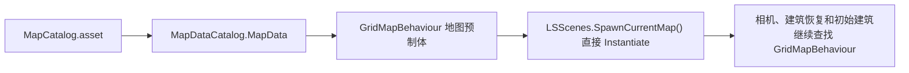
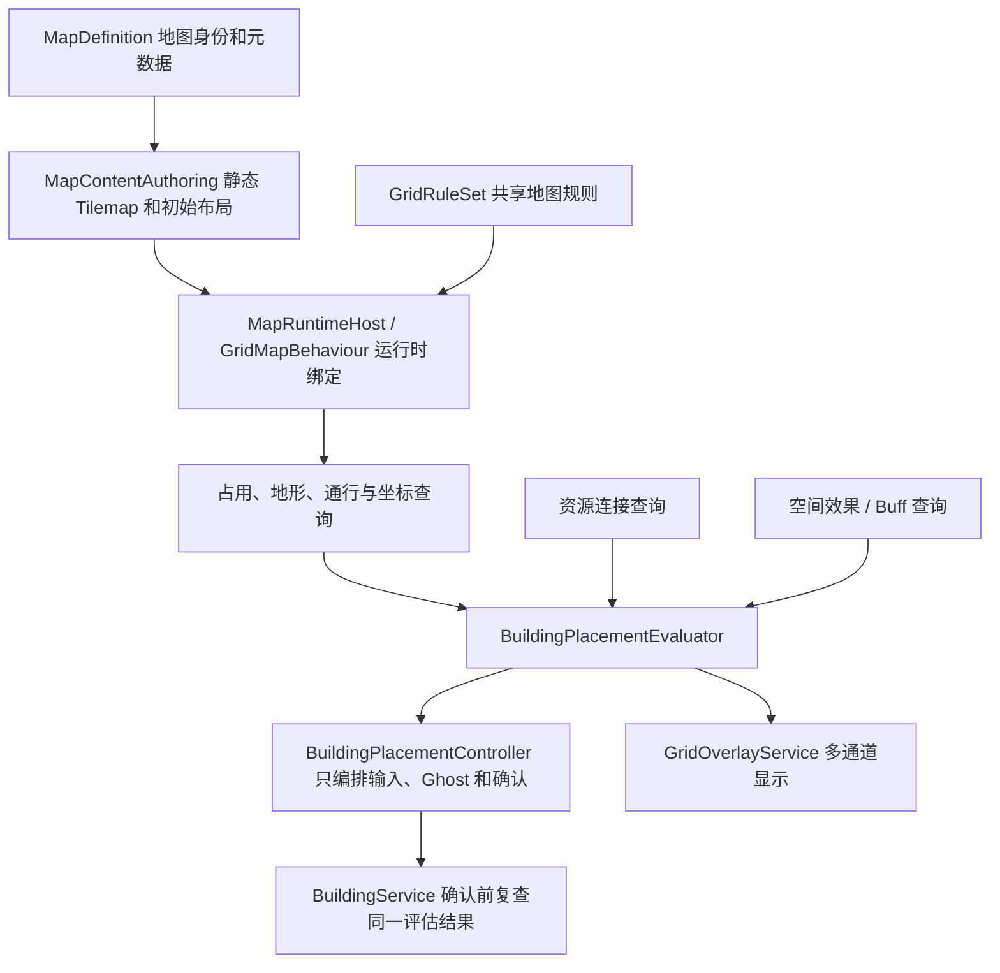

# 地图系统与建筑放置预览重构实施规格

> 状态（2026-07-13）：**核心重构已经完成，运行时与 Editor 程序集编译通过，用户已在 Unity / Play Mode 验收地图创建、完整占地、多通道 Overlay 和 Resource 连接预览，确认本轮目的达到。** 灌溉坊、美化装饰物等具体 Buff 内容仍需在后续创建 Definition 与 Prefab 绑定；这不影响地图/放置基础架构完成。
>
> 目标：先把地图资产、地图运行时、放置规则和格子视觉反馈的边界理清，再分阶段实施，避免一次性重写后仍然保留同样的耦合。
>
> 后续维护请优先阅读 [AI_地图系统.md](AI_地图系统.md)；本文保留完整决策过程和实施历史，不再作为唯一的日常维护入口。
>
> 建筑领域于同日完成第二轮终态重构：等级 Prefab、`BM_施工材料消耗`、Prefab 替换升级和 `XXXLVn` 脚本已经删除。本文前半部分出现这些名称时只代表地图重构当时的历史事实；当前建筑规则必须以 [建筑系统交接总览](建筑系统/README.md)、[终态决策](建筑系统/README_建筑架构审计与终态决策.md) 和 [AI 添加建筑规则](建筑系统/AI_添加建筑规则.md) 为准。

## 1. 这次重构要解决什么

这不是单独给 `BuildingPlacementController` 增加两张高亮瓦片，而是同时解决四个互相影响的问题：

1. 地图静态内容和地图运行时逻辑被打包在每一张完整地图预制体中。公共配置或公共层级变化时，每张地图都要重复修改。
2. 多个系统直接写同一个 `Highlight Tilemap`。建筑放置、建筑选择、行动力范围、道路预览和将来的 Buff 范围无法可靠共存。
3. 放置阶段只判断占地和地形是否合法，不判断建筑放下后能否连接资源提供点。
4. 范围类能力没有统一的“预测查询”接口。已有建筑可以计算行动力范围，但尚未落地的建筑无法复用同一套规则稳定预览资源连接和 Buff 影响范围。

本轮讨论确认规则后，建议采用分阶段重构。每一阶段都应保持项目可运行，不把地图资产迁移、规则重写和 UI 表现一次性混在同一个提交中。

## 2. 已从当前项目确认的现状

### 2.1 地图加载与资产结构

当前地图入口是：



已经确认：

- `Assets/Landsong/Objects/Prefabs/Map/默认地图.prefab` 约 6.8 MB。
- `Assets/Landsong/Objects/Prefabs/Map/默认地图2.prefab` 约 6.8 MB。
- 两个旧地图预制体都重复包含同样的公共骨架：`GridMapBehaviour`、`GridRenderer`、Base/陆地/水域/占用/高亮 Tilemap 和旧初始建筑父级组件。
- `MapDataCatalog.MapData` 直接保存 `GridMapBehaviour` 预制体引用。
- `LSScenes.SpawnCurrentMap()` 直接实例化整个地图预制体。
- 相机边界、存档建筑恢复、初始建筑占格等后续流程都依赖场景中存在的 `GridMapBehaviour`。

当前设计把以下三类内容绑成了一个资产：

- 每张地图独有的静态内容：Base Tilemap、地形 Tilemap、初始建筑布局。
- 所有地图共用的运行时设施：占用字典、动态占用层、高亮层、网格渲染器。
- 可能应该共享、也可能允许地图覆盖的规则：默认地形、可建造规则、行动力消耗规则。

因此，新增公共层、改变公共组件或修正公共配置时，会被迫修改每一张完整地图预制体。

### 2.2 当前地图真相来源

目前 `GridMapBehaviour` 的地图真相是：

- Base Tilemap 是否存在瓦片，决定格子是否属于地图。
- Terrain Tilemap 决定地形 Key。
- 运行时字典决定建筑占用。
- 没有另一份 `GridMap` / `GridCell` 数据缓存。

本次重构不应重新制造一份与 Tilemap 同步的整图格子数据。可以增加查询结果缓存、版本号和索引，但 Base/Terrain Tilemap 仍应是静态地图内容的权威来源。

### 2.3 当前放置器的真实行为

`BuildingPlacementController` 当前承担了很多职责：

- 普通建筑拖拽放置。
- 道路双端点和 L 形路径预览。
- 拆除模式。
- 建筑 Ghost 创建与移动。
- 放置确认 UI 定位。
- 全图可建造区域高亮。
- 当前占地、道路路径和拆除目标高亮。
- 输入与相机互斥。

普通建筑的 `currentCanPlace` 目前只来自：

```text
GridMapBehaviour.CanOccupy(origin, buildingSize, requiredTerrainKeys)
```

也就是说，它只回答：

- 占地是否仍在 Base Tilemap 内。
- 地形 Key 是否符合要求。
- 是否与现有占用冲突。

它不回答：

- 建筑是否需要资源提供点。
- 从候选位置是否能在 `BuildingActionPower` 内到达提供点。
- 将来的 Buff 范围及运行时空间效果如何查询。
- 该位置是否会导致建筑落地后处于异常运行状态。

另外，当前“全图合法格”扫描使用的是 `CanOccupy(position, Vector2Int.one, ...)`，不是当前建筑的完整尺寸。因此对于 2x2、3x3 等建筑，这些绿色格子并不能严格表示“以该格为候选原点时，完整建筑可以放下”。C 项已经决定删除这类全图候选热区，改为只显示当前 Ghost 的完整 footprint 及其能力范围。

### 2.4 当前资源连接规则

`BuildingResourceProviderSystem.TrySelectProvider(BuildingBase consumer, ...)` 已经定义了实际运行时资源提供点选择规则：

1. 候选建筑必须是有效、已放置、同一地图、非拆除状态的资源提供点。
2. 如果提供点实现运行状态接口，它还必须处于可提供状态。
3. 从消费者占地出发，使用 `GridManhattanPathfinder` 和消费者的 `BuildingActionPower` 搜索。
4. 路径消耗来自 `GridMapBehaviour`：普通格默认 10，道路等地形可以更低，阻挡建筑不可穿过。
5. 先选择优先级更高的可达提供点；同优先级选择行动力代价更低的点；最后使用稳定键打破并列。

问题在于这个接口要求消费者已经是一个完成放置并注册的 `BuildingBase`。放置预览中的候选建筑还没有 `HasPlacement`，因此不能直接复用它。

资源连接预览必须把这套算法抽成可接受“虚拟消费者”的纯查询，不能在放置器里重新写一份相似但不完全相同的寻路规则。

### 2.5 当前视觉层为什么不能安全叠加

`GridMapBehaviour` 只公开一个 `HighlightTilemap`。至少以下两个系统会直接向它写瓦片：

- `BuildingPlacementController`
- `BuildingSelectionController`

每个系统都自己记录写过的坐标，并在结束时把这些坐标设为 `null`。这是一种“默认自己是唯一写入者”的实现。

后果包括：

- A 系统清理自己的效果时，可能顺便擦掉 B 系统在同一格上的效果。
- 同一格只能由最后一次 `SetTile` 的结果代表，无法同时表达“可放置 + 行动力可达 + Buff 范围”。
- 视觉优先级散落在各个调用方的空值回退逻辑中。
- 新增一种范围效果就需要继续向放置器或选择器添加字段和清理列表。

所以用户判断“现在的视觉特效层似乎不支持同时显示多种特效”是准确的。这不是再加一张 Tile 就能长期解决的问题，需要明确的视觉层所有权和合成规则。

### 2.6 当前 Buff / 范围能力

项目中已有“附近人口岗位吸引”模块，它按建筑占地向外计算曼哈顿半径内的人口。但它的语义是“附近人口为本建筑提供岗位吸引加成”，并不等于“本建筑给附近建筑施加 Buff”。

当前没有发现统一的空间 Buff 系统或统一的 Buff 范围预览契约。F 项已经给出灌溉坊和装饰物两个首批实例，因此应先建立统一运行时空间效果规则，再接入预览；不能只给 UI 增加一个与运行时效果脱节的 `buffRadius` 字段。

## 3. 建议的目标架构

建议把系统拆成四条边界清晰的链：地图内容、地图运行时、放置评估、视觉覆盖层。



图中的类名是讨论用名称，不代表已经决定最终命名。

## 4. 地图资产拆分方案

### 4.1 已选方向：共享运行时 Host + 每图独立 Additive Content Scene

地图资产以“方便策划直接编辑”为首要约束。建议将当前完整地图预制体拆成共享 Runtime Host 和每张地图独立的 Content Scene。策划编辑地图时直接打开对应 `.unity` Scene，使用 Unity 原生 Scene、Tile Palette、Hierarchy、Undo 和多对象编辑流程，不需要进入大型 Prefab Mode，也不需要接触运行时服务对象。

每张地图 Scene 采用 Additive Content Scene 定位：它只是地图内容，不包含相机、UI、`GameSystem` 或地图公共运行时组件。进入游戏时，由地图加载流程把 Content Scene Additive 加载到公共游戏 Scene，并由 Runtime Host 完成绑定。

建议拆成：

#### `MapDefinition`（ScriptableObject）

只保存地图身份和目录信息：

- 稳定 `mapId`。
- 显示名称、图标、描述。
- 地图 Content Scene 的强类型 Addressables Scene `AssetReference`；策划不手填字符串 Address Key。

旧存档已经决定直接放弃。新结构只保存稳定 `mapId`，不再用显示名称 `MapName` 作为地图身份，也不提供 `MapName -> mapId` 的旧存档迁移回退。

#### `MapContentAuthoring`（每张地图 Scene 中唯一的内容入口）

该组件放在每张地图 Content Scene 的根节点，只保存并暴露编辑器创作内容：

- Unity `Grid` 及其布局参数。
- Base Tilemap。
- 陆地、水域、道路或其他静态地形 Tilemap。
- 初始建筑标记或初始建筑内容根节点。
- 其他真正属于该地图的静态装饰。

建议的策划工作流：

1. 从 `MapDefinition` 或地图目录窗口点击“打开地图编辑”。
2. 工具只打开目标地图 Content Scene；需要环境参照时，可附加加载一个不可保存覆盖的编辑器预览 Scene。
3. 策划使用 Tile Palette 绘制 Base/地形层，在 Hierarchy 中摆放初始建筑标记和静态装饰。
4. 保存 Scene 前运行地图校验：检查唯一 `MapContentAuthoring`、Base Tilemap、地形 Key、初始建筑占地和地图 ID。
5. 点击“从此地图开始 Play”时，编辑器工具自动打开公共游戏 Scene、Additive 加载当前地图并进入正常启动流程。

地图加载失败规则：

- `mapId` 找不到、Scene 引用无效或 Addressables Scene 加载失败时，终止进入游戏并返回主菜单。
- 错误必须明确显示目标 `mapId` 和失败原因。
- 不允许静默回退到 Catalog 第一张地图，避免加载错误世界后继续恢复存档。

Content Scene 中不保存：

这里不再保存：

- `GridMapBehaviour` 的通用运行时规则。
- `GridRenderer` 的通用配置。
- 动态占用 Tilemap。
- 通用高亮 Tilemap。
- 每一种新预览效果的 Tilemap。

#### `MapRuntimeHost`（所有地图共享一份）

负责：

- 等待目标 Content Scene Additive 加载完成并绑定其中唯一的 `MapContentAuthoring`。
- 创建/管理运行时占用层和视觉覆盖层。
- 提供 `GridMapBehaviour` 查询接口。
- 持有 `GridOverlayService`。
- 初始化占用、初始建筑、相机边界和恢复流程需要的运行时状态。

初始建筑直接由每张地图必备的 `MapContentAuthoring` 统一管理：

- 策划直接在 `MapContentAuthoring` 层级下摆放建筑 Prefab Instance，可看到完整视觉效果；无需为父物体或每个建筑额外挂初始化组件。
- Scene Gizmo 显示 Definition 计算的完整占地；预览偏移时显示橙色并阻止地图校验通过。
- 项目中没有“旋转建筑”概念：建筑根 Transform 始终使用单位旋转，footprint 始终使用未旋转的 `Definition.Size`。美术朝向如有需要，应在建筑 Prefab 内部子对象中完成，不成为放置或存档数据。
- 子级建筑在运行时自动隐藏，只作为生成模板；Runtime Host 仅在新游戏流程中通过 `BuildingService` 生成真实建筑并占格。
- 加载新存档时跳过初始模板生成，只恢复快照中的建筑实例。
- `MapContentAuthoring` 的 Awake 只负责在运行时隐藏策划模板，不自动占格，避免 Additive Scene 加载与快照恢复竞争。

`GridMapBehaviour` 仍保留同对象的 Unity `Grid` 与可选 Occupancy Tilemap，但 Base Tilemap、Terrain Layers 和 GridRuleSet 已从其 Inspector 移除。Content Scene 加载后，`MapRuntimeHost` 会把 `MapContentAuthoring` 的 Grid 和静态逻辑层以及全局 RuleSet 显式注入。占用判定始终以 Content Base/Terrain 为准；Game Scene Grid 如与 Content Grid 的几何参数不一致，`MapRuntimeHost.TryBind` 会拒绝加载，避免 Occupancy 可视化偏移或变形。

#### `GridRuleSet`（共享规则资产）

建议保存：

- 默认地形 Key。
- 默认是否可建造。
- 默认行动力消耗。
- 各地形行动力消耗。
- 以后可能增加的地形通行或建造规则。

全项目只使用一份 `GridRuleSet`，由共享 Runtime Host 或项目级服务持有。地图 Content Scene 和 `MapDefinition` 不允许覆盖默认地形、建造、通行或行动力消耗规则；修改规则后对所有地图统一生效。

### 4.2 备选方案：Content Prefab 或公共地图模板 + Prefab Variant

如果不希望改变地图加载方式，也可以让共享 Runtime Host 继续实例化每图 Content Prefab，或先建立公共地图模板并把两张地图改成 Prefab Variant。

优点：

- 对当前 `LSScenes -> Instantiate(GridMapBehaviour prefab)` 流程改动较小。
- 可以较快消除公共字段重复维护。

缺点：

- 6.8 MB 级 Tilemap 覆盖仍然与运行时骨架处在同一个 Variant 资产中。
- 公共字段一旦在 Variant 上形成 override，后续模板修改可能仍不能传播。
- 动态层和静态层的概念边界仍不够明确。

这些方案对当前 `Instantiate` 流程改动较小，但大型 Tilemap 的 Prefab Mode、Variant override 和策划编辑体验都弱于独立 Content Scene。基于“方便策划编辑”的已确认要求，不再将它们作为首选；必要时只作为迁移过渡。

### 4.3 不建议现在引入第二份整图格子数据

不建议为了拆预制体，把所有 Tilemap 再导出为一份逐格 ScriptableObject 数组，并让运行时依赖这份数组。那会重新带来 Tilemap 与数据资产之间的同步问题。

可以增加的缓存包括：

- Base 有效格列表。
- 各地形格索引。
- 占用版本号。
- 某建筑尺寸/规则下的候选位置缓存。

这些都应是由当前 Tilemap 和运行时占用派生的缓存，而不是第二个需要人工维护的地图真相。

## 5. 多视觉特效层方案

### 5.1 新增统一的 `GridOverlayService`

所有格子视觉都通过一个服务申请、更新和释放，不再由业务控制器直接操作 Tilemap。

建议的使用方式类似：

```csharp
GridOverlayChannelId channelId = overlayRegistry.RegisterOrGet(channelDescriptor);
using var handle = overlayService.Acquire(owner, channelId);
handle.SetCells(cells, style);
```

核心规则：

- 每个效果有明确 owner。
- owner 只能清理自己的内容。
- Service 统一决定 Tilemap、排序、合成和刷新。
- 业务系统提交“哪些格子、什么语义”，不直接持有 Tilemap。
- 地图切换或模式退出时，Service 可以按 owner、channel 或全部安全清理。
- 通道使用稳定 `GridOverlayChannelId` 和描述数据动态注册，不使用封闭的固定 enum。
- 新增效果时注册新的 Channel/Style，不修改每张地图 Content Scene，也不要求 `GridOverlayService` 增加专用字段。
- Runtime Host 按通道描述动态创建或从池中取得 Tilemap 层，并应用排序、透明度和合成分组。

### 5.2 首批视觉通道

第一版至少注册以下通道，但这不是封闭列表：

| 通道 | 用途 | 典型表现 |
| --- | --- | --- |
| PlacementValidity | 当前完整 footprint 的空间放置结果 | 越界、占用或地形不符为红色；空间合法为绿色 |
| PlacementFootprint | 当前建筑实际占地 | 边框、角标或更高亮填充 |
| ResourceReachable | `BuildingActionPower` 可达范围 | 半透明填充或纹理 |
| ResourceProvider | 可连接提供点和最终选中的提供点 | 提供点占地描边或 Marker |
| BuffRange | 当前建筑的空间 Buff 范围 | 与行动力范围不同的图案/颜色 |
| RoadPlan | 道路端点、合法路段、非法路段 | 保留现有道路语义 |
| Selection | 普通建筑选择和已落地建筑范围 | 与放置模式隔离 |
| Debug | 调试视图 | 最低或可配置优先级 |

PlacementValidity 只表达当前 Ghost 完整占地是否满足地图边界、占用和建筑地形要求等空间规则：非法红色，合法绿色。金币、材料、资源连接和 Buff 范围内当前是否已有受益建筑都不会改变红/绿结果。ResourceReachable 和 BuffRange 都以当前 Ghost 的候选位置为中心计算，并且必须是独立通道，否则这些信息无法同时存在。

### 5.3 动态分层与扩展规则（G 项已决定）

> **最终决定：视觉效果必须能够分层并动态扩展。新增效果不能要求修改地图资产或扩展固定通道枚举。**

每个动态通道描述至少包含：

```text
GridOverlayChannelDefinition（ScriptableObject）
├─ ChannelId（稳定且唯一）
├─ CompositionGroup
├─ SortingOrder / Priority
├─ GridOverlayChannelDefinition（直接引用 TileBase）
├─ Blend / Opacity 配置
└─ 是否允许多个 owner 在同一通道合成
```

实现约束：

- footprint、放置合法性、资源范围、路径、Buff、美化、道路、选择和调试效果都只是已注册通道，不是 Service 中的硬编码特例。
- 每个通道定义对应一个运行时动态 Tilemap 层；同一通道可以由多个 owner 提交，格子集合取并集。
- 同一通道同一格收到冲突提交时，先比较 submission priority，再使用稳定 owner key 决胜，保证结果不随遍历顺序闪烁。
- owner 释放时只清除自己的提交，不能擦除其他 owner 或其他通道。
- 同格多层能否同时看清取决于用户绑定的 Tile/Style；代码负责层级、排序和生命周期，不替代美术资源。
- 动态 Tilemap 层由 Runtime Host 创建和回收，不写入地图 Content Scene。

## 6. 放置评估重构

### 6.1 从 `BuildingPlacementController` 抽出纯规则查询

建议新增一个不读取鼠标、不创建 Ghost、不写 Tilemap 的 `BuildingPlacementEvaluator`。

输入应包含：

- 建筑预制体或不可变建筑配置视图。
- 候选 origin。
- 建筑 size、RequiredTerrainKeys、MovementResistance。
- `BuildingActionPower`。
- 当前地图查询接口。
- 当前建筑列表/资源提供点索引。

输出不只是一项 `bool`，而是结构化结果，例如：

```text
BuildingPlacementEvaluation
├─ GridFailureReason
├─ FootprintCells
├─ ShouldPreviewResourceConnection
├─ ResourceProviderFound
├─ SelectedProvider
├─ ResourceConnectionActionCost
├─ ResourceReachableCells
├─ BuffPreviewResults
├─ CanConfirm（只由通用放置规则和正常建造条件决定）
└─ UserFacingReasons
```

`BuildingPlacementController` 只负责：

- 把指针位置换算为 origin。
- 请求评估。
- 移动 Ghost。
- 把评估结果交给 `GridOverlayService` 和放置 UI。
- 用户确认时发起放置请求。

### 6.2 `BuildingService` 只复查通用放置规则

资源连接已经确定为辅助选址信息，不是放置合法性条件。`BuildingService.TryPlace` 不应因为找不到资源提供点而拒绝放置。

`BuildingService` 仍必须权威复查所有通用放置规则，避免以下入口绕过地图边界、占用和建筑地形要求：

- 调试命令。
- 初始建筑工具。
- 升级/替换建筑。
- 以后新增的脚本放置入口。
- 存档恢复。

资源连接查询结果只交给预览、提示和建筑落地后的运行状态逻辑，不改变 `CanConfirm`。建筑放置后没有连接资源时如何运行，继续由对应建筑/模块的实际资源消费规则处理。

### 6.3 资源连接查询接受“虚拟消费者”

建议把现有 `TrySelectProvider(BuildingBase consumer, ...)` 的核心逻辑改造成：

```text
ResourceConsumerProbe
├─ Map
├─ CandidateFootprint
├─ ActionPower
├─ ConnectionTypeId（当前为 Resource）
├─ IgnoredOccupantId（升级/替换时使用）
├─ Consumer capability / type
└─ Optional runtime building reference
```

已落地建筑和放置预览都转换成同一种 Probe，再调用同一个提供点选择算法。这样才能保证：

- 预览显示可连接，放下后也真的选择到同一提供点。
- 提供点优先级、运行状态和路径消耗只有一份规则。
- 升级/替换时可以忽略旧占用并预测新占地。

### 6.4 可扩展的连接类型与消费者能力

当前明确需要 `Resource` 连接的是居民房和生产类建筑，例如把原木加工为木板的加工建筑。不能把“有 `BuildingActionPower`”等同于“放置时需要显示资源连接信息”，也不应依靠具体建筑类名判断。

建议由建筑能力或模块明确声明，例如：

```text
IBuildingConnectionConsumer
├─ ShouldPreviewConnectionDuringPlacement
├─ UsesResourceConnectionDuringOperation
└─ RequiredConnectionTypeIds（当前只有 Resource）
```

连接提供点也使用按类型扩展的公共契约：

```text
IBuildingConnectionProvider
├─ ConnectionTypeId
├─ Priority
└─ IsOperational
```

当前只实现 `Resource` 类型。一个 `Resource` 消费者只选择一个资源提供点；这个提供点表示能够访问全局库存系统，不保存本地资源、不按资源 Item 类型分别配对，也没有运输容量。生产建筑实际消耗原木等物品时，直接由既有库存系统扣除。本轮新增通用“输入物品 -> 输出物品”加工模块作为生产消费者。

接口必须允许将来增加 `Electricity` 等独立连接类型。届时某些建筑可以声明电力连接需求，并选择一个对应的电力提供点；是否可能同时要求 `Resource` 和 `Electricity`，由连接类型列表自然扩展，不需要重写资源连接接口。

该能力只决定是否执行和显示对应类型的连接查询，不会把连接结果变成放置限制。当前居民房的 `BM_居民运营` 在全部运营等级声明 Resource 连接；含逐回合费用的 Construction 由家族施工数据自动声明。市场模块继续要求岗位满员才可运行，并保留按经手资源总价值 10% 结算金币的规则。`building.player_home` 继续作为低优先级基础 Resource 提供点；市场保持更高优先级，运行时优先选择可用市场，市场不可用时回退王宫。

## 7. 放置时显示的信息（C 项已决定）

> **最终决定：放置预览只围绕当前正在放置的建筑，不显示全图候选原点热区。**
>
> 所有范围都从当前 Ghost 的候选 footprint 出发计算。Ghost 移动到新的 origin 后，重新评估并差量更新对应 Overlay。

放置时固定显示：

1. **当前建筑的完整占地**：必须使用真实 size 显示完整 footprint，并表达通用放置规则是否合法。
2. **Buff 范围**：如果当前建筑能够向周围提供 Buff，则从当前 footprint 出发显示实际 Buff 影响范围。
3. **资源连接范围**：如果当前建筑运行时需要连接资源，则从当前 footprint 出发，按照其 `BuildingActionPower` 和实际通行消耗显示可达范围，并标出范围内可用资源提供点及最终会选择的提供点。

该决定明确取消以下方案：

- 不从每个资源提供点向外反推并涂绿所有可连接的候选地块。
- 不显示“把建筑放在全图每个 origin 时会怎样”的全图红/绿热区。
- 不让资源连接范围参与 `CanConfirm`；没有连接到提供点仍可按通用规则放置。

当前 footprint、BuffRange 和 ResourceReachable 是三个独立视觉通道。它们重叠时的美术表现与排序仍由 G 项决定。

## 8. BuildingActionPower 范围预览

建议严格复用当前项目已有的行动力语义，而不是画固定几何圆：

- 从当前 Ghost 的候选完整占地多源出发。
- 使用 `GridManhattanPathfinder`。
- 普通格、道路、高级道路使用 `GridMapBehaviour` 中的实际行动力消耗。
- 不可通行建筑阻挡搜索。
- 资源提供点自己的占地可以作为搜索终点，但不应因为该建筑不可穿过而永远无法连接。
- 预览结果包含每格最小行动力代价，未来可以做距离渐变或悬停信息。

建议同时显示：

- 所有可达格。
- 范围内所有可用资源提供点。
- 按现有优先级规则最终会选择的提供点。
- 到最终提供点的最小行动力代价路径。

路径显示已经确定为必需。当前 `FindReachable` 返回可达节点和代价，但没有直接暴露路径前驱，因此需要在公共寻路层补充可复用的前驱/路径结果。放置预览、已落地建筑查询和将来的其他连接类型都使用同一结果，不在放置器里临时倒推另一条路径。

## 9. Buff 范围预览

### 9.1 运行时规则与预览必须共用查询

T 项已经确定本轮同时实现真实运行时空间效果和放置预览，不接受只有 Tilemap 范围、没有实际灌溉/美化结算的视觉占位实现。

建议为真正的空间效果建立统一查询契约，而不是给放置器增加一批建筑类型分支：

```text
IBuildingSpatialEffectSource
├─ EffectId / DisplayName
├─ RangeRule
├─ CollectAffectedCells(context)
├─ CanAffect(target)
└─ StackingRule
```

候选建筑即使尚未落地，也可以根据候选 footprint 构造 context，得到与落地后相同的影响格。放置预览不扫描、描边或统计当前受益建筑；落地后的效果查询按当前空间关系动态筛选目标，因此后续在范围内新增的建筑会自动受到影响。

### 9.2 第一版预览内容

- Buff 影响格。
- Buff 名称与简短效果说明。
- 不显示当前受益建筑的描边、Marker 或数量，也不因范围内暂时没有目标而显示警告或阻止放置。
- 多个 Buff 使用同一范围时可以合并格子显示，但信息面板仍列出各效果。

### 9.3 首批空间 Buff 实例（F 项已决定）

#### 灌溉坊

- 从灌溉坊完整 footprint 向外计算 10 格曼哈顿几何范围，不受道路行动力折扣影响。
- 目标仅为农田建筑。
- 范围内农田产出增加 30%。
- Buff 是范围效果，忽略建筑、水域和其他地形阻碍；只按曼哈顿距离和 Base 地图有效边界裁剪。
- 农田是否被其他建筑包围不会影响 Buff，只要任一 footprint 格位于范围内就能被命中。
- 是否允许多个灌溉坊叠加做成可配置 `StackingRule`，不在放置器中硬编码。
- 当配置为叠加时，每个有效来源的 +30% 按加法累计；当配置为不叠加时，同一农田只采用一个有效灌溉 Buff。
- 第一版灌溉坊资产固定配置为 `NoStack`；`Additive` 作为系统支持的可选配置保留。
- 收获时先 Roll 基础整数产出，再乘以 `1 + 所有 Additive 百分比之和`，最终向下取整；`NoStack` 只应用一次 +30%。
- 手动收获和自动收获使用完全相同的 Buff 与取整公式。
- 放置预览只显示 10 格可传播范围和“农田产出 +30%”效果说明，不描边或统计当前农田。

#### 装饰物

- 装饰物是空间 Buff 来源，为周围提供 1 点美化值。
- 美化值属于地图格子。装饰物把自己的美化值写入配置范围覆盖的每个 Base 有效格。
- 同一格受到多个美化来源影响时不相加，而是取所有有效来源中的最高值。
- 例如同一格同时受到 `+1` 和 `+2` 美化影响时，该格最终美化值为 `+2`，不是 `+3`。
- 未被任何美化源覆盖的 Base 格默认美化值为 0。
- 第一个装饰物配置为 +1 美化、曼哈顿半径 1，包含自身 footprint 及相邻一圈有效格。以后其他装饰物的范围和数值仍作为 Buff 配置数据，不写死在公共系统中。
- 美化范围沿用 P：从完整 footprint 按曼哈顿距离计算，忽略建筑与地形阻碍，只按 Base 地图边界裁剪。
- 多格建筑的最终美化值为其完整 footprint 所有格子美化值的算术平均数，并使用向下取整。
- 放置预览显示配置范围和“覆盖格子提供指定美化值”效果说明，不扫描或统计当前范围内建筑。

#### 通用配置契约

首批实例要求空间效果至少支持：

```text
BuildingSpatialEffectDefinition
├─ EffectId
├─ Range
├─ RangeMetric（灌溉坊为 ManhattanStep）
├─ PropagationRule（灌溉坊为 IgnoreObstacles）
├─ TargetFilter（灌溉坊为 Farmland）
├─ EffectValue
└─ StackingRule（NoStack / Additive / HighestValue）
```

运行时产出/美化计算和放置预览必须读取同一份定义。Tilemap Overlay 只显示查询结果，不自行解释 30%、美化值或叠加规则。

## 10. 性能与缓存策略

两张地图的 Tilemap 资产已经较大。C 项已经取消全图候选位置热区，因此只需要评估当前 Ghost 所在的候选 origin，不执行“全图候选位置 × 完整寻路”。

建议：

1. `GridMapBehaviour` 增加 OccupancyVersion。建筑占用、清除、替换后递增。
2. Base 有效格和地形索引在地图绑定后构建只读缓存。
3. 只在 origin、建筑类型、规则版本或 OccupancyVersion 变化时重新评估当前候选位置。
4. Overlay 更新使用差集，只修改当前 footprint、BuffRange 和 ResourceReachable 发生变化的格子，不每帧 `ClearAllTiles()`。
5. 寻路复用 List、Dictionary、Heap 等缓冲，避免拖拽时产生大量 GC。
6. 资源提供点建立按地图维护的索引，不必在 Ghost 每次移动后重新扫描所有建筑。

第一版先保证三个当前建筑中心 Overlay 的规则正确，再用 Profiler 验证范围较大时是否需要分帧刷新。

## 11. 与现有系统的兼容边界

重构时必须显式保护以下流程：

- `MapCatalog.asset` 的地图选择和主菜单显示。
- 新存档使用稳定 `mapId` 保存地图身份；不读取或迁移旧 `GameData.MapName` 存档。
- `LSScenes.SpawnCurrentMap()` 的加载时序。
- 相机通过 `GridMapBehaviour.BaseCellBounds` 自适应地图边界。
- `GameRuntimeSnapshotService` 在地图存在后恢复建筑。
- `MapContentAuthoring` 初始建筑模板的新游戏生成流程，以及存档加载时的建筑恢复顺序。
- 道路双端点、道路交叉复用和批量扣费。
- 拆除模式与普通选择互斥。
- 建筑升级/替换时忽略旧占用的事务流程。
- 当前 Base Tilemap 作为地图有效边界的语义。

不建议为了保持旧接口而永久保留两套地图加载和高亮系统。可以有一次性迁移适配层，但完成两张地图迁移并验证后应删除旧路径。

## 12. 建议实施顺序

### 阶段 0：确认规则和美术契约

- 回答本文第 14 节的问题。
- 确定红、绿、行动力、Buff、提供点和重叠表现需要的瓦片。
- 选定地图资产拆分方案。

### 阶段 1：地图 Runtime / Additive Content Scene 拆分

- 建立 `MapDefinition`、`MapContentAuthoring`、`GridRuleSet` 和共享 Runtime Host。
- 改造 `MapDataCatalog` 与 `LSScenes`，通过 Addressables Additive 加载/卸载地图 Content Scene。
- 迁移两张现有地图，把静态 Tilemap、初始建筑标记和装饰提取到各自的 Content Scene。
- 使用新的稳定 `mapId` 和新存档结构，保持初始建筑、相机和新存档恢复可用；不实现旧存档迁移。
- 添加地图目录/打开/校验/从当前地图开始 Play 的策划工具，避免策划接触运行时 Scene 和手工填写 Address Key。

### 阶段 2：统一 Overlay 服务

- 建立多通道运行时 Tilemap。
- 迁移建筑选择范围、普通选择高亮和拆除高亮。
- 迁移道路预览。
- 删除业务控制器对 `GridMapBehaviour.HighlightTilemap` 的直接写入。
- 验证两个效果重叠和分别清理。

### 阶段 3：放置评估与资源连接预测

- 抽出 `BuildingPlacementEvaluator`。
- 把提供点算法改为支持带 `ConnectionTypeId` 的虚拟消费者 Probe。
- 给生产类建筑增加显式 `Resource` 连接消费能力。
- 增加通用“多项输入 -> 多项输出”加工模块与库存层原子交换 API，并接入市场 10% 经手价值。
- 放置预览显示行动力范围、可用提供点、最终选择和到最终提供点的最小代价路径。
- 公共寻路结果补充路径前驱/路径重建能力，不在放置器中复制寻路。
- `BuildingService` 确认前只复查通用放置规则；资源连接结果不阻止放置。

### 阶段 4：当前建筑中心的放置 Overlay

- 显示当前建筑的完整 footprint，并正确支持多格建筑。
- 按建筑能力显示 BuffRange 和 ResourceReachable。
- 标出资源范围内可用提供点和最终选择。
- 增加缓存、版本失效和三个通道的差量 Overlay 更新。
- 接入你提供的瓦片资产。

### 阶段 5：空间 Buff 运行时与预览

- 建立 `BuildingSpatialEffectDefinition`、目标过滤、可配置传播规则和 `StackingRule`。
- 实现灌溉坊 10 格农田产出 +30% 的运行时结算与预览。
- 实现格子美化值取所有有效来源最高值、多格建筑按 footprint 平均并向下取整的运行时结算与预览。
- 让放置预览调用同一空间效果范围查询，只显示影响格和效果说明；当前受益建筑的查询仅供运行时结算使用。

### 阶段 6：删除旧路径并做完整回归

- 删除单一 `HighlightTilemap` 的直接使用和废弃字段。
- 删除旧完整地图加载兼容层。
- 更新 `Assembly-CSharp.csproj` 中新增/删除脚本记录（如果 Unity 工程文件未自动刷新）。
- 编译、Prefab/资产文本检查、Unity Editor 和 Play Mode 回归。

## 13. 验收标准草案

### 地图资产

- 修改共享 Runtime Host 或共享规则后，两张地图不需要逐个手工修改。
- 策划可以直接打开单张地图 Content Scene，使用 Tile Palette 绘制地形、摆放初始建筑和装饰。
- 每张地图 Content Scene 只保存自己独有的静态 Tilemap 和初始布局，不包含公共运行时服务。
- 两张现有地图都能从主菜单选择并正确加载。
- 相机边界、初始建筑、新存档加载和建筑恢复没有回归。
- 旧 `MapName` 存档不在支持范围内，代码中不保留旧格式迁移分支。

### 视觉覆盖层

- 放置合法性、行动力范围和 Buff 范围可以同时存在。
- 清理任意一个效果不会擦除其他效果。
- 道路预览、建筑选择和拆除模式仍正常。
- 地图切换后没有遗留 Tile 或 owner handle。

### 放置与资源连接

- 1x1 和多格建筑的红色非法结果都与通用放置规则一致。
- 当前 Ghost 的完整占地、资源连接范围和 Buff 范围都以当前候选 footprint 为中心正确刷新。
- 预览选中的资源提供点、行动力代价与建筑落地后的实际选择一致。
- 预览路径以当前 footprint 为起点并到达最终选择的提供点，路径总代价与选择结果一致。
- 提供点被拆除、停运或优先级变化后，预览能正确失效。
- 找不到资源提供点时仍可确认放置，只要满足通用放置规则和正常建造条件。
- `Resource` 提供点只表示全局库存访问能力；生产消耗仍由库存系统统一扣除，不引入提供点本地库存或容量。
- 存档恢复、初始建筑和升级替换继续遵循各自已有的通用放置策略，不增加资源连接限制。

### Buff

- 预览范围与落地后的实际影响范围一致。
- 多格建筑、地图边缘和阻挡规则结果正确。
- 受影响建筑筛选和叠加规则有自动化或可重复的测试场景。
- 灌溉坊范围忽略建筑与地形阻碍，只按 10 格曼哈顿距离和 Base 地图边界判断农田。
- 灌溉坊配置为 `Additive` 时多个来源按 +30% 累计，配置为 `NoStack` 时只生效一次。
- 农田先 Roll 基础整数产出，再应用 Buff 并向下取整；手动与自动收获结果规则一致。
- 多个美化来源覆盖同一格时取最高值，例如 +1 与 +2 的格子结果为 +2。
- 多格建筑最终美化值等于 footprint 格子美化值平均数向下取整。

### 性能

- 拖拽建筑时不每帧全图清空重画，只差量更新当前建筑相关的三个 Overlay 通道。
- 大地图上没有明显持续 GC 峰值。
- Ghost origin 未变化时，不重复计算资源连接或 Buff 范围。

## 14. 已确认的决策记录

本轮 A～AB 决策已经全部完成，最终一致性和可执行性审查已通过。本文档现在是实施期的权威规格；如果规则改变，需要在改代码前更新对应决策及受影响章节。

### 14.1 决策汇总清单（A～J 已完成）

这份清单集中记录最终决定，目前 A～J 已全部完成。每项结论都已同步回写到下方对应详细章节，包含最终结论、决定依据和实现约束；对话内容不作为唯一记录。

#### 开始地图基础重构前必须决定

- [x] **A｜地图资产最终形态**：A1 共享 Runtime Host + 每图独立 Additive Content Scene；A2 共享 Runtime Host + 每图 Content Prefab；A3 公共 Prefab + Variant。**已决定：以方便策划编辑为首要目标，采用 A1。**
- [x] **H｜地图规则归属**：**已决定：全项目只共享一份 `GridRuleSet`，所有地图统一使用，不提供每图覆盖。**
- [x] **I｜旧存档兼容级别**：**已决定：直接放弃旧存档；新结构只使用稳定 `mapId`，不实现 `MapName -> mapId` 或旧快照迁移。**
- [x] **J｜Prefab 与瓦片绑定分工**：**已决定：我负责代码、字段契约和绑定清单；你负责 Unity Inspector、Prefab、Scene 与瓦片资源绑定及最终视觉检查。**

#### 开始放置与资源连接重构前必须决定

- [x] **B｜资源连接是否阻止放置**：**已决定：不阻止。能否放置只遵循地图边界、占用、地形要求等通用规则；资源连接仅作为当前建筑的辅助选址信息。**
- [x] **C｜放置时显示的信息**：**已决定：显示当前 Ghost 完整占地；有 Buff 能力时显示从当前 footprint 出发的 Buff 范围；需要资源连接时显示从当前 footprint 出发的 `BuildingActionPower` 可达范围、可用提供点和最终提供点。不显示全图候选地块热区。**
- [x] **D｜BuildingActionPower 范围规则**：**已决定：沿用当前曼哈顿四方向、实际地形行动力消耗、障碍阻挡和完整 footprint 多源出发规则；必须显示到最终提供点的最小代价路径。**
- [x] **E｜资源连接模型**：**已决定：生产类建筑需要 `Resource` 连接；一个 Resource 消费者选择一个资源提供点；资源从全局库存直接拉取，提供点没有本地库存和容量；接口按 ConnectionTypeId 预留未来 `Electricity` 等提供点。**

#### 开始 Buff 与多效果视觉重构前必须决定

- [x] **F｜首批 Buff 建筑规则**：**已决定：灌溉坊在忽略障碍的 10 格曼哈顿范围内使农田产出 +30%，叠加策略可配置；装饰物提供美化值，同类美化来源不相加而取最高值。**
- [x] **G｜重叠视觉表现**：**已决定：采用可动态注册的分层 Overlay；新增效果通过直接引用 `TileBase` 的 `GridOverlayChannelDefinition` 扩展，Runtime Host 动态创建或复用 Tilemap 层，不修改地图 Content Scene 或固定通道枚举。**

#### 最终决定速记

以下内容是当前完整决策的简写：

```text
A1，策划直接编辑每图 Additive Content Scene
B 已决定：资源连接不阻止放置
C 已决定：显示当前完整 footprint，并按能力显示以当前建筑为中心的 Buff/资源连接范围
D 已决定：沿用现有寻路规则，并显示最终提供点路径
E 已决定：生产类建筑使用单个 Resource 提供点；全局库存；预留 Electricity 等连接类型
F 已决定：灌溉坊 10 格、农田 +30%、忽略障碍、叠加可配置；美化取所有来源最高值
G 已决定：可动态注册的分层 Overlay
H 已决定：全项目共享唯一 GridRuleSet，不允许每图覆盖
I 已决定：放弃旧存档
J 已决定：用户负责 Inspector、Prefab、Scene 与瓦片绑定
```

### 14.2 执行前门禁（K～T 已全部决定）

对照当前代码复核后，A～J 仍不足以直接实施。以下项目会改变数据结构、加载时序或实际玩法结果，必须在执行前全部确定；不允许留到编码过程中再决定。

- [x] **K｜地图 Scene 引用与加载失败行为**：**已决定：使用强类型 Addressables Scene `AssetReference`；`mapId` 无效或加载失败时终止进入游戏并返回主菜单，绝不静默回退其他地图。**

- [x] **L｜初始建筑的编辑与生成协议**：**已修订：Content Scene 中所有位于 `MapContentAuthoring` 层级下的建筑 Prefab Instance 都自动视为初始模板；策划直接看到建筑效果和完整占地，无需任何额外 Marker/Placement 组件。模板在运行时隐藏；Runtime Host 仅在新游戏通过 BuildingService 生成真实建筑，加载存档时只恢复快照。两个旧组件与兼容分支已删除。**

- [x] **M｜当前 footprint 的颜色与确认规则**：**已决定：只按空间规则着色——越界、占用、地形不符为红色；空间合法为绿色；资源连接、Buff 范围内是否已有目标、金币或材料不足均不改变红/绿。**

- [x] **N｜Resource 消费者与现有提供点迁移**：**已决定：居民房继续需要 Resource 连接；本轮新增通用“输入物品 -> 输出物品”加工模块；保留市场满员门槛和 10% 经手收益；PlayerHome 继续作为低优先级基础 Resource 提供点，市场保持更高优先级。**

- [x] **O｜灌溉 +30% 的结算公式**：**已决定：先 Roll 基础整数，再乘 `1 + 所有 Additive 百分比之和`，最终向下取整；NoStack 只应用一次 +30%；手动和自动收获完全一致。**

- [x] **P｜Buff 范围传播语义**：**已决定：建筑 Buff 是纯范围效果，忽略建筑、水域和其他地形阻碍；从完整 source footprint 按曼哈顿距离计算，只由范围数值和 Base 地图有效边界裁剪。**

- [x] **Q｜美化值的承载对象与范围规则**：**已决定：美化值属于格子；同一格受到多个美化来源影响时取最高值；多格建筑的最终美化值为其完整 footprint 所有格子美化值的算术平均数并向下取整；范围沿用 P 的无视障碍曼哈顿范围，具体半径由装饰物配置。**

- [x] **R｜放弃旧存档时如何处理磁盘文件**：**已决定：项目尚未发布，由用户在启用新结构前直接删除全部旧存档；代码不实现旧存档识别、隐藏、迁移或自动删除，只支持新数据结构。**

- [x] **S｜动态 Overlay 的具体资产与合成契约**：**已决定：采用推荐方案。`GridOverlayChannelDefinition` ScriptableObject 保存稳定 ID、Style 和排序；每通道一个动态 Tilemap；同通道多个 owner 取格子并集；同格冲突按 submission priority、再按稳定 owner key 决胜；路径使用独立通道。**

- [x] **T｜本轮是否实现真实运行时 Buff**：**已决定：本轮实现真实运行时空间效果及其放置预览；运行时灌溉/美化计算与预览共用同一查询和定义，不做仅视觉的伪预览。**

### 14.3 二次审查新增的最终门禁（U～W 已全部决定）

- [x] **U｜Buff 作用范围与放置预览目标语义**：**已决定：美化范围包含 source footprint 的距离 0 格，因此美化建筑会美化自己占用的格子；所有 Buff 建筑放置时只显示 Buff 范围和效果说明，不扫描、描边或统计当前会受影响的建筑；当前范围内没有目标不提示异常，也不阻止放置。运行时按当前空间关系动态计算，以后在范围内新建的建筑会自动受到 Buff。**

- [x] **V｜通用“输入物品 -> 输出物品”加工模块事务规则**：**已决定：沿用现有生产周期和工人规则；周期完成时先选择 Resource 提供点，并预检全部输入数量与全部输出容量；预检通过后同一事务内扣除全部输入并加入全部输出，成功后进度归零；任何失败都不产生部分扣除或部分产出，进度停在完成状态等待下回合重试；成功消耗的输入计入本次选中市场的 10% 经手价值。如果本次最终选中的 Resource 提供点是 PlayerHome，则不产生市场经手收益。**

- [x] **W｜新游戏初始建筑与首次存档时机**：**已决定：Runtime Host 完成地图绑定、初始模板生成和占格后，立即覆盖保存当前新游戏槽位一次；只有保存成功后才完成进入游戏流程。读档流程跳过初始模板生成和这次初始快照写入。**

### 14.4 最终审查新增门禁（X～AB 已全部决定）

- [x] **X｜灌溉坊第一个实例的默认叠加模式**：**已决定：第一版灌溉坊使用 `NoStack`，多个灌溉坊覆盖同一农田仍只生效一次 +30%；系统仍支持 `Additive`，供以后其他资产或平衡调整使用。**

- [x] **Y｜第一个装饰物的美化半径与无覆盖默认值**：**已决定：未被任何美化源覆盖的 Base 格默认为 0；第一个装饰物提供 +1 美化，使用曼哈顿半径 1，范围包含自身 footprint 及其相邻一圈有效格；以后其他装饰物可单独配置半径和美化值。**

- [x] **Z｜加工事务的产出容量预检时点**：**已决定：对相同 ItemId 先合并输入和输出数量，在“假设全部原料已扣除”的投影库存上检查全部产出；只要事务最终状态能容纳就允许生产，并由库存层提供原子交换 API，不在建筑模块里手工回滚。**

- [x] **AA｜新游戏初始化或首次覆盖保存失败时的回滚**：**已决定：在实例化前一次性验证全部初始模板的 Prefab、预览对齐、地形、边界和相互占用；任何模板失败或首次快照保存失败时，撤销本次已生成建筑，删除本次刚创建的新游戏槽位，显示明确错误并返回主菜单；不留下可读取的半初始化存档。**

- [x] **AB｜建筑旋转语义**：**已决定：游戏中没有旋转建筑物的概念。初始建筑模板、玩家放置请求、建筑升级/替换和新存档快照都不保存、传递或恢复 rotation；建筑根 Transform 使用单位旋转，footprint 始终使用原始 `Definition.Size`。旧存档已放弃，因此直接从新建筑快照模型中删除 rotation 字段，不保留兼容分支。美术朝向只能在 Prefab 内部子对象中设置，不影响根对象或占地。**

#### 代码审查发现的直接依据

- `LSScenes.OnTargetSceneLoaded()` 当前同步实例化地图后立即恢复快照，Additive Addressables Scene 必须进入同一加载进度和失败处理链。
- 旧初始建筑父级组件会在 Awake 自动占格，与快照恢复清理场景建筑的时序冲突；当前实现已改为 `MapContentAuthoring` 模板 + 明确新游戏生成协议。
- `GameData.Validate()` 当前会把旧版本直接提升到最新版，存档索引扫描也会读取旧槽位；“放弃旧存档”不能只删除 `MapName` 字段。
- 当时实际资源消费者是 `ResidentialHousingLV1`；现已迁移为覆盖全部等级的 `BM_居民运营` 模块，Runtime Prefab 使用统一 `BuildingBase`。`BM_资源产出` 仍只负责输出，“输入 -> 输出”由 `BM_资源加工` 负责。
- `Market` 当前按经手资源总价值的 10% 结算金币，并要求岗位满员才作为可运行提供点。
- 农田产出是随机整数，当前没有统一产量修正管线。
- 项目目前只有“美化”建筑分类，没有美化值运行时模型。
- `Inventory.CanAddItems()` 只检查当前库存状态，现有服务没有“先假设扣除多项输入，再原子化加入多项输出”的交换 API。
- `DataManager.SaveCurrentGameInternal()` 当前返回 `void` 并在内部吞掉保存异常；W 要求上层只在保存成功后继续，因此实现时必须改成可观察的成功/失败结果。
- `BuildingService` 和建筑快照当前会传递 rotation，但 `CanOccupy()` 和占格始终只读取未旋转的 `Definition.Size`；现有两张地图中的初始建筑都使用单位旋转。AB 已决定删除这些伪旋转接口与存档字段。

### A. 地图资产最终形态（已决定）

> **最终决定：采用 A1——共享 Runtime Host + 每张地图独立 Additive Content Scene。**
>
> 决定依据：地图必须方便策划直接编辑。策划应使用 Unity 原生 Scene、Tile Palette、Hierarchy、Undo 和多对象编辑流程，不进入大型 Prefab Mode，也不接触公共运行时对象或手工管理 Additive 加载。

该决定形成以下实现约束：

- 每张地图对应一个可独立打开编辑的 `.unity` Content Scene。
- Content Scene 只保存静态 Tilemap、初始建筑标记和地图装饰，不保存相机、UI、`GameSystem`、动态占用层或 Overlay 层。
- 公共游戏 Scene 只维护一份 Runtime Host。
- `MapDefinition` 保存稳定地图 ID、显示信息以及 Content Scene 的 Addressable 引用。
- 正常游戏加载流程负责 Additive 加载/卸载 Content Scene，并把其中唯一的 `MapContentAuthoring` 绑定到 Runtime Host。
- 必须提供地图目录、打开地图、地图校验、登记 Catalog 和“从当前地图开始 Play”的编辑器工具，避免策划手工处理 Scene 加载和 Address Key。
- 两张现有完整地图 Prefab 迁移完成并验证后，旧的整图 Prefab 加载路径应删除。

备选方案不再作为目标架构，仅保留为迁移风险说明：

- **A2｜共享 Runtime Host + 每图 Content Prefab**：保留实例化流程，但大型 Tilemap 的 Prefab Mode 编辑体验较弱。
- **A3｜公共 Prefab + 每图 Prefab Variant**：迁移较快，但仍存在大型资产和 Variant override 风险。

策划不需要手工管理 Additive 加载。应提供地图编辑工具，把“打开地图”“校验地图”“登记到 Catalog”“从当前地图开始 Play”封装成明确按钮。Content Scene 只包含静态地图内容，公共 Runtime Host 仍由正常游戏 Scene 统一提供。

### B. 资源连接是否阻止放置（已决定）

> **最终决定：资源连接不阻止放置。**
>
> 能否放置只遵循建筑放置的通用规则。资源连接是辅助选址信息，不是合法性条件。

该决定形成以下实现约束：

- 地图边界外、占用冲突、建筑要求水域但候选位置不是水域等情况，仍按通用规则判定非法。
- 对需要连接资源的建筑，放置模式从当前 Ghost 的候选 footprint 出发计算资源连接范围。
- 显示 `BuildingActionPower` 可达格、范围内可用资源提供点和最终会选择的提供点。
- 当前范围内没有资源提供点时仍然允许放置，不禁用确认按钮。
- `BuildingService.TryPlace` 不增加“必须连接资源”的校验。
- 放置预览和建筑落地后的资源提供点选择必须共用同一套寻路、优先级和提供点状态规则，避免预览与实际运行不一致。
- 资源连接结果属于独立 Overlay 语义，不能与 PlacementValidity 混成同一个 `bool`。
- 不再从资源提供点反推并显示全图可连接候选地块。

### C. 放置时显示的信息（已决定）

> **最终决定：所有放置 Overlay 都以当前正在放置的建筑为中心。**
>
> 保留当前 Ghost 的完整占地显示；根据建筑能力追加 Buff 范围或资源连接范围；取消全图候选地块热区。

该决定形成以下实现约束：

- 所有建筑都显示当前 Ghost 的完整 footprint，不能只标记鼠标所在单格或建筑 origin。
- footprint 使用通用放置规则表达当前位置是否合法。
- 建筑具有对周围提供 Buff 的能力时，显示从当前 footprint 出发的实际 Buff 范围。
- 建筑运行时需要连接资源时，显示从当前 footprint 出发的 `BuildingActionPower` 可达范围。
- 资源连接范围内同时标出可用资源提供点，以及按现有优先级/行动力代价规则最终会选择的提供点。
- Ghost 移动到新 origin 后重新评估；origin 未变化时不重复计算。
- 不从资源点向外反推哪些建筑候选位置可连接，也不绘制全图绿色候选地块。
- footprint、BuffRange、ResourceReachable 分属独立 Overlay 通道；它们重叠时的瓦片样式和排序由 G 项决定。

### D. BuildingActionPower 范围（已决定）

> **最终决定：沿用当前 BuildingActionPower 寻路规则，并显示到最终提供点的路径。**

该决定形成以下实现约束：

- 使用曼哈顿四方向寻路。
- 从当前 Ghost 的完整 footprint 多源出发。
- 使用 `GridMapBehaviour` 的实际地形/道路行动力消耗。
- 不可通行建筑继续阻挡搜索。
- 提供点占地可以作为搜索终点。
- 显示所有可达格、所有可用提供点、最终提供点，以及到最终提供点的最小行动力代价路径。
- 最终提供点仍按“优先级更高 -> 路径代价更低 -> 稳定键”选择，不能为了显示更直的路径改变提供点选择结果。
- 公共寻路结果必须提供路径前驱或路径重建接口，放置器不复制一套路径算法。
- Ghost origin、占用版本、提供点状态或行动力规则变化后，范围和路径一起刷新。

### E. 哪些建筑需要资源提供点（已决定）

> **最终决定：生产类建筑需要资源连接；当前连接类型只有 `Resource`，但接口必须支持未来增加 `Electricity` 等其他提供点类型。**

当前 `Resource` 连接规则：

- 居民房和生产类建筑是 Resource 消费者；生产类示例包括把原木加工为木板的加工建筑。
- 是否属于消费者由显式能力/模块声明，不通过具体建筑类名硬编码。
- 一个 Resource 消费者只选择一个 Resource 提供点。
- Resource 提供点代表“可以访问全局库存系统”，不是本地仓库或运输实体。
- 原木、木板等具体 Item 不分别选择提供点；实际输入资源直接从全局库存系统检查和扣除。
- Resource 提供点没有本地库存、资源种类库存和运输容量，当前连接查询不做容量判断。
- 找不到 Resource 提供点不阻止建筑放置，但放置预览仍显示范围内没有最终提供点。

扩展接口要求：

- 提供点和消费者通过稳定 `ConnectionTypeId` 匹配，当前内置 `Resource`。
- 未来可以增加 `Electricity` 等类型，不修改 Resource 专用代码分支。
- 每种连接类型分别选择自己的最终提供点和路径。
- 接口允许一个建筑声明多个连接类型，因此未来建筑可以同时需要 Resource 和 Electricity；是否实际存在这种建筑由后续系统规则决定。
- Electricity 的容量、网络负载、断路等规则不在本轮实现，但不能被当前“Resource 无容量”假设锁死。

居民房的 `BM_居民运营` 在全部等级保持显式 Resource 消费能力；通用输入/输出由加工模块负责。`BM_市场资源结算` 继续保留满员运行条件和 10% 经手收益。`building.player_home` 保留为低优先级基础 Resource 提供点，市场保持更高优先级。

### F. 首批要支持的 Buff 建筑实例（已决定）

> **最终决定：第一批支持灌溉坊和装饰物两类空间 Buff。**

#### 灌溉坊

- 以完整 footprint 为源，范围为 10 格曼哈顿距离。
- 只影响农田建筑，使产出增加 30%。
- Buff 范围忽略建筑、水域和其他地形阻碍，不做寻路或视线遮挡判断。
- 只要农田任一 footprint 格位于灌溉坊范围内，该农田就是有效目标。
- 叠加作为效果配置项：至少支持 `NoStack` 和 `Additive`。
- 第一版灌溉坊资产使用 `NoStack`，多个来源覆盖同一农田仍只生效一次 +30%。
- 收获先 Roll 基础整数，再应用百分比总和并向下取整；手动和自动收获一致。
- 预览显示 10 格范围和效果说明，不描边或统计当前会被增强的农田。

#### 装饰物

- 为周围提供 1 点美化值。
- 美化值属于格子；同格使用 `HighestValue` 规则，不做加法叠加。
- 同一格受到多个美化来源影响时取最高值；例如 +1 与 +2 的最终结果为 +2。
- 具体范围由每个装饰物的空间效果配置提供。
- 未被任何美化源覆盖的 Base 格默认为 0；第一个装饰物提供 +1 美化，使用曼哈顿半径 1，并包含自身 footprint。
- 范围忽略建筑与地形障碍，只受曼哈顿半径和 Base 地图边界限制。
- 多格建筑读取完整 footprint 的格子美化值，求算术平均后向下取整。
- 预览显示美化影响格和效果说明，不扫描或统计当前范围内建筑。

#### 架构结论

- 建立独立空间效果查询，而不是在 `BuildingPlacementController` 中判断灌溉坊、农田或装饰物类型。
- 运行时效果结算与放置预览使用同一份 `BuildingSpatialEffectDefinition`。
- `StackingRule` 属于效果定义；灌溉 Buff 可配置为 `NoStack` 或 `Additive`，美化固定使用 `HighestValue`。
- 空间效果查询必须支持 `IgnoreObstacles`；灌溉坊使用此规则，不复用资源连接的通行/阻挡寻路。

### G. 重叠视觉表现（已决定）

> **最终决定：采用可动态扩展的分层 Overlay 系统。**

该决定形成以下实现约束：

- Overlay 通道不能使用无法外部扩展的固定 enum 作为唯一注册方式。
- 每种效果通过 `GridOverlayChannelDefinition` ScriptableObject 注册稳定 `ChannelId`、`TileBase` 和排序。
- Runtime Host 为每个已使用通道动态创建/复用一个 Tilemap 层，不把所有可能效果预建到每张地图。
- footprint、合法性、资源范围、最终路径、Buff、美化、道路、选择和调试都遵循同一注册与 owner 生命周期。
- 新效果原则上只新增描述、Style 和业务查询，不修改地图 Content Scene，也不在 `GridOverlayService` 增加专用字段。
- 不同通道分别清理；同一通道多个 owner 的格子取并集，同格冲突按 submission priority 和稳定 owner key 决胜。
- 实际填充、边框、纹理和透明度来自用户绑定的瓦片/Style，系统不假定未来只有当前几种视觉效果。

### H. 地图规则是否跨地图共享（已决定）

> **最终决定：地图规则全项目共享。**

该决定形成以下实现约束：

- 项目只存在一份权威 `GridRuleSet`。
- 默认地形、建造规则、普通格消耗和道路消耗对所有地图统一生效。
- `MapDefinition` 和 Content Scene 不提供规则覆盖字段。
- 修改共享规则后必须对所有地图回归验证。

### I. 旧存档兼容级别（已决定）

> **最终决定：直接放弃旧存档。**

该决定形成以下实现约束：

- 新存档使用稳定 `mapId` 和本次重构后的数据结构。
- 删除旧 `MapName` 地图身份逻辑和旧快照兼容分支。
- 不编写旧存档迁移工具，也不把兼容字段长期留在运行时模型中。
- 项目尚未发布，由用户在启用新结构前手动删除现有全部旧存档；运行时代码不扫描、隐藏、迁移或自动删除旧文件。
- 验证范围只覆盖新游戏、新存档保存和新存档恢复。

### J. Prefab 与瓦片绑定分工（已决定）

> **最终决定：你负责所有 Unity Inspector 绑定。**

我的交付责任：

- 实现脚本、公共 Runtime Host、服务接口、编辑器校验和序列化字段。
- 提供精确绑定清单：目标 Scene/Prefab、对象层级、组件、字段类型、用途、排序和期望资产。
- 对必填字段增加明确的校验与错误信息。
- 完成源码编译、文本检查和不依赖最终美术绑定的自动验证。

你的绑定责任：

- 在 Unity Inspector 中完成 Scene、Prefab、TileBase、Style 和其他序列化引用绑定。
- 决定最终瓦片、透明度、边框/纹理和视觉排序表现。
- 在 Unity Editor / Play Mode 中完成最终视觉与交互确认。

实现时不应为了“自动完成”而手写猜测性的 Prefab YAML 引用或创建替代美术资源；未绑定项必须通过清单和校验明确交接。

## 15. 执行前结论（历史记录）

A～AB 已全部确认并回写到对应章节。最后一轮审查没有再发现会迫使实现期临时决定的玩法、数据、加载时序、失败回滚或 Inspector 分工缺口。方案现已达到可执行状态。

收到明确的开始实施指令后，代码实施按本文第 12 节的分阶段方案推进，总体顺序为：

1. 将地图公共运行时与每图静态 Content 分开。
2. 建立有 owner 和 channel 的 `GridOverlayService`，先迁移现有选择/道路/拆除高亮。
3. 把资源提供点选择重构为已落地建筑和候选建筑都能使用的同一查询。
4. 实现通用加工事务、市场经手价值、灌溉和美化的真实运行时规则。
5. 最后让放置器消费结构化评估结果，并接入红/绿、行动力和 Buff 预览。

这样处理后，`BuildingPlacementController` 会变薄，地图预制体不再重复保存公共运行时骨架，后续新增范围特效也不需要继续向单一高亮 Tilemap 和单体放置器堆逻辑。

## 16. 实施结果与 Inspector 绑定清单

### 16.1 已实现的代码边界

- 地图身份已改为稳定 `mapId`；`MapDefinition` 保存显示数据与强类型 Addressable Content Scene 引用。
- `MapRuntimeHost` + `MapContentAuthoring` 已替代整图 Prefab 实例化；无效 `mapId`、Scene 加载失败或 Content 绑定失败不会回退到其他地图。
- `MapContentAuthoring` 从层级下的建筑 Prefab Instance 自动推导 Prefab + origin，并在 Scene 中显示完整视觉和占地；新游戏预检全部模板后生成，立即写入首次快照；失败时回滚建筑和新存档。
- `InitialBuildingMarker` / `InitialBuildingPlacement` 已直接删除，不保留兼容；初始建筑无需任何辅助组件。
- `MapContentAuthoring` 的“一键生成基础 Tilemap”会创建/复用 Base、水域、障碍层，并把水域和障碍登记到唯一的 `terrainLayers` 数据源。
- 建筑放置请求和建筑快照已删除 rotation 语义；普通等级升级现为同实例原地升级，不再有 Prefab 替换。
- `GridOverlayService` 按 `GridOverlayChannelDefinition` 动态生成 Tilemap，按 owner 独立提交/清理，同通道同格使用 priority + 稳定 owner key 决胜。
- 建筑选择、已落地行动力范围、道路、拆除、放置 footprint、资源范围/提供点/最终路径和 Buff 范围已脱离单一 Highlight Tilemap。
- `BuildingPlacementEvaluator` 使用完整 footprint 返回结构化放置结果；资源连接与 Buff 目标不改变红/绿或 `CanConfirm`。
- `ResourceConsumerProbe` 让 Ghost 与已落地建筑共用提供点选择和寻路；查询返回可达格、所有提供点、最终提供点和可重建的路径。
- `BM_资源加工` 支持多项输入/输出、生产周期、最低工人、Resource 连接、失败保留完成进度与市场经手价值。
- `BuildingFamilyDefinition.Construction` 直接声明施工回合费用；有费用的施工态没有提供点时仍可放置，但不会扣料或推进进度，成功消费会记录最终提供点。
- `Inventory.TryExchangeItems()` 会在扣除全部输入后的投影库存上检查输出，成功后一次性提交。
- `BuildingSpatialEffectDefinition` + `BM_空间效果源` 实现忽略障碍的完整 footprint 曼哈顿范围。农田收获已应用 Additive/NoStack 产量修正；美化按格取最高值，多格建筑查询取平均向下取整。
- `Landsong/地图/地图目录与校验` 编辑器窗口提供打开地图、校验、登记 Catalog 和从指定地图开始 Play。

### 16.2 Game Scene / Runtime Host 绑定

Game Scene 中只保留一份公共运行时骨架：

1. 添加唯一 `MapRuntimeHost`。
2. `MapRuntimeHost.gridMap` 绑定 Game Scene 中的 `GridMapBehaviour`。
3. `MapRuntimeHost.ruleSet` 绑定全项目唯一 `GridRuleSet`。
4. `MapRuntimeHost.overlayService` 绑定同一 Host 的 `GridOverlayService`。
5. `MapRuntimeHost.runtimeBuildingsRoot` 可绑定专用动态建筑父节点；留空时会运行时创建 `Runtime Buildings`。
6. `GridMapBehaviour` 只保留运行时 Occupancy Tilemap + occupied tile；Base/Terrain/共享 RuleSet 由 `MapRuntimeHost` 在 Content Scene 绑定时注入，不在两个组件上重复配置 RuleSet。
7. Runtime Host Grid 与每张 Content Scene Grid 的 cell size/layout/swizzle 及 Transform 原点必须一致，保证 Occupancy 视觉与静态 Tilemap 对齐。

### 16.3 每张 Content Scene 绑定

1. Scene 中必须且只能有一个 `MapContentAuthoring`。
2. 绑定 `unityGrid`、已绘制的 `baseTilemap` 和全部 `terrainLayers`。
3. Scene 不放相机、UI、GameSystem、GridMapBehaviour、Occupancy Tilemap 或 Overlay Tilemap。
4. 将初始建筑 Prefab Instance 直接放在 `MapContentAuthoring` 层级下，然后在该组件上执行“吸附初始建筑到格子”并检查青色占地 Gizmo。建筑根 Transform 不允许旋转。
5. 将 Content Scene 标记为 Addressable，然后绑定到对应 `MapDefinition.contentScene`。
6. 两张地图迁移、校验和 Play Mode 验证后，删除旧整图 Prefab 的游戏加载用途。

### 16.4 地图资产绑定

1. 创建唯一 `GridRuleSet`，填写默认地形、默认可建造、普通格/`Road`/`AdvancedRoad` 行动力消耗。
2. 每张地图创建一个 `MapDefinition`，填写唯一且不随显示名修改的 `mapId`、显示信息和 Addressable Scene。
3. 在 `MapCatalog` 中登记所有 `MapDefinition`；可使用编辑器窗口的“登记到 Catalog”。
4. 启用新结构前按 R 项手动删除旧存档。新版只接受 `GameData.CurrentDataVersion == 10`。

### 16.5 Overlay 资产与控制器绑定

每种视觉创建唯一 `GridOverlayChannelDefinition`（稳定且必填的 ChannelId + 直接引用的 TileBase + sortingOrder）。`GridOverlayStyle` 已删除，不保留中间样式类。建议语义上保持以下独立通道：

- `placement.valid`
- `placement.invalid`
- `placement.road`
- `placement.demolition`
- `connection.resource.reachable`
- `connection.resource.providers`
- `connection.resource.selected`
- `connection.resource.path`
- `buff.range`
- `selection.footprint`
- `selection.reachable`

`BuildingPlacementController` 必须绑定前九个字段；`BuildingSelectionController` 绑定最后两个字段。代码会在缺失时输出明确错误。

当前资产实际使用 `C1`～`C11` 作为稳定 ChannelId，而不是上面的语义字符串；业务代码不硬编码具体文本，只要求非空、全局唯一并绑定瓦片。不要在已有存档/Prefab 引用仍使用时随意复制资产并复用相同 ID。目录中 `C.asset` 是无 ID、无瓦片的无效资产，不能绑定到运行时控制器。

### 16.6 建筑与 UI 绑定

- `PlayerHomeRuntime`：`isResourceProviderPoint = true`，`resourceProviderPriority = 0`。
- `MarketRuntime`：`isResourceProviderPoint = true`，`resourceProviderPriority = 10`；市场仍只在满员时可提供。
- `ResidentialHouseModules`：`BM_居民运营` 覆盖全部运营等级并显式实现 Resource 消费能力；Runtime Prefab 直接使用统一 `BuildingBase`。
- 含费用施工：由 FamilyDefinition 的 Construction 自动声明 Resource；`buildingActionPower` 决定放置预览和运行时搜索预算。
- 加工建筑：在独立 ModuleSet 添加 `BM_资源加工`，填写生产周期、最低工人、全部输入和输出。
- 灌溉坊：创建 `BuildingSpatialEffectDefinition`，`Kind=ProductionPercent`、`TargetFilter=Farmland`、`Range=10`、`Value=30`、`StackingRule=NoStack`；在家族 ModuleSet 添加 `BM_空间效果源` 并绑定定义。
- 第一个装饰物：定义使用 `Kind=Beauty`、`TargetFilter=Cell`、`Range=1`、`Value=1`、`StackingRule=HighestValue`；同样通过 ModuleSet 绑定。
- 放置控制 UI：为 `GamePanel_BuildingPlacementControls.placementInfoText` 绑定 TMP Text，用于显示占地结果、最终资源点/代价和 Buff 范围说明。

### 16.7 已完成的静态验证

- `dotnet build Assembly-CSharp.csproj --no-restore`：通过，0 error。
- `dotnet build Assembly-CSharp-Editor.csproj --no-restore`：通过，0 error。
- 文本扫描已确认：业务控制器不再读写 `HighlightTilemap`；地图存档不再使用 `MapName`；建筑快照不再保存 rotation。
- Unity 已完成脚本 meta、Inspector、Content Scene、Addressables、Overlay 瓦片与 Play Mode 核心链路验收；用户确认本轮重构目的达到。
- 2026-07-13 建筑终态重构后再次验证：8 个 Family、8 个 Runtime Prefab 结构零错误；含费用 Construction 的 Resource 声明由核心生命周期处理，不再依赖施工模块。

### 16.8 当前资产事实与后续内容工作

- 当前 `MapCatalog.asset` 登记一张 `Map_Test01`，Content Scene 为 `Assets/Landsong/Scenes/MapScenes/TestMap.unity`。
- 旧 `Assets/Landsong/Objects/Prefabs/Map` 整图 Prefab 已退出新加载链路；不要恢复为地图运行时入口。
- `GridOverlayChannelDefinition`、`BM_资源加工` 和空间效果框架已经可用，但当前建筑 Prefab 中尚未配置实际 `BM_资源加工` 或 `BM_空间效果源` 实例，也没有灌溉坊/美化 Definition 资产。后续新增内容时按 [AI_添加建筑规则.md](建筑系统/AI_添加建筑规则.md) 和 [AI_地图系统.md](AI_地图系统.md) 配置。
- 障碍层当前只通过主地形不匹配阻止普通建筑放置，不会阻断 `CanTraverse()` / Resource 路径；若要让山体不可通行，需要扩展共享 `GridRuleSet`，不能只修改某张地图。
