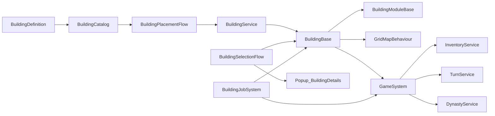
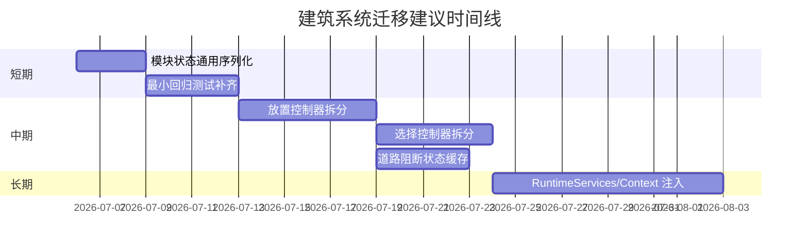

# Landsong 仓库建筑系统深度分析报告

## 执行摘要

本报告以 `Assets/Landsong/Scripts/BuildingSystem` 为核心，联动检查了其依赖的 `GameSystem`、`Grid`、`Inventory`、`Condition`、`UI` 等目录，按“跨仓库检索相关建筑实现”的假设进行评估。整体结论是：**该建筑系统已经具备可用的领域骨架，尤其是在“建筑定义 + 目录索引 + 可选模块 + 网格放置 + 建筑服务”这一条主链路上，扩展入口是明确的；但系统的扩展点与运行时基础设施尚未彻底解耦，导致新增“有状态模块”、多场景复用、自动化测试与长期维护时，会迅速暴露出基类硬编码、控制器巨型化和全局单例耦合的问题。** 以正向评分计，扩展性为 **7.5/10**，维护性为 **5.0/10**；“局限性”按**问题严重度**评分，为 **7.0/10（分数越高表示局限越重）**。这些判断主要由 `BuildingDefinition.cs`、`BuildingCatalog.cs`、`BuildingBase.cs`、`BuildingService.cs`、`BuildingPlacementController.cs`、`BuildingSelectionController.cs`、`BuildingModules.cs`、`BuildingJobSystem.cs`、`ResidentialHousingLV1.cs`、`GridMapBehaviour.cs` 与 `Popup_BuildingDetails.cs` 的实现共同支撑。citeturn5view0turn19view0turn20view0turn22view0turn23view0turn26view0turn26view1turn26view2turn26view3turn26view4turn26view6turn25view2turn24view0

从优先级看，**最值得立即处理的不是“重写系统”，而是两类高回报修补**：其一，把 `BuildingBase` 里针对模块状态保存/恢复的硬编码改为面向接口的通用序列化，以解除“新增有状态模块就得改基类”的瓶颈；其二，把放置/选择控制器从“输入 + UI + 网格 +业务流程”混合体中拆出更细的运行时服务，用依赖注入或上下文对象替代大量 `GameSystem.Instance` 与 `FindFirstObjectByType`。这样做能在不改变主要玩法行为的前提下，同时提升扩展性、维护性和测试能力。citeturn30view2turn30view3turn30view4turn31view0turn32view0turn46view1turn46view2turn34view3

项目配置层面，仓库当前记录的 Unity 编辑器版本为 **6000.3.5f2**，并在 `Packages/manifest.json` 中启用了 Addressables、Input System、Tilemap Extras 与 Test Framework 等包；但仓库中的 `_Test` 目录并未体现建筑系统自动化测试资产，更多是临时场景、Prefab 和素材文件。这意味着底层测试能力“工具上已具备，工程上尚未落实”。citeturn29view0turn29view1turn27view0

## 评估范围与方法

本次评估没有把“建筑系统”限定在单一文件夹内，而是把与建筑运行闭环直接相关的代码都纳入：建筑定义与目录（`BuildingDefinition.cs`、`BuildingCatalog.cs`）、建筑实体基类与模块（`BuildingBase.cs`、`BuildingModules.cs`）、建造/替换/拆除服务（`BuildingService.cs`）、放置与选择控制器（`BuildingPlacementController.cs`、`BuildingSelectionController.cs`）、建筑可用性计算（`BuildingAvailabilityEvaluator.cs`）、就业/人口公式（`BuildingJobSystem.cs`）、网格占用与地形通行（`GridMapBehaviour.cs`）、库存成本扩展（`InventoryBuildingCostExtensions.cs`、`InventoryService.cs`）、详情面板 UI（`Popup_BuildingDetails.cs`），以及代表性建筑实现 `ResidentialHousingLV1.cs` 与 `RoadBuilding.cs`。目录结构本身已经反映出这种跨目录耦合关系。citeturn5view0turn19view0turn20view0turn22view0turn23view0

评估方法分三层。第一层看**抽象边界**：是否存在稳定的配置对象、接口、服务层和扩展点；第二层看**变更传播成本**：新增一种建筑、模块或放置模式时，需要改动几处核心文件；第三层看**运行失败模式**：缺少 `GameSystem`、缺少库存、道路不通、资源点不可达、批量建造回滚、替换升级等路径中，系统是“显式失败并可恢复”，还是“隐式耦合且难以定位”。这些路径都能在源码中找到对应入口。citeturn38view0turn40view0turn40view2turn42view1turn42view2turn45view0turn46view2

评分口径如下：扩展性和维护性按**“越高越好”**打分；局限性按**“问题严重度越高分越高”**打分。由于未逐一解析所有 `.unity`、`.prefab` 与资源引用，本报告的优势在于对源码架构与关键行为链路判断的确定性较高；不足在于对“具体场景挂载关系”和“某些 Prefab 实际序列化数据”的验证是部分完成的。`Assets/Landsong/Scenes` 目录存在，但本次没有把所有场景资源展开到运行时对象级别。citeturn26view8turn28view0

## 扩展性分析与评分

### 评估方法与主要发现

建筑系统在“**配置层抽象**”上设计得不错。`BuildingDefinition` 将建筑 ID、显示名、分类、占地尺寸、地形要求、移动阻力、放置成本、菜单显示条件、可用条件、排序、数量限制组与专属详情面板等都统一收敛在一个静态定义对象中；其中 `VisibleCondition` 与 `AvailableCondition` 通过 `SerializeReference` 挂接 `GameCondition`，`BuildLimitGroupId` 允许多个建筑共享上限策略，`RequiredTerrainKeys` 则把建造地形约束抽象为运行时可计算集合。这种做法非常适合“加新建筑、不改主流程”的迭代节奏。citeturn37view0turn37view1turn37view2turn37view3turn37view4

目录层面也支持扩展。`BuildingCatalog` 维护 `buildingPrefabs` 与 `prefabsById` 索引，既能按 ID 查询建筑 Prefab，也支持编辑器下从文件夹自动扫描建筑 Prefab，并对重复 ID 给出警告。这说明作者已经把“建筑数据发现机制”从手工 if/else 分发提升到了目录驱动模式。这里是扩展性的一大加分项。citeturn39view0turn39view1turn39view2turn39view3

模块机制是另一个明显优点。`BuildingBase` 使用 `[SerializeReference] List<BuildingModuleBase>` 存储能力模块，并提供 `TryGetModule<TModule>`；`BuildingModules.cs` 中已经存在 `BM_资源产出`、`BM_库存格容量`、`BM_科技点产出`、`BM_等级升级` 等通用模块，而 `BuildingJobSystem.cs` 又通过 `IBuildingPopulationSource`、`IBuildingJobSource` 等接口，把人口与岗位计算抽成了相对纯粹的公式层。这意味着“新增一个不改变主建造流程的通用能力”在当前架构下通常是可做的。citeturn46view4turn46view5turn41view0turn41view1turn41view2turn41view3turn47view0turn47view1turn47view2turn47view3turn47view4

但扩展性在**运行时状态管理**处被显著削弱。`BuildingDataBase` 与 `BuildingBase.CaptureCommonSaveData/RestoreCommonSaveData` 只对 `BM_等级升级` 和 `BM_资源产出` 做了硬编码保存恢复；这意味着模块列表虽然是开放的，但**“可扩展模块”并不等于“可持久化模块”**。一旦新增像 `BM_科技点产出` 这类带运行时状态的模块，就必须修改 `BuildingBase` 自己，而不是只实现模块本身。换句话说，模块系统的开放封闭原则只完成了一半。citeturn30view2turn30view3turn30view4turn30view5turn30view6turn41view2turn41view3turn41view4

### 量化评分与理由

| 维度 | 评分 | 评分理由 |
|---|---:|---|
| 扩展性 | **7.5 / 10** | 静态定义对象、条件系统、目录索引、模块列表、接口化就业公式，构成了较清晰的扩展入口；但状态持久化、控制器行为模式、全局单例依赖仍让“深度扩展”需要修改基类或控制器核心。 |

给出这个分数的关键依据，是系统同时呈现出“**入口开放**”与“**底座封闭不足**”两种特征。一方面，`BuildingDefinition` 的条件、排序、建造限制与地形要求抽象是成熟的，`BuildingCatalog` 也避免了把建筑注册散落在各处；另一方面，`BuildingBase` 对模块状态的保存/恢复明显只覆盖了两种模块，这使得扩展一旦触及“有状态模块”或“升级/替换后的状态迁移”，就会溢出到基类。citeturn37view0turn37view2turn39view0turn39view2turn30view2turn30view3turn30view4

### 可复现场景与当前表现

**成功场景：新增一个有静态规则的建筑**

只要新 Prefab 继承 `BuildingBase`，提供有效 `BuildingDefinition.BuildingId`，并被 `BuildingCatalog` 收录，就可以依赖目录索引、统一放置服务与菜单可用性计算进入建造链路。若建筑只是新增地形要求、显示条件或数量限制组，当前架构能较自然承载。citeturn39view0turn38view0turn38view1turn38view2

**部分成功场景：新增一个纯计算型模块**

如果新模块只用于 UI 展示或回合内即时计算，并不需要独立持久化状态，那么通过 `BuildingModuleBase` 与 `TryGetModule<T>` 挂到建筑上，通常即可工作。这类扩展与 `BM_库存格容量`、`BM_科技点产出` 的风格相近。citeturn46view4turn46view5turn41view0turn41view2turn41view4

**失败场景：新增一个有状态模块并要求存档恢复**

复现方式很简单：新增一个类似“建筑热度模块/故障累计模块/科技点缓冲模块”的 `BuildingModuleBase` 子类，在模块里维护运行时字段，然后触发保存与恢复。当前实现下，这个模块的状态不会被 `BuildingBase` 通用保存，因为基类只处理 `BM_等级升级` 与 `BM_资源产出` 两种特例。结果是：模块“可挂载”，但“不可完整持久化”。citeturn30view2turn30view3turn30view4turn30view5turn30view6

## 维护性分析与评分

### 评估方法与主要发现

维护性最突出的风险来自**控制器巨型化**与**基础设施隐式依赖**。`BuildingPlacementController.cs` 拥有 **1304 行 / 1104 LOC**，内部同时处理预览、拖拽、道路端点、拆除模式、摄像机输入阻断、Tilemap 高亮、放置确认协程、UI 控件定位、服务解析等；`BuildingSelectionController.cs` 也有 **919 行**，同时负责选中判定、详情触发、操作条、镜头联动、高亮管理和事件订阅。这样的类在短期迭代时“集中好找”，但在长期维护时会形成经典的“改一个分支要回归整个控制器”的问题。citeturn26view0turn26view1

第二个问题是**全局单例与场景查找**。`BuildingBase.Start()` 直接调用 `Landsong.GameSystem.Instance.RegisterBuilding(this)`；`Initialize()` 也再次从 `GameSystem.Instance` 取系统上下文。与此同时，放置控制器和选择控制器多处使用 `FindFirstObjectByType<GridMapBehaviour>`、`FindFirstObjectByType<BuildingPlacementController>`、`FindFirstObjectByType<CameraController>` 进行场景解析。这样的写法在原型期常见，但它让依赖关系写在“运行时环境”而不是“代码签名”里，导致错误常常变成“场景没配好”或“加了第二套系统以后指向错对象”。citeturn46view0turn46view1turn46view2turn31view0turn31view2turn32view0turn32view1turn34view3

第三个问题是**测试落地不足**。`manifest.json` 已包含 `com.unity.test-framework`，说明项目并不排斥测试；但仓库 `_Test` 目录当前展示的主要是材质、Prefab、临时预览图和场景，而不是建筑系统 EditMode/PlayMode 测试脚本。这会直接抬高回归成本，尤其是涉及 `TryPlace`、`TryReplace`、`ResidentialHousingLV1.OnTurn()`、道路阻断判定、批量建造回滚时。citeturn29view1turn27view0turn40view0turn40view2turn42view1turn42view2

### 量化评分与理由

| 维度 | 评分 | 评分理由 |
|---|---:|---|
| 维护性 | **5.0 / 10** | 有清晰的服务层和一定的命名/注释质量，但控制器过于集中、单例/场景查找过多、测试未跟上，导致改动难以小步验证。 |

这个分数不是因为代码“不可读”，相反，许多类和方法的命名是清楚的；问题在于**修改影响面过宽**。例如 `BuildingPlacementController` 的 `Update` 会切换放置拖拽与拆除选择两个主模式，而确认放置又走协程与服务层；`BuildingSelectionController` 既要管 `GameSystem` 注册，又要管操作条实例化与选中高亮。这类聚合类在业务增长后通常是维护性坍塌点。citeturn31view3turn31view4turn31view5turn32view2turn32view5

### 可复现场景与当前表现

**失败场景：场景未放置 `GameSystem` 或者建筑子类重写 `Start` 时漏掉 `base.Start()`**

`BuildingBase` 依赖 `Start()` 自动注册；源码注释已经明确要求子类重写时必须调用 `base.Start()`。如果某个建筑忘记调用，后续 `ProcessTurn()` 可能因为未初始化而抛 `InvalidOperationException`；如果场景里没有可用 `GameSystem`，则注册链路会在运行时变脆弱。这个风险并非理论上的，而是由生命周期设计直接决定的。citeturn46view0turn46view1turn46view2turn46view3

**失败场景：多场景 / Additive 场景中出现多套 Grid、Camera 或 PlacementController**

放置与选择控制器都会在运行时用 `FindFirstObjectByType` 补引用。只要工程开始引入 Additive UI、多人编辑、关卡预载或并行测试场景，这种“第一命中即正确”的前提就会变得危险。当前实现下，这不是编译期错误，而是运行期“选中了别的对象”或“定位不到预期对象”。citeturn31view0turn31view2turn32view0turn32view1

**成本高场景：回归建造链路**

虽然 `BuildingService` 已经把 `TryPlace`、`TryReplace`、批量放置回滚和拆除做成了稳定入口，但因为缺少工程内自动化测试，任何一次对这些路径的改动都更依赖手工场景回归。项目已经导入 Test Framework，却没有呈现出建筑系统测试资产，这说明维护流程还有明显提升空间。citeturn40view0turn40view2turn40view4turn29view1turn27view0

## 局限性分析与评分

### 评估方法与主要发现

这里的“局限性评分”按**问题严重度**计分，分数越高表示当前限制越重。我认为当前最值得警惕的三个局限分别是：**基类保存硬编码、控制器职责过载、状态计算潜在过重**。citeturn30view2turn31view5turn31view6turn30view0turn30view1

首先，`BuildingBase` 的通用状态保存恢复不是“模块化”的，而是“枚举特例”的：现在只有等级升级与资源生产两个模块被写入 `BuildingDataBase`。这会让未来所有新的持久化需求都绕不开基类。这个局限比一般“代码不够优雅”更严重，因为它直接限制系统的形态演化。citeturn30view2turn30view3turn30view4turn30view5turn30view6

其次，`BuildingPlacementController` 和 `BuildingSelectionController` 把输入、场景引用恢复、UI、Tilemap 高亮、服务调用和模式状态机都揉在一起。此时“新增一种放置模式”“新增一个特殊选中操作条”“改道路拖拽策略”都不再是局部变更，而是有较高概率碰撞同一个大类。局限性不只是代码长度，而是**变更同构性太差**：不同问题都必须在同一处解决。citeturn26view0turn26view1turn31view3turn31view5turn31view6turn32view5

最后，`BuildingBase` 的通用状态里，`CreateRoadBlockedStatus()` 会调用 `HasPathFromAroundBuildingToMapBoundary()`，后者内部用队列与集合做边界可达搜索；而 `GridMapBehaviour` 的通行判定又要查询占用字典和地形成本。只要这个状态被高频 UI 刷新、批量列表刷新或大地图统计调用，在大图上就有明显的性能隐患。这里我谨慎地称之为“潜在局限”，因为我没有直接跑性能采样，但从算法路径看，风险是真实存在的。citeturn30view0turn30view1turn45view1turn45view3turn45view4

### 量化评分与理由

| 维度 | 评分 | 评分说明 |
|---|---:|---|
| 局限性严重度 | **7.0 / 10** | 核心问题不是“系统不能用”，而是“越往后开发，越难保持增量演进”。最重的限制在于模块状态持久化不泛化、控制器模式不解耦、若干状态计算可能在规模上放大成本。 |

此外，还有两个次级局限。一是 `RoadBuilding.cs` 只有 22 行、`OnRegistered/OnPlaced/OnTurn` 基本为空，这说明“道路语义”更多是靠放置控制器和网格通行规则隐式表达，而不是由道路领域对象主动承载；这在当前简单道路规则下没问题，但如果以后要加“道路等级、维修、拥堵、区域化道路权限”，很可能还得先把职责从控制器回迁到领域层。二是 `BuildingAvailability` 中 `IsAvailable` 与 `CanBuild` 被明确拆分，前者不含材料检查、后者才含 `CanAfford`；这本身并非错误，但如果 UI 只拿 `IsAvailable` 而不看 `CanBuild`，就会出现“看起来可建、确认时失败”的交互落差。citeturn43view0turn43view1turn38view3turn38view4

### 可复现场景与当前表现

**失败场景：存读档后新模块状态丢失**

步骤：给任意建筑新增一个带运行时状态的新模块，运行一段时间后存档并恢复。当前表现：只有升级经验和资源产出进度这类内建特例能稳定还原，其它模块状态会丢失或需要手工补逻辑。citeturn30view2turn30view3turn30view4

**失败场景：大地图中频繁打开/刷新建筑详情或状态列表**

步骤：在较大 `GridMap` 上放置大量建筑，频繁触发状态刷新。当前表现：每次构造通用状态时都可能重新做道路边界可达搜索，随着地图和建筑数量增长，状态刷新成本会被放大。源码没有显示缓存或脏标记机制。citeturn30view0turn30view1turn45view1turn45view3

**失败场景：住房与资源点断连**

步骤：放置 `ResidentialHousingLV1`，再让其失去可达资源点或缺粮数回合。当前表现：住房会记录“无法连接资源”或“食物不足”，累计失败达到阈值后人口衰减，最终进入荒废状态。这是一个行为上正确、但也说明“资源供应链脆弱且高度依赖道路/资源点”的例子。citeturn42view1turn42view2turn42view3turn42view4turn42view5

## 优先级改进建议与可应用补丁

### 优先级排序建议

| 优先级 | 时间窗口 | 建议 | 预期收益 | 风险 | 难度 | 估计工作量 |
|---|---|---|---|---|---|---:|
| 高 | 短期 | 把模块状态保存/恢复改成接口驱动，而不是 `BuildingBase` 内硬编码两种模块 | 解除新增有状态模块对基类的修改依赖；降低后续功能耦合 | 需要处理旧存档兼容 | 中 | 2–3 人日 |
| 高 | 短期 | 给建筑系统补最小可用 EditMode/PlayMode 测试：`TryPlace`、`TryReplace`、住房断粮衰减、道路阻断状态 | 建立回归护栏，显著改善维护性 | 需要补少量测试场景与 asmdef | 中 | 2–4 人日 |
| 中 | 中期 | 拆分 `BuildingPlacementController`：输入读取、预览渲染、放置流程、道路拖拽、拆除模式分模块 | 降低控制器变更冲突；方便多人并行开发 | 需要梳理现有状态变量与事件 | 高 | 5–8 人日 |
| 中 | 中期 | 拆分 `BuildingSelectionController`：选择判定、操作条、详情打开、高亮绘制分层 | 选中逻辑更稳定，更易测试/替换 UI | 可能影响现有 UI 绑定 | 中 | 4–6 人日 |
| 中 | 中期 | 为“道路不通”状态增加缓存/脏标记，只在占用格变化后重算 | 降低大地图状态刷新开销 | 需要定义网格脏事件 | 中 | 3–5 人日 |
| 低 | 长期 | 引入 `BuildingContext` / `IRuntimeServices`，逐步替代 `GameSystem.Instance` 与 `FindFirstObjectByType` | 真正支持多场景、可测试性与未来多人/编辑器工具 | 牵涉较广，回归面大 | 高 | 8–12 人日 |

这些建议的排序依据很直接：短期先处理“扩展点封口”和“无测试”的高成本问题；中期再做控制器瘦身；长期才值得做运行时上下文重构。因为前两类问题已经能明显拖慢代码审查与合并请求质量，而不需要等待大架构完全重做。citeturn30view2turn31view3turn31view5turn32view5turn29view1turn27view0

### 可直接应用的补丁方案

下面给出一个**兼容性优先**的补丁方案：不推翻现有存档结构，保留 `BM_等级升级` / `BM_资源产出` 的旧字段，同时新增**通用模块状态通道**，让未来模块通过接口参与存档。

#### 变更清单

| 文件 | 操作 | 变更摘要 | 兼容性影响 | 回滚方案 |
|---|---|---|---|---|
| `Assets/Landsong/Scripts/BuildingSystem/BuildingBase.cs` | 修改 | 在 `BuildingDataBase` 中新增通用模块状态列表；改造 `CaptureCommonSaveData/RestoreCommonSaveData` 循环采集接口模块状态 | 向后兼容；旧字段保留 | 回退该文件即可恢复旧存档行为 |
| `Assets/Landsong/Scripts/BuildingSystem/BuildingModules.cs` | 修改 | 新增 `IBuildingModuleStateSerializer` 接口；让确有状态的模块按需实现 | 对未实现接口的旧模块零影响 | 回退该文件 |
| `Assets/Landsong/Scripts/BuildingSystem/BuildingModuleStateEntry.cs` | 新增 | 定义可序列化的模块状态条目 | 新增文件，无旧逻辑影响 | 删除新文件并回退引用 |
| `Assets/Landsong/Tests/EditMode/BuildingSystem/BuildingModuleStateSerializationTests.cs` | 新增 | 增加一个最小回归测试，验证模块状态存读 | 仅测试工程影响 | 删除测试文件 |
| `Assets/Landsong/Tests/EditMode/BuildingSystem/Landsong.BuildingSystem.Tests.asmdef` | 新增 | 建立测试程序集 | 仅测试工程影响 | 删除 asmdef |

#### 关键补丁示例

```diff
// BuildingModuleStateEntry.cs
+ using System;
+
+ namespace Landsong.BuildingSystem
+ {
+     [Serializable]
+     public sealed class BuildingModuleStateEntry
+     {
+         public string ModuleType;
+         public string Json;
+     }
+ }
```

```diff
// BuildingModules.cs
+ public interface IBuildingModuleStateSerializer
+ {
+     bool TryCaptureState(out string json);
+     void RestoreState(string json);
+ }

  [Serializable]
  public abstract class BuildingModuleBase
  {
      ...
  }

  [Serializable]
  public sealed class BM_科技点产出 : BuildingModuleBase, IBuildingTechnologyPointSource
+     , IBuildingModuleStateSerializer
  {
      ...
+     [Serializable]
+     private sealed class SaveState
+     {
+         public int LastTechnologyPoints;
+     }
+
+     public bool TryCaptureState(out string json)
+     {
+         json = JsonUtility.ToJson(new SaveState
+         {
+             LastTechnologyPoints = lastTechnologyPoints
+         });
+         return !string.IsNullOrWhiteSpace(json);
+     }
+
+     public void RestoreState(string json)
+     {
+         if (string.IsNullOrWhiteSpace(json))
+         {
+             lastTechnologyPoints = 0;
+             return;
+         }
+
+         var state = JsonUtility.FromJson<SaveState>(json);
+         lastTechnologyPoints = Mathf.Max(0, state == null ? 0 : state.LastTechnologyPoints);
+     }
  }
```

```diff
// BuildingBase.cs
  public abstract class BuildingDataBase
  {
      public bool HasLevelUpgradeModuleData;
      public bool LevelUpgradeAutoUpgradeEnabled;
      public int LevelUpgradeCurrentExperience;
      public bool HasResourceProductionModuleData;
      public int ResourceProductionProgress;
+     public List<BuildingModuleStateEntry> GenericModuleStates;
  }

  private void CaptureCommonSaveData(BuildingDataBase data)
  {
      if (data == null)
      {
          return;
      }

      if (TryGetModule<BM_等级升级>(out var levelModule))
      {
          data.HasLevelUpgradeModuleData = true;
          data.LevelUpgradeAutoUpgradeEnabled = levelModule.AutoUpgradeEnabled;
          data.LevelUpgradeCurrentExperience = levelModule.CurrentExperience;
      }

      if (TryGetModule<BM_资源产出>(out var productionModule))
      {
          data.HasResourceProductionModuleData = true;
          data.ResourceProductionProgress = productionModule.ProductionProgress;
      }

+     if (buildingModules == null || buildingModules.Count == 0)
+     {
+         return;
+     }
+
+     data.GenericModuleStates ??= new List<BuildingModuleStateEntry>();
+     data.GenericModuleStates.Clear();
+
+     for (var i = 0; i < buildingModules.Count; i++)
+     {
+         if (buildingModules[i] is not IBuildingModuleStateSerializer serializer)
+         {
+             continue;
+         }
+
+         if (!serializer.TryCaptureState(out var json) || string.IsNullOrWhiteSpace(json))
+         {
+             continue;
+         }
+
+         data.GenericModuleStates.Add(new BuildingModuleStateEntry
+         {
+             ModuleType = buildingModules[i].GetType().AssemblyQualifiedName,
+             Json = json
+         });
+     }
  }

  private void RestoreCommonSaveData(BuildingDataBase data)
  {
      if (data == null)
      {
          return;
      }

      if (data.HasLevelUpgradeModuleData
          && TryGetModule<BM_等级升级>(out var levelModule))
      {
          levelModule.SetAutoUpgradeEnabled(data.LevelUpgradeAutoUpgradeEnabled);
          levelModule.SetExperience(data.LevelUpgradeCurrentExperience);
      }

      if (data.HasResourceProductionModuleData
          && TryGetModule<BM_资源产出>(out var productionModule))
      {
          productionModule.RestoreProductionProgress(data.ResourceProductionProgress);
      }

+     if (data.GenericModuleStates == null || buildingModules == null)
+     {
+         return;
+     }
+
+     for (var i = 0; i < data.GenericModuleStates.Count; i++)
+     {
+         var entry = data.GenericModuleStates[i];
+         if (entry == null || string.IsNullOrWhiteSpace(entry.ModuleType))
+         {
+             continue;
+         }
+
+         for (var j = 0; j < buildingModules.Count; j++)
+         {
+             var module = buildingModules[j];
+             if (module == null || module.GetType().AssemblyQualifiedName != entry.ModuleType)
+             {
+                 continue;
+             }
+
+             if (module is IBuildingModuleStateSerializer serializer)
+             {
+                 serializer.RestoreState(entry.Json);
+             }
+             break;
+         }
+     }
  }
```

这组补丁的核心优点有三点。第一，它不破坏现有的 `BuildingDataBase` 兼容路径，旧模块照旧可用；第二，它把“模块状态是否要存档”的决定权下放给模块自身，而不是继续累加 `BuildingBase` 的 if/else；第三，它为后续给 `BM_科技点产出`、未来的“故障模块”“温度模块”“耐久模块”增加状态保存留出了统一接口。该补丁直接针对前面扩展性与局限性部分指出的核心瓶颈。citeturn30view2turn30view3turn30view4turn41view2turn41view4

### 架构重构图与迁移时间线





## 本地验证步骤与示例用例

### 构建与导入

仓库记录的 Unity 版本为 **6000.3.5f2**；因此本地验证建议使用相同版本或非常接近的 Unity 6 编辑器。由于 `manifest.json` 已启用 Addressables、Input System、2D Tilemap、UGUI 与 Test Framework，第一次导入应允许包解析完成再做脚本验证。citeturn29view0turn29view1

```bash
# macOS 示例
UNITY="/Applications/Unity/Hub/Editor/6000.3.5f2/Unity.app/Contents/MacOS/Unity"
PROJECT="/path/to/Landsong"

"$UNITY" -batchmode -nographics \
  -projectPath "$PROJECT" \
  -quit \
  -logFile "$PROJECT/Logs/import.log"
```

### 手工烟雾测试

建议在 `Assets/Landsong/Scenes` 下选择实际接入 `GameSystem`、`GridMapBehaviour`、`BuildingPlacementController` 的场景进行验证；由于本次未逐一展开所有场景资源，具体进入哪个场景需要以你仓库内当前实际挂载为准。citeturn26view8turn28view0

**用例一：基础放置**

在可建造地形上放置一个普通建筑，预期通过 `BuildingService.TryPlace` 完成占格、实例化、扣成本和注册；若材料不足，则应在可建造性上体现为 `CanBuild == false`。citeturn40view0turn40view1turn38view2turn38view3turn38view4

**用例二：道路与住房联动**

放置若干 `RoadBuilding` 与 `ResidentialHousingLV1`，让住房与资源点断开连接，再推进数回合。预期住房先报“无法连接资源”，失败累计达到阈值后人口衰减，最终荒废。道路对象自身逻辑极轻，主要依赖网格通行与住房搜索逻辑工作。citeturn43view0turn43view1turn42view1turn42view2turn42view3turn42view4turn45view1

**用例三：升级替换**

若建筑挂载 `BM_等级升级`，则升级最终走 `BuildingService.TryReplace`，并通过 `ReceiveReplacementStateFrom` 迁移状态。测试点应包括：升级成功后旧实例被注销销毁，新实例完成注册；升级失败时是否能保持旧对象存续。citeturn41view5turn40view2turn40view3

**用例四：补丁回归**

应用模块状态序列化补丁后，为带 `BM_科技点产出` 的建筑运行一回合、存档、读档，再检查模块内部状态是否恢复。该用例专门验证“新增有状态模块无需改 `BuildingBase`”的目标是否成立。citeturn41view2turn41view4turn30view2turn30view3turn30view4

### 测试命令示例

如果按上面的建议新增 EditMode 测试程序集，可使用如下命令行跑最小回归：

```bash
"$UNITY" -batchmode -nographics \
  -projectPath "$PROJECT" \
  -runTests \
  -testPlatform editmode \
  -testResults "$PROJECT/Logs/editmode-results.xml" \
  -quit \
  -logFile "$PROJECT/Logs/editmode-tests.log"
```

## 开放问题与结论

本报告的高置信度判断主要集中在**源码架构**与**关键行为链路**上：建筑定义、目录索引、网格占用、库存扣费、选择/放置/替换/住房断粮衰减等，这些都可以由现有源文件直接支撑。相对不完整的部分，是**实际场景挂载关系**、**Prefab 序列化内容** 与 **真实性能采样**；因此像“道路不通状态在大地图一定造成明显卡顿”这样的结论，我只把它表述为基于算法路径的高风险推断，而不是已跑 profiler 后的定量结论。citeturn26view8turn30view0turn30view1turn45view1turn45view3

最后给出一句面向代码审查与合并请求的简明判断：**Landsong 的建筑系统已经有足够好的领域骨架，适合继续演进；但若不尽快把“模块状态持久化泛化”和“控制器拆层”这两件事做掉，后续每次加建筑、加模块、改交互，都会越来越像在现有代码上缝补，而不是在一个真正可持续演进的建筑平台上迭代。** 这也是本报告建议优先落小补丁、再做中期拆分的根本原因。citeturn37view0turn39view0turn46view4turn30view2turn31view3turn32view5