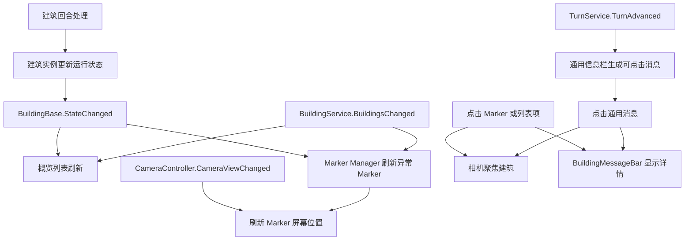

# 建筑 UI 表现流程 README

本文档梳理基础版建筑运行信息 UI 的完整链路：建筑实例如何产生状态，UI 如何显示概览列表、地图感叹号，以及点击后如何聚焦建筑并在消息栏显示详情。

## 目标

- 建筑异常状态由建筑实例自己提供，UI 只负责读取和表现。
- 建筑概览列表显示所有运行中建筑的状态，例如：
  - `1. 居民房LV1 无法连接资源 人口 4/5`
  - `2. 居民房LV1 正常 人口 5/5`
- 建筑出现异常状态时，在复用的 HUD Canvas 上显示一个感叹号 Marker。
- 点击感叹号或概览列表项后，相机移动到建筑，并在消息栏显示具体信息。
- 回合结算后，异常建筑会在通用信息栏生成可点击消息。
- Marker 不每帧刷新位置，只在建筑状态变化、建筑列表变化、相机视野变化时刷新。

## 核心原则

建筑数据和异常判断属于建筑系统，UI 不直接计算业务状态。

- 建筑实例负责维护人口、消耗失败、人口衰减、荒废等状态。
- `BuildingService.Buildings` 提供当前运行时建筑列表。
- UI 从建筑实例读取状态并格式化显示。
- HUD Canvas 被复用来承载地图 Marker，不需要为每个建筑单独配置 World Space Canvas。

## 数据来源

### 建筑运行状态

建筑如果需要向 UI 暴露异常状态，实现：

```csharp
IBuildingRuntimeStatusSource
```

该接口返回 `RuntimeStatuses`，每个状态由 `BuildingRuntimeStatus` 表示。

常见状态示例：

- `正常`
- `无法连接资源`
- `蔬菜不足`
- `消耗失败 1/3`
- `人口衰减 4/5`
- `荒废`

### 建筑概览数值

建筑如果需要在列表里显示关键数值，实现：

```csharp
IBuildingOverviewSource
```

例如居民房 LV1：

- `OverviewValueLabel`: `人口`
- `OverviewValueText`: `4/5`

UI 会组合成：

```text
居民房LV1 人口 4/5
```

## UI 如何拿到并解析建筑信息

UI 读取建筑信息的第一步，是拿到一个运行时建筑实例：

```csharp
BuildingBase building;
```

只要 UI 手上有 `BuildingBase`，就可以通过接口判断这个建筑支持哪些信息。

当前系统里，UI 拿到 `BuildingBase` 的常见入口有四种：

```text
1. 概览列表项：GamePanel_BuildingStatusOverviewItem.Bind(..., BuildingBase building, ...)
2. 地图感叹号：BuildingStatusMarker.Bind(BuildingBase building, ...)
3. 通用信息栏：BuildingEventMessage.Building
4. 直接点击建筑：BuildingBase.Clicked 事件会把自己传出来
```

重点：UI 不应该解析中文字符串。

错误思路：

```text
看到“人口衰减 4/5”这个字符串，再用字符串拆分判断人口衰减。
```

正确思路：

```text
判断 building 是否实现某个接口。
如果实现，就读取接口里的结构化字段。
```

例如：

```csharp
if (building is IBuildingRuntimeStatusSource statusSource)
{
    IReadOnlyList<BuildingRuntimeStatus> statuses = statusSource.RuntimeStatuses;
}
```

这句代码的意思是：

```text
如果这个建筑实现了 IBuildingRuntimeStatusSource，
就把它当成 statusSource 使用，
然后读取 RuntimeStatuses。
```

### 示例：点击建筑后打印信息

下面这个例子可以挂在建筑 prefab 根节点上。

它监听当前建筑的 `Clicked` 事件。玩家点击建筑时，脚本会读取这个建筑实现的接口，并把能读到的信息打印出来。

```csharp
using System.Collections.Generic;
using Landsong.BuildingSystem;
using UnityEngine;

public sealed class BuildingClickPrintExample : MonoBehaviour
{
    [SerializeField] private BuildingBase building;

    private void Awake()
    {
        // 如果 Inspector 没有手动指定，就从当前物体上找 BuildingBase。
        if (building == null)
        {
            building = GetComponent<BuildingBase>();
        }
    }

    private void OnEnable()
    {
        // BuildingBase 被点击时，会触发 Clicked 事件，并把被点击的建筑传出来。
        if (building != null)
        {
            building.Clicked += HandleBuildingClicked;
        }
    }

    private void OnDisable()
    {
        // 取消订阅，避免物体禁用后继续收到点击回调。
        if (building != null)
        {
            building.Clicked -= HandleBuildingClicked;
        }
    }

    private void HandleBuildingClicked(BuildingBase clickedBuilding)
    {
        PrintBuildingInfo(clickedBuilding);
    }

    private static void PrintBuildingInfo(BuildingBase targetBuilding)
    {
        if (targetBuilding == null)
        {
            return;
        }

        string buildingName = GetBuildingDisplayName(targetBuilding);
        Debug.Log($"建筑：{buildingName}", targetBuilding);

        PrintOverviewInfo(targetBuilding);
        PrintRuntimeStatuses(targetBuilding);
        PrintResourceConsumptions(targetBuilding);
        PrintResourceProductions(targetBuilding);
        PrintTaxRewards(targetBuilding);
    }

    private static string GetBuildingDisplayName(BuildingBase targetBuilding)
    {
        if (targetBuilding.Definition != null
            && !string.IsNullOrWhiteSpace(targetBuilding.Definition.DisplayName))
        {
            return targetBuilding.Definition.DisplayName;
        }

        return targetBuilding.name;
    }

    private static void PrintOverviewInfo(BuildingBase targetBuilding)
    {
        // 不是所有建筑都有概览信息，所以先判断接口。
        if (targetBuilding is not IBuildingOverviewSource overviewSource)
        {
            return;
        }

        Debug.Log(
            $"概览：{overviewSource.OverviewValueLabel} {overviewSource.OverviewValueText}",
            targetBuilding);
    }

    private static void PrintRuntimeStatuses(BuildingBase targetBuilding)
    {
        // 不是所有建筑都有异常状态，所以先判断接口。
        if (targetBuilding is not IBuildingRuntimeStatusSource statusSource)
        {
            Debug.Log("状态：正常", targetBuilding);
            return;
        }

        IReadOnlyList<BuildingRuntimeStatus> statuses = statusSource.RuntimeStatuses;
        if (statuses == null || statuses.Count == 0)
        {
            Debug.Log("状态：正常", targetBuilding);
            return;
        }

        for (int i = 0; i < statuses.Count; i++)
        {
            BuildingRuntimeStatus status = statuses[i];
            if (!status.IsValid)
            {
                continue;
            }

            string statusText = status.DisplayName;
            if (status.Target > 0)
            {
                statusText = $"{status.DisplayName} {status.Progress}/{status.Target}";
            }

            Debug.Log(
                $"状态：{statusText}，状态ID：{status.StatusId}，事件消息：{status.EventMessage}",
                targetBuilding);
        }
    }

    private static void PrintResourceConsumptions(BuildingBase targetBuilding)
    {
        if (targetBuilding is not IBuildingResourceConsumptionSource consumptionSource)
        {
            return;
        }

        PrintResourceChanges("预计消耗", consumptionSource.CurrentResourceConsumptions, targetBuilding);
        PrintResourceChanges("上回合消耗", consumptionSource.LastResourceConsumptions, targetBuilding);
    }

    private static void PrintResourceProductions(BuildingBase targetBuilding)
    {
        if (targetBuilding is not IBuildingResourceProductionSource productionSource)
        {
            return;
        }

        PrintResourceChanges("预计产出", productionSource.CurrentResourceProductions, targetBuilding);
        PrintResourceChanges("上回合产出", productionSource.LastResourceProductions, targetBuilding);
    }

    private static void PrintTaxRewards(BuildingBase targetBuilding)
    {
        if (targetBuilding is not IBuildingTaxSource taxSource)
        {
            return;
        }

        PrintResourceChanges("预计税收", taxSource.CurrentTaxRewards, targetBuilding);
        PrintResourceChanges("上回合税收", taxSource.LastTaxRewards, targetBuilding);
    }

    private static void PrintResourceChanges(
        string title,
        IReadOnlyList<BuildingResourceChange> changes,
        BuildingBase targetBuilding)
    {
        if (changes == null || changes.Count == 0)
        {
            Debug.Log($"{title}：无", targetBuilding);
            return;
        }

        for (int i = 0; i < changes.Count; i++)
        {
            BuildingResourceChange change = changes[i];
            if (!change.IsValid)
            {
                continue;
            }

            Debug.Log($"{title}：{change.ItemId} x{change.Amount}", targetBuilding);
        }
    }
}
```

### UI 面板中解析信息的最小流程

如果你不是在建筑 prefab 上写脚本，而是在某个 UI 面板里写详情显示，流程也是一样的。

UI 面板不需要知道“这是居民房还是伐木小屋”，只需要这样做：

```csharp
public void ShowBuildingDetail(BuildingBase building)
{
    if (building == null)
    {
        return;
    }

    if (building is IBuildingOverviewSource overviewSource)
    {
        string label = overviewSource.OverviewValueLabel;
        string value = overviewSource.OverviewValueText;

        // 这里可以把 label 和 value 填到 TMP_Text。
        Debug.Log($"{label}：{value}", building);
    }

    if (building is IBuildingRuntimeStatusSource statusSource)
    {
        IReadOnlyList<BuildingRuntimeStatus> statuses = statusSource.RuntimeStatuses;

        for (int i = 0; i < statuses.Count; i++)
        {
            BuildingRuntimeStatus status = statuses[i];
            if (!status.IsValid)
            {
                continue;
            }

            // 这里可以创建一行状态 UI。
            Debug.Log($"状态：{status.DisplayName}", building);
        }
    }
}
```

所以“解析信息”的本质不是解析文本，而是按接口读取结构化数据：

```text
BuildingBase
-> 判断是否实现 IBuildingOverviewSource
-> 判断是否实现 IBuildingRuntimeStatusSource
-> 判断是否实现 IBuildingResourceConsumptionSource
-> 判断是否实现 IBuildingResourceProductionSource
-> 判断是否实现 IBuildingTaxSource
-> 把读到的数据填到 UI
```

## UI 组件职责

### `BuildingStatusUIFormatter`

统一把建筑实例转换成 UI 可显示的数据。

负责内容：

- 建筑名
- 是否异常
- 主状态文本
- 概览数值文本
- 详情消息文本

列表、Marker、消息栏都应复用它，避免每个 UI 各自拼接文案。

### `GamePanel_BuildingStatusOverview`

建筑状态概览列表。

数据来源：

```csharp
GameSystem.Instance.Buildings.Buildings
```

刷新时机：

- 面板启用
- `BuildingService.BuildingsChanged`
- 建筑 `StateChanged`

点击列表项后可选行为：

- 聚焦相机到建筑
- 在 `BuildingMessageBar` 显示详情

### `GamePanel_BuildingStatusOverviewItem`

概览列表中的单行 UI。

建议预制体内容：

- 序号文本
- 建筑名称文本
- 状态文本
- 数值文本
- 异常标识节点
- 正常标识节点
- Button

### `BuildingStatusMarkerManager`

管理地图上的异常感叹号。

职责：

- 通过 `UIManager` 获取当前 `UIPanel_Game`
- 从 `UIPanel_Game` 所在层级获取 HUD Canvas
- 运行时创建 `BuildingStatusMarkerRoot`
- 把 Marker Root 放到 HUD Canvas 的第一位
- 为异常建筑创建 Marker
- 在相机视野变化时刷新 Marker 屏幕位置

Marker Manager 不需要每帧刷新。

### `BuildingStatusMarker`

单个感叹号 UI。

建议预制体内容：

- RectTransform
- Button
- TMP 文本，显示 `!`
- 可选背景图片

点击 Marker 后可选行为：

- 相机移动到建筑
- 消息栏显示建筑状态详情

### `GamePanel_BuildingMessageBar`

建筑消息栏。

由 `UIPanel_Game.BuildingMessageBar` 暴露给其他 UI 使用。

用途：

- 点击 Marker 后显示详情
- 点击概览列表项后显示详情
- 直接显示任意建筑相关消息

### `GamePanel_BuildingEventMessageList`

通用建筑事件消息列表。

数据来源：

```csharp
TurnService.TurnAdvanced
BuildingService.Buildings
IBuildingRuntimeStatusSource.RuntimeStatuses
```

职责：

- 回合推进完成后读取所有建筑的异常状态
- 为异常建筑生成一条或多条消息
- 每条消息保存来源建筑
- 点击消息后相机聚焦到来源建筑
- 点击消息后调用 `BuildingMessageBar.ShowBuildingMessage(building)` 显示详情

默认每个异常建筑每回合生成一条主消息。如果开启 `createOneMessagePerStatus`，则每个状态都会生成一条消息。

### `GamePanel_BuildingEventMessageItem`

通用信息栏中的单条消息 UI。

建议预制体内容：

- RectTransform
- Button
- TMP 文本

## 完整流程



## 预制体配置

### `UIPanel_Game`

需要配置或包含：

- `GamePanel_BuildingMessageBar`
- `GamePanel_BuildingEventMessageList`
- `GamePanel_BuildingStatusOverview`
- `BuildingStatusMarkerManager`

`UIPanel_Game` 需要把消息栏暴露为：

```csharp
public GamePanel_BuildingMessageBar BuildingMessageBar { get; }
```

### `GamePanel_BuildingMessageBar`

需要配置：

- Root 节点
- TMP 消息文本
- 可选空文本

### `GamePanel_BuildingEventMessageList`

需要配置：

- Item Root
- Item Prefab

选填：

- Item Pool Root
- Max Messages
- Newest Message First
- Create One Message Per Status
- Focus Building On Message Click
- Show Message Bar On Message Click
- Camera Controller
- Message Bar

Item Prefab 需要挂载 `GamePanel_BuildingEventMessageItem`，并配置：

- Button
- TMP 消息文本

### `GamePanel_BuildingStatusOverview`

需要配置：

- Item Root
- Item Prefab
- 可选 Item Pool Root
- 可选 Camera Controller
- 可选 Message Bar

如果不手动配置 Camera Controller 或 Message Bar，运行时可以通过现有服务和 `UIPanel_Game` 补齐。

### `GamePanel_BuildingStatusOverviewItem`

Item Prefab 需要配置：

- Button
- Index Label
- Building Name Label
- Status Label
- Value Label
- Abnormal Root
- Normal Root

### `BuildingStatusMarkerManager`

必须配置：

- Marker Prefab

选填字段放在 Inspector 的 `[FoldoutGroup("选填")]` 中：

- Marker World Offset
- Marker Screen Offset
- Hide When Offscreen
- Camera Controller
- Focus Building On Marker Click
- Show Message On Marker Click

Marker Canvas 不需要手动配置。运行时流程是：

1. 通过 `UIManager` 获取当前 `UIPanel_Game`。
2. 通过 `UIPanel_Game` 的父级 Canvas 复用 HUD Canvas。
3. 创建 `BuildingStatusMarkerRoot`。
4. 将 `BuildingStatusMarkerRoot` 放到 HUD Canvas 第一位。

## 代码案例：定义一条自定义建筑状态

目标：居民房 LV1 在上一回合发生人口衰减后，同时产生下面三种 UI 表现。

```text
1. 概览列表显示：居民房LV1 人口衰减 人口 4/5
2. 地图上显示感叹号
3. 通用信息栏新增一条消息：居民房人口衰减！
```

### 第 1 步：在建筑脚本里定义状态 ID

状态 ID 应该是稳定字符串，用于程序判断，不直接面向玩家。

```csharp
private const string StatusPopulationDecayed = "population_decayed";
```

### 第 2 步：在建筑脚本里保存运行时标记

这个标记表示上一回合是否发生了人口衰减。

```csharp
[SerializeField, ReadOnly] private bool lastTurnPopulationDecayed;
```

每回合开始处理前先清理上一回合临时状态：

```csharp
private void ClearLastTurnState()
{
    lastTurnPopulationDecayed = false;
}
```

### 第 3 步：业务发生时写入标记

人口衰减是居民房自己的业务逻辑，不应该写在 UI 里。

```csharp
private void DecayPopulation()
{
    // 记录衰减前的人口，用来判断这次操作是否真的导致人口下降。
    int previousPopulation = currentPopulation;

    // 人口最小不能低于 0。
    currentPopulation = Mathf.Max(0, currentPopulation - 1);

    // 这个 bool 是给 RuntimeStatuses 使用的状态标记。
    // true 表示“上一回合发生了人口衰减”，UI 会据此显示异常。
    lastTurnPopulationDecayed = currentPopulation < previousPopulation;

    if (lastTurnPopulationDecayed)
    {
        // 人口变化后，同步更新王朝/全局人口贡献。
        UpdatePopulationContribution();
    }
}
```

### 第 4 步：实现 `IBuildingRuntimeStatusSource`

建筑类实现接口：

```csharp
public class ResidentialHousingLV1 : BuildingBase, IBuildingRuntimeStatusSource
{
    public IReadOnlyList<BuildingRuntimeStatus> RuntimeStatuses => CreateRuntimeStatuses();
}
```

### 第 5 步：在 `RuntimeStatuses` 中返回状态

`BuildingRuntimeStatus` 的参数含义：

```csharp
new BuildingRuntimeStatus(
    statusId,      // 稳定 ID，给代码判断使用，例如 "population_decayed"
    displayName,   // 显示名称，给概览列表、Marker、详情栏使用，例如 "人口衰减"
    progress,      // 当前进度，例如当前人口 4
    target,        // 目标值，例如人口上限 5
    eventMessage); // 通用信息栏短消息，例如 "居民房人口衰减！"
```

居民房人口衰减示例：

```csharp
private IReadOnlyList<BuildingRuntimeStatus> CreateRuntimeStatuses()
{
    // 默认不创建 List。只有真的有状态要显示时才创建，避免每次读取都分配列表。
    List<BuildingRuntimeStatus> statuses = null;

    if (lastTurnPopulationDecayed)
    {
        // 创建一条“人口衰减”状态。
        BuildingRuntimeStatus populationDecayedStatus = new BuildingRuntimeStatus(
            StatusPopulationDecayed,
            "人口衰减",
            currentPopulation,
            maxPopulationContribution,
            "居民房人口衰减！");

        // 把有效状态加入列表。
        AddRuntimeStatus(ref statuses, populationDecayedStatus);
    }

    if (statuses == null)
    {
        // 没有任何异常状态时返回空数组。
        // UI 看到空列表，就会把建筑视为正常。
        return Array.Empty<BuildingRuntimeStatus>();
    }

    return statuses;
}
```

`AddRuntimeStatus` 不是 Unity 或 C# 内置方法，它只是建筑脚本里的一个本地辅助方法。

它的作用是：

- 如果传入的状态无效，就什么都不做。
- 如果状态有效，但列表还没有创建，就先创建列表。
- 最后把状态加入列表。

示例实现：

```csharp
private static void AddRuntimeStatus(
    ref List<BuildingRuntimeStatus> statuses,
    BuildingRuntimeStatus status)
{
    // StatusId 为空时，status.IsValid 会是 false。
    // 这可以避免 UI 收到没有意义的空状态。
    if (!status.IsValid)
    {
        return;
    }

    // statuses 使用延迟创建。
    // 没有状态时保持 null，最后直接返回 Array.Empty。
    if (statuses == null)
    {
        statuses = new List<BuildingRuntimeStatus>();
    }

    statuses.Add(status);
}
```

这条状态会被三个 UI 同时读取：

- 概览列表读取 `DisplayName`、`Progress`、`Target`
- Marker Manager 判断状态有效后显示感叹号
- 通用信息栏优先读取 `EventMessage`

### 第 6 步：保证状态变化后能通知 UI

回合系统调用：

```text
TurnService -> BuildingBase.ProcessTurn() -> OnTurn() -> NotifyStateChanged()
```

所以普通回合内的状态变化不需要手动调用 `NotifyStateChanged()`。

如果状态是在按钮、点击、调试命令等非回合流程中改变，需要在建筑脚本里手动调用：

```csharp
NotifyStateChanged();
```

### 第 7 步：通用信息栏如何生成消息

`GamePanel_BuildingEventMessageList` 监听：

```csharp
TurnService.TurnAdvanced
```

回合推进完成后，它会遍历：

```csharp
GameSystem.Instance.Buildings.Buildings
```

然后读取每个建筑的：

```csharp
IBuildingRuntimeStatusSource.RuntimeStatuses
```

如果状态里有 `EventMessage`，就直接显示这条消息：

```text
居民房人口衰减！
```

如果没有 `EventMessage`，则自动拼接：

```text
建筑显示名 + 状态显示名 + ！
```

例如：

```text
居民房LV1无法连接资源！
```

### 第 8 步：点击通用消息后的行为

每条消息会保存来源建筑：

```csharp
public BuildingBase Building { get; }
```

点击消息时：

```csharp
cameraController.FocusOnBuilding(building);
messageBar.ShowBuildingMessage(building);
```

最终表现：

```text
点击“居民房人口衰减！” -> 相机移动到居民房 -> 消息栏显示居民房详细状态
```

### 第 9 步：定义另一条自定义状态

例如想让伐木小屋在工人不足时显示：

```text
伐木小屋缺少工人！
```

代码只需要返回一条新的 `BuildingRuntimeStatus`：

```csharp
private const string StatusInsufficientWorkers = "insufficient_workers";

private IReadOnlyList<BuildingRuntimeStatus> CreateRuntimeStatuses()
{
    List<BuildingRuntimeStatus> statuses = null;

    if (currentWorkers < minimumWorkersForProduction)
    {
        // 当前工人数小于最低生产人数时，建筑进入“工人不足”状态。
        BuildingRuntimeStatus insufficientWorkersStatus = new BuildingRuntimeStatus(
            StatusInsufficientWorkers,
            "工人不足",
            currentWorkers,
            minimumWorkersForProduction,
            "伐木小屋缺少工人！");

        AddRuntimeStatus(ref statuses, insufficientWorkersStatus);
    }

    if (statuses == null)
    {
        return Array.Empty<BuildingRuntimeStatus>();
    }

    return statuses;
}
```

不要在 UI 里判断“伐木小屋是否缺工”。UI 只读取建筑暴露出来的状态。

## 扩展新建筑

新增建筑如果要接入这套 UI：

1. 在建筑脚本中维护自己的运行状态。
2. 实现 `IBuildingRuntimeStatusSource` 暴露异常状态。
3. 如需显示概览数值，实现 `IBuildingOverviewSource`。
4. 在状态变化后调用建筑的状态变化通知。
5. UI 会通过 `BuildingService.Buildings` 自动刷新列表和 Marker。

不要把具体业务判断写进 UI。例如“连续 3 回合消耗失败人口 -1”应该属于居民房脚本，不应该属于列表或 Marker。
