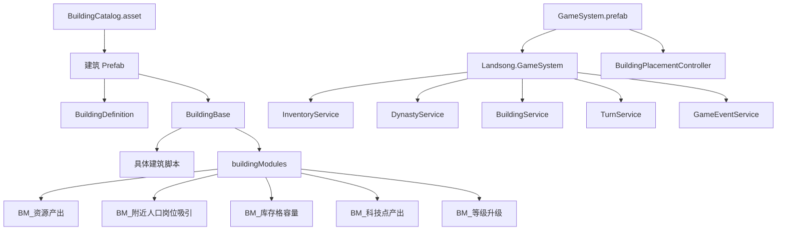
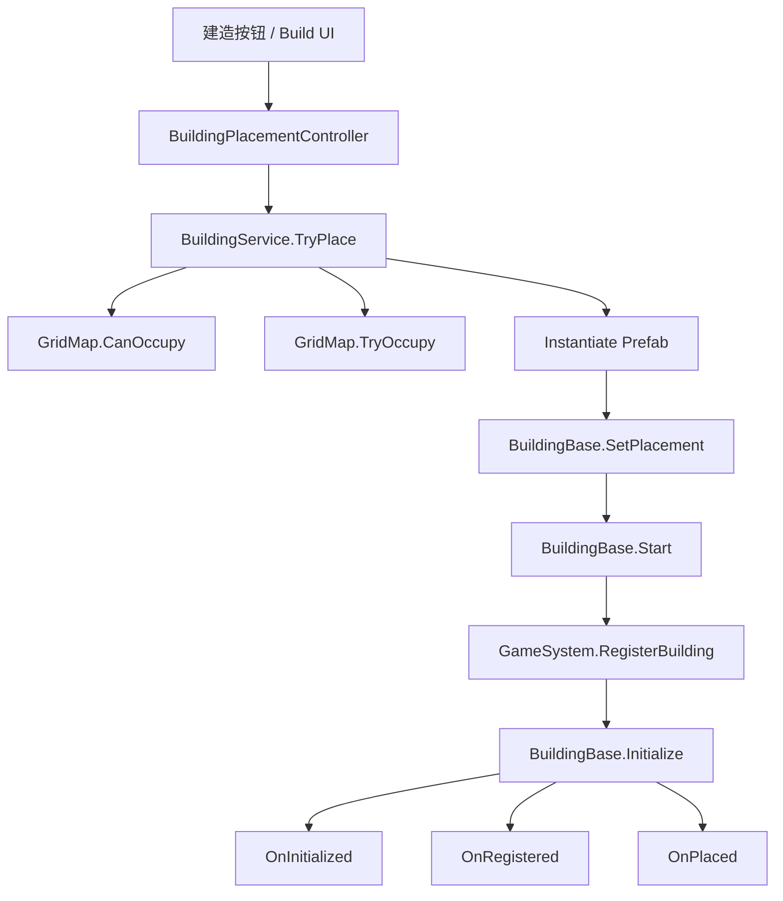
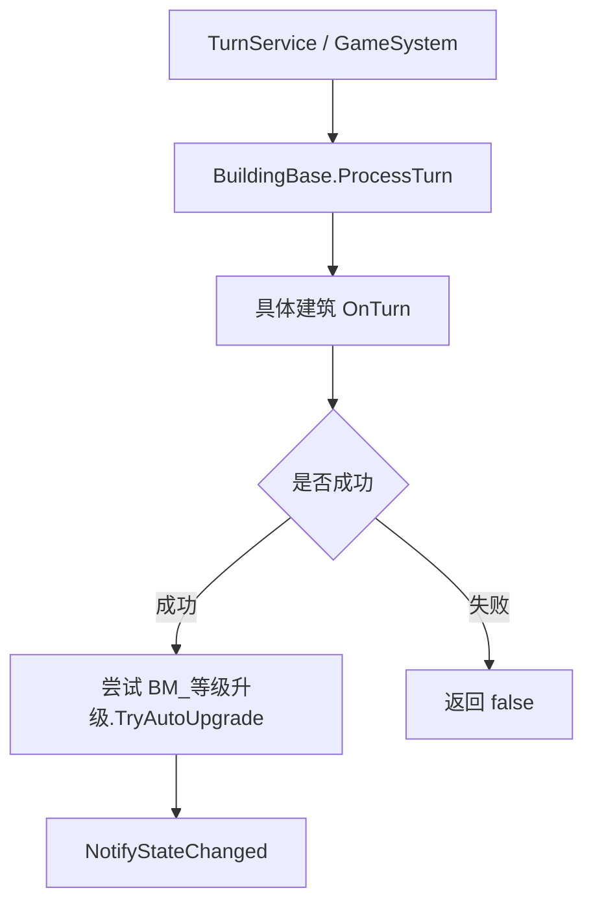
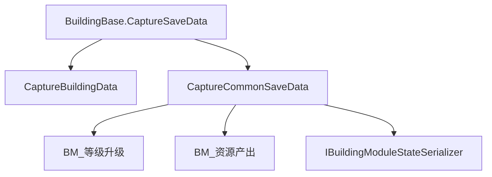

# 建筑架构 README

本文档说明 Landsong 当前建筑系统的实际架构。  
它关注的是：

- 运行时入口在哪里
- 静态配置放哪里
- 模块负责什么
- 具体建筑脚本负责什么
- 放置、回合、升级、存档、UI 各自的边界是什么

## 目的

- 统一“建筑系统”的架构认知。
- 减少新增建筑时把字段放错层、把逻辑写错位置的问题。
- 为后续扩展建筑、模块、详情 UI 和存档提供一致参考。

## 前置条件

阅读本文前，建议至少了解这些文件：

- `BuildingBase.cs`
- `BuildingDefinition.cs`
- `BuildingModules.cs`
- `BuildingService.cs`
- `BuildingAvailabilityEvaluator.cs`
- `BuildingPlacementController.cs`
- `BuildingJobSystem.cs`
- `BuildingSaveDataRegistry.cs`
- 代表性建筑脚本：
  - `LumberCabin.cs`
  - `ResidentialHousingLV0.cs`
  - `ResidentialHousingLV1.cs`
  - `PlayerHomeLV1.cs`
  - `FishingHutBuilding.cs`

## 当前核心结构

当前项目的建筑系统是：

- 以 `BuildingBase` 为统一运行时入口
- 以 `BuildingDefinition` 为静态定义
- 以 `BM_*` 模块承载可复用能力
- 以具体建筑脚本承载玩法逻辑
- 以服务层承载跨建筑聚合和全局流程

结论：

- **继承式运行时 + 模块化能力配置 + Prefab 参数化**
- 不是“二选一”的架构，而是分层组合

## 职责边界

### `BuildingDefinition`

定位：

- Prefab 级静态定义
- 只描述“这个建筑是什么”

适合放：

- `buildingId`
- `displayName`
- `category`
- `icon`
- `size`
- `requiredTerrainKeys`
- `movementResistance`
- `placementCosts`
- `visibleCondition`
- `availableCondition`
- `buildMenuSortOrder`
- `maxBuildCount`
- `buildLimitGroupId`
- `isDevelopmentCompleted`
- `uniqueDetailPanel`

不适合放：

- 当前工人
- 当前人口
- 当前经验
- 当前生产进度
- 上回合产出
- 是否荒废
- 是否自动升级
- 任何会随“建筑实例”变化的状态

### `BuildingBase`

定位：

- 所有建筑实例的统一运行时入口

当前已经承担的职责：

- 持有 `BuildingDefinition`
- 持有格子放置信息与占地 ID
- 持有 `buildingModules`
- 注册到 `GameSystem`
- 处理 `Initialize()`
- 驱动 `OnInitialized / OnRegistered / OnPlaced / OnTurn`
- 提供 `CaptureSaveData / RestoreSaveData`
- 聚合模块状态存档
- 提供 `GetOverviewInfo / GetRuntimeStatuses / GetFunctionBlockEntries`
- 处理公共状态，例如道路不通
- 统一点击/双击分发

不应该继续膨胀成：

- 所有建筑共享的大杂烩字段仓库
- 各种具体建筑独有状态的承载者

### `BuildingModuleBase`

定位：

- 多种建筑可复用、但不是所有建筑都需要的能力层

当前特点：

- 使用 `SerializeReference` 挂在 `buildingModules`
- 不是 `MonoBehaviour`
- 没有独立 `Update()` / `Start()`
- 默认只提供：
  - `Normalize()`
  - `AppendFunctionBlockEntries(...)`
  - `ModuleDescription`

适合放：

- 可复用能力配置
- 可复用说明数据
- 可复用的小型状态
- 可以由建筑脚本显式调用的能力逻辑

不适合放：

- 全局服务聚合
- 建筑独有的整套玩法状态机
- 隐式修改库存 / 王朝 / 场景对象的大流程

### 具体建筑脚本

定位：

- 描述“这个建筑怎么运作”

适合放：

- `OnTurn()` 的业务逻辑
- 独有运行时状态
- 对库存 / 王朝 / 事件系统的调用
- 独有异常状态
- 建筑自己的存档数据
- 建筑自己的概览信息和功能块逻辑

当前典型类：

- `ResidentialHousingLV0`
- `ResidentialHousingLV1`
- `LumberCabin`
- `FishingHutBuilding`
- `PlayerHomeLV1`

## 现有模块体系

### `BM_资源产出`

职责：

- 周期型资源生产
- 多个产出项
- 工人数 -> 产量表映射
- 当前预期产出
- 上次成功产出
- 生产进度

最适合：

- 伐木
- 捕鱼
- 工坊
- 农田成熟

### `BM_附近人口岗位吸引`

职责：

- 给岗位建筑提供“周围人口”的吸引力加成

依赖：

- `BuildingJobSystem.CountNearbyPopulation(...)`

### `BM_库存格容量`

职责：

- 建筑存在时提供额外库存格数

依赖：

- `GameSystem` 聚合所有已注册建筑模块

### `BM_科技点产出`

职责：

- 建筑成功完成回合后提供科技点
- 保存上回合科技点结果
- 支持模块状态序列化

### `BM_等级升级`

职责：

- 保存升级经验
- 判断升级条件
- 扣升级成本
- 执行建筑替换

## 服务层边界

### `BuildingService`

职责：

- 放置
- 批量放置
- 替换
- 拆除
- 删除
- 成本判定
- 建筑列表管理
- 数量限制统计

不负责：

- 具体建筑每回合产出
- 人口增长
- 税收
- UI 拼装

### `BuildingAvailabilityEvaluator`

职责：

- 把建筑在建造菜单中的状态统一为：
  - 是否可见
  - 是否开发完成
  - 是否解锁
  - 是否达到数量上限
  - 是否有材料

结论：

- 建造菜单层不要再重复手写一遍可建造判断。

### `BuildingPlacementController`

职责：

- 玩家输入
- 预览
- 高亮
- 确认放置
- 取消放置
- 批量道路放置

不负责：

- 建筑业务规则本身
- 人口/岗位/生产逻辑
- 升级逻辑

### `BuildingJobSystem`

职责：

- 岗位吸引力与稳定工人数公式
- 可用人口计算
- 建筑之间的 Manhattan 距离
- 附近人口统计
- 补贴相关推导

它是**纯计算/统计层**，适合持续扩展公式，但不适合直接持有建筑实例状态。

## 关键流程

### 放置流程

### 回合流程

### 存档流程

## 共享脚本 + Prefab 参数化的现状

当前仓库已经证明“一个脚本服务多个等级 Prefab”的路线是可行的。

### 典型案例：`LumberCabin`

- `伐木小屋LV1.prefab` 与 `伐木小屋LV2.prefab` 都使用 `LumberCabin`
- LV1 / LV2 的差异主要来自：
  - `maxWorkers`
  - 初始工人数
  - `BM_资源产出` 配置
  - `BM_等级升级` 配置
  - `BuildingDefinition`

这说明：

- 当等级差异以“参数变化”为主时，优先共享脚本。
- 当等级差异在“玩法状态机和业务流程”上已经明显分叉时，再考虑拆成不同脚本。

### 典型案例：住宅

住宅当前是两种路线并存：

- `ResidentialHousingLV0`：施工态，独立脚本
- `ResidentialHousingLV1`：完成态，独立脚本
- `ResidentialHousingLV2/LV3/LV4`：简化人口贡献脚本

这说明：

- 当阶段行为完全不同，拆脚本是合理的。
- 但后续如果希望 LV2+ 和 LV1 共享完整运营逻辑，仍然有整理空间。

## 配置资产边界

### `BuildingCatalog.asset`

职责：

- 建筑目录索引
- 供建造菜单和运行时按 `buildingId` 查找 Prefab

要求：

- 新建筑接入后应加入 Catalog
- `buildingId` 必须唯一

### `GameSystem.prefab`

职责：

- 场景级服务组合根
- 当前已经绑定：
  - `itemCatalog`
  - `technologyCatalog`
  - `buildingCatalog`
  - `BuildingPlacementController`

结论：

- 新建筑逻辑大多数无需改场景，只需要：
  - 配好 Prefab
  - 加到 Catalog
  - 让现有放置流程可以找到它

## 新能力放哪里

| 需求 | 推荐位置 |
| --- | --- |
| 所有建筑都要共享的生命周期、放置、模块入口 | `BuildingBase` |
| Prefab 级静态字段 | `BuildingDefinition` |
| 多种建筑共用的能力配置 | `BuildingModuleBase` 子类 |
| 具体建筑独有的回合行为 | 具体建筑脚本 |
| 跨建筑的统计与公式 | 静态系统 / 服务层 |
| UI 横向读取的数据契约 | 接口 |

实际判断标准：

- **如果只是“这个能力很多建筑会复用”**，优先模块。
- **如果是“这个建筑怎么活”**，优先具体建筑脚本。
- **如果是“整个游戏怎么算”**，优先服务或静态系统。

## 示例

### 适合做模块的能力

- 周期性资源产出
- 额外库存格
- 科技点产出
- 升级经验与替换目标
- 周边人口岗位加成

### 不适合做模块、而更适合放到建筑脚本里的能力

- 住宅的食物消耗失败 -> 人口衰减 -> 荒废状态机
- 捕鱼小屋的特殊捕获联动
- 皇宫的王朝注册
- 树木的双击受伤和倒下掉落

## 编辑器与使用步骤

### 新建筑接入的架构流程

1. 决定是**共享脚本**还是**新脚本**。
2. 配置 `BuildingDefinition`。
3. 配置 `buildingModules`。
4. 如果需要运行时状态，补 `BuildingDataBase` 数据类。
5. 接好 UI 输出入口：
   - `GetOverviewInfo`
   - `GetRuntimeStatuses`
   - `GetFunctionBlockEntries`
6. 加入 `BuildingCatalog.asset`。
7. 在 Unity Editor 验证：
   - 放置
   - 回合
   - 详情面板
   - 存档恢复
   - 升级替换

## 排错

### 字段越加越多，不知道放哪里

先问自己三件事：

1. 这是静态配置还是实例状态？
2. 是不是很多建筑都可能复用？
3. 它是“数据”还是“流程”？

如果答案分别是：

- 静态配置 -> `BuildingDefinition`
- 多建筑复用 -> 模块
- 建筑独有流程 -> 具体建筑脚本
- 全局聚合/公式 -> 服务或静态系统

### UI 开始出现大量 `if (building is Xxx)` 分支

说明架构正在退化。  
应回退到：

- 接口
- `GetFunctionBlockEntries()`
- `GetRuntimeStatuses()`
- 模块附加功能块

### 存档恢复后状态丢失

优先检查：

- 是否写了 `CaptureBuildingData / RestoreBuildingData`
- 是否补了 `[BuildingDataTypeId(...)]`
- 模块状态是否应实现 `IBuildingModuleStateSerializer`
- 是否依赖了没有纳入存档的模块运行时字段

## 变更记录

### 2026-07-06

- 按当前仓库真实实现重写架构说明。
- 明确当前是“继承 + 模块 + Prefab 参数化”的混合架构。
- 补充 `BuildingAvailabilityEvaluator`、`BuildingCatalog.asset`、`GameSystem.prefab` 的角色。
- 补充 `BuildingBase` 公共模块存档边界。
- 补充共享脚本 `LumberCabin` 的实际用法。
- 修正旧版本中对模块显示 API 的过时描述。
