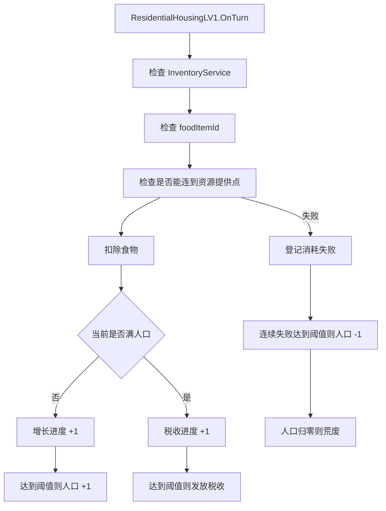
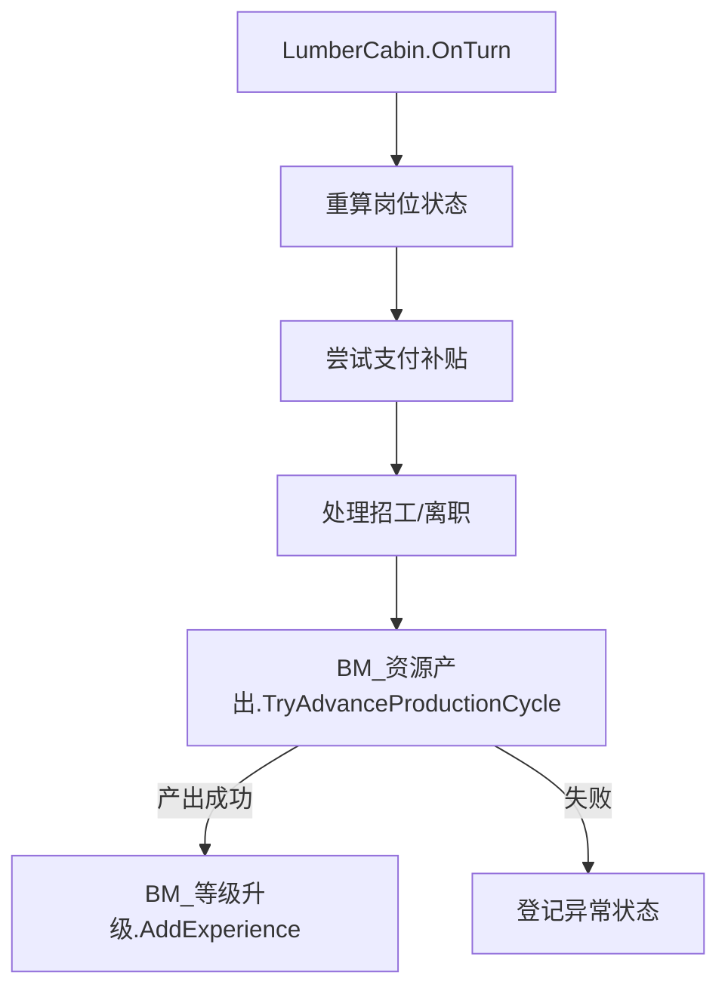

# 建筑说明

本文档说明 Landsong 当前仓库中的建筑实现现状。  
重点是**当前已经存在的建筑、它们各自的脚本职责、Prefab 差异、配置参数和编辑器接入方式**。

## 目的

- 快速了解仓库当前有哪些建筑类型。
- 说明各类建筑的脚本实现、Prefab 配置与运行方式。
- 为后续继续加建筑、调参数、修文档提供统一参考。

## 前置条件

当前建筑系统依赖这些基础对象：

- `GameSystem.prefab`
  - 挂载 `Landsong.GameSystem`
  - 挂载 `BuildingPlacementController`
  - 绑定 `itemCatalog`
  - 绑定 `technologyCatalog`
  - 绑定 `buildingCatalog`
- `BuildingCatalog.asset`
  - 当前登记 21 个建筑 Prefab
- `Assets/Landsong/Objects/Prefabs/建筑`
  - 当前建筑 Prefab 主目录
- `Game.unity`
  - 当前场景入口中实例化 `GameSystem` Prefab

## 建筑总览

### 当前 Prefab 目录中的主要建筑

当前可见建筑 Prefab 包括：

- `PlayerHomeLV1`
- `PlayerHomeLV2`
- `PlayerHomeLV3`
- `PlayerHomeLV4`
- `云中城LV0`
- `云中城LV1`
- `伐木小屋LV1`
- `伐木小屋LV2`
- `居民房lv0`
- `居民房LV1`
- `居民房LV2`
- `居民房LV3`
- `捕鱼小屋LV1`
- `捕鱼小屋LV2`
- `树1` ~ `树8`
- `路`

说明：

- `BuildingCatalog.asset` 已经登记这些建筑目录中的 Prefab。
- `Game.unity` 当前没有发现一批固定摆放在场景里的初始建筑；主入口仍然是运行时建筑放置与注册。

## 建筑分类说明

### 皇宫

#### `PlayerHomeLV1`

脚本：

- `PlayerHomeLV1`

作用：

- 固定提供 `10` 人口
- 通过 `BM_库存格容量` 提供 `5` 格库存
- 通过 `BM_科技点产出` 提供 `1` 科技点/回合
- 注册为王朝皇宫
- 作为资源提供点被住宅连接

实现要点：

- `CurrentPopulation = 10`
- `OnRegistered()` 中调用：
  - `EnsureInventorySlotCapacity()`
  - `EnsureTechnologyPointsPerTurn()`
  - `GameSystem.Dynasty.RegisterPalace(this)`
  - `GameSystem.Dynasty.SetPopulationContribution(this, 10)`
- Prefab 上 `isResourceProviderPoint = true`

适用文档结论：

- 如果未来要新增“皇宫系”建筑，优先把公共能力放到模块，王朝注册留在具体脚本。
- `PlayerHomeLV2/LV3/LV4` 当前实现较薄，主要用于皇宫注册，不等价于 LV1 的全部能力。

### 住宅

#### `ResidentialHousingLV0`

脚本：

- `Landsong.BuildingSystem.Buildings.ResidentialHousingLV0`

定位：

- **施工态住宅**
- 不是正式运行的居民房逻辑

行为：

- 维护 `exp`
- 三个施工回合分别消耗：
  - `firstTurnCost`
  - `secondTurnCost`
  - `thirdTurnCost`
- `exp >= 3` 后通过 `BuildingService.TryReplace(...)` 替换成 `ResidentialHousingLV1`

说明：

- 旧文档把“居民房LV0”对应脚本写成 `ResidentialHousingLV1` 是错误的。
- LV0 更接近“在建阶段”的建筑，而不是能正常供养人口的住宅。

#### `ResidentialHousingLV1`

脚本：

- `ResidentialHousingLV1`

定位：

- 当前仓库中的**主要正式住宅逻辑**

核心效果：

- 初始提供人口：`initialPopulationContribution`
- 最大人口：`maxPopulationContribution`
- 每回合消耗食物：当前人口数量对应的 `foodItemId`
- 只有当住宅能连接到**可达的资源提供点建筑**时，才允许正常运营
- 每累计 `growthIntervalTurns` 次成功消耗后，人口 +1
- 满人口后，每累计 `taxIntervalTurns` 次成功消耗后，产出 `currentPopulation` 数量的税收物品
- 连续失败达到 `consumptionFailureDecayThreshold` 后，人口 -1
- 人口减到 `0` 后进入荒废

资源连接说明：

- 不是简单的“固定半径检查”
- 当前实现会：
  - 收集所有 `IsResourceProviderPoint = true` 的建筑 footprint
  - 使用 `GridManhattanPathfinder.FindReachable(...)`
  - 结合 `BuildingActionPower` 和 `GridMap` 通行规则做可达性判断
- 因此道路、障碍和可通行代价都会影响住宅是否能连接资源点

运行状态：

- `isAbandoned`
- `growthConsumptionProgress`
- `taxConsumptionProgress`
- `consecutiveConsumptionFailures`
- `lastTurnHadResourceProvider`
- `lastTurnConsumptionFailed`
- `lastTurnProvidedTax`
- `lastAbnormalStatusId`

详情说明：

- `GetOverviewInfo()` 返回 `人口 当前/上限`
- `GetFunctionBlockEntries()` 会输出食物消耗
- `GetRuntimeStatuses()` 会输出：
  - 荒废
  - 消耗失败进度
  - 上次异常状态
  - 公共状态，例如道路不通

#### `ResidentialHousingLV2 / LV3 / LV4`

脚本：

- `ResidentialHousingLV2`
- `ResidentialHousingLV3`
- `ResidentialHousingLV4`

当前实现特征：

- 这些等级目前都是**简化版人口贡献建筑**
- 主要逻辑是：
  - `OnRegistered()` 向 `DynastyService` 注册人口贡献
  - `OnUnregistered()` 清除人口贡献

因此要注意：

- 这些等级当前并没有复刻 `ResidentialHousingLV1` 那一整套“食物消耗/增长/税收/荒废”逻辑
- 如果设计上希望 LV2+ 也具备完整住宅运营逻辑，当前代码还没有统一到这一层

### 岗位生产建筑

#### `LumberCabin`

Prefab：

- `伐木小屋LV1.prefab`
- `伐木小屋LV2.prefab`

脚本：

- **两个等级当前都使用 `LumberCabin`**

这是当前架构最关键的事实之一：

- LV1 / LV2 不是两个不同脚本
- 是**同一个脚本 + 不同 Prefab 参数 / 不同模块配置**

核心能力：

- 实现 `IBuildingWorkforceFundingSource`
- 支持岗位吸引力计算
- 支持稳定工人数计算
- 支持自动补贴满岗位
- 支持立即招工
- 使用 `BM_资源产出` 做周期性资源生产
- 使用 `BM_等级升级` 做经验与升级

默认产出逻辑：

- 产出物：`原木`
- 周期：默认 `3` 回合
- LV1 默认产量表：
  - `2` 工人 -> `1`
  - `3` 工人 -> `2`
- LV2 Prefab 中：
  - `maxWorkers = 5`
  - 同样使用 `BM_资源产出`
  - 产量表以 Prefab 模块配置为准

岗位公式来源：

- `BuildingJobSystem`

重要参数：

- `maxWorkers`
- `initialWorkersOnPlaced`
- `baseJobAttraction`
- `singleRecruitCost`
- `autoFullWorkerSubsidyEnabled`
- `targetStableWorkers`

重要实现点：

- 放置成功后可尝试发放初始工人
- 每回合会：
  - 重算岗位状态
  - 尝试支付补贴
  - 处理招工/离职
  - 调用 `BM_资源产出.TryAdvanceProductionCycle(...)`
  - 若产出成功则给 `BM_等级升级` 加经验

运行状态：

- `currentWorkers`
- `stableWorkers`
- `jobAttraction`
- `jobAttractionWithoutSubsidy`
- `targetSubsidyGoldPerTurn`
- `paidSubsidyGoldThisTurn`
- `lastTurnRecruitedWorker`
- `lastTurnSubsidyGoldMissing`

运行状态 UI：

- `工人不足`
- `缺工`
- `补贴金币不足`
- 上一回合业务异常状态
- 公共状态，例如道路不通

#### `FishingHutBuilding`

Prefab：

- `捕鱼小屋LV1.prefab`
- `捕鱼小屋LV2.prefab`

脚本：

- `FishingHutBuilding`

实现结构与 `LumberCabin` 类似：

- 也是岗位建筑
- 也是 `IBuildingWorkforceFundingSource`
- 也是通过 `BM_资源产出` 做主资源生产
- 也是通过 `BM_等级升级` 做升级经验

额外差异：

- 支持特殊捕获
- 使用参数：
  - `enableSpecialCatch`
  - `specialCatchMinimumWorkers`
  - `specialCatchChancePercent`
  - `specialCatchAmount`
- 特殊结果会额外产出 `黄金鱼`

### 道路与装饰/资源点建筑

#### `RoadBuilding`

脚本：

- `Landsong.BuildingSystem.Buildings.RoadBuilding`

当前实现：

- 逻辑极薄
- 主要价值在于 Prefab 的 `BuildingDefinition`、占格和移动阻力配置
- 通常用于通行/连通性

#### `Building_Tree`

脚本：

- `Building_Tree`

当前行为：

- 随机生命值
- 双击造成伤害
- 生命值归零后拆除
- 拆除时向库存发放：
  - `原木`
  - `树苗`

说明：

- 当前树木不是“纯装饰”，它已经有可交互和收益逻辑。
- 该类自带私有 `TreeData` 保存当前生命值。

### 占位型/壳类建筑

#### `CloudspirePalaceLV0 / CloudspirePalaceLV1`

当前实现：

- 生命周期都是空壳
- `OnTurn()` 直接返回 `true`
- 更像占位或等待后续玩法补全的建筑

## 实现数据流

### 住宅数据流

### 伐木小屋数据流

## 配置参数建议

### 住宅系典型配置

#### `居民房lv0.prefab`

重点检查：

- 三段施工消耗是否配置完整
- `residentialHousingLv1Prefab` 是否指向正确 Prefab
- `populationContribution` 是否保持为施工态预期值

#### `居民房LV1.prefab`

重点检查：

- `initialPopulationContribution`
- `maxPopulationContribution`
- `foodItemId`
- `growthIntervalTurns`
- `consumptionFailureDecayThreshold`
- `taxItemId`
- `taxIntervalTurns`

### 伐木小屋系典型配置

#### `伐木小屋LV1.prefab`

重点检查：

- `maxWorkers = 3`
- `initialWorkersOnPlaced = 2`
- `baseJobAttraction = 55`
- `singleRecruitCost = 10`
- `BM_资源产出.productionIntervalTurns = 3`
- `BM_等级升级` 是否配置：
  - `autoUpgradeEnabled`
  - `requiredExperience`
  - `upgradeTargetPrefab`

#### `伐木小屋LV2.prefab`

重点检查：

- `maxWorkers = 5`
- `initialWorkersOnPlaced = 2`
- `baseJobAttraction = 55`
- `singleRecruitCost = 10`
- 产量表与升级目标是否按 LV2 预期设置

### 皇宫系典型配置

#### `PlayerHomeLV1.prefab`

重点检查：

- `isResourceProviderPoint = true`
- `BM_库存格容量`
- `BM_科技点产出`

## 编辑器与使用步骤

### 查看一个建筑是“共享脚本”还是“独立脚本”

1. 打开对应 Prefab。
2. 看根节点上的脚本类型。
3. 再看 `BuildingDefinition` 和 `buildingModules`。

判断标准：

- 如果多个等级 Prefab 都指向同一个脚本，说明当前是“共享脚本 + 参数化”。
- 如果不同等级使用不同脚本，说明当前是“继承分级”。

### 新增建筑时的推荐流程

1. 从最接近的现有 Prefab 复制。
2. 决定复用还是新增脚本。
3. 配置 `BuildingDefinition`。
4. 配置 `buildingModules`。
5. 加入 `BuildingCatalog.asset`。
6. 在 Play 模式验证：
   - 能否放置
   - 能否注册
   - `GetOverviewInfo()` 是否正确
   - 详情面板是否显示功能块
   - 回合推进后是否更新状态
   - 存档恢复是否正常

## 排错

### 住宅一直显示无法连接资源

先查：

- 是否真的存在 `isResourceProviderPoint = true` 的建筑
- 资源提供点与住宅是否处于同一个 `GridMap`
- 道路/障碍是否阻断了可达路径
- `BuildingActionPower` 是否足够
- `GridMap.CanTraverse(...)` 与地形代价配置是否异常

### 伐木小屋不产出

先查：

- `currentWorkers` 是否达到最小产出工人数
- `BM_资源产出` 是否存在
- `productionIntervalTurns` 是否过大
- 物品 ID 是否有效
- `InventoryService` 是否存在且能写入库存

### 伐木小屋无法自动升级

先查：

- 是否真的在成功产出后累加了经验
- `BM_等级升级.requiredExperience`
- `upgradeTargetPrefab`
- `upgradeCondition`
- `upgradeCosts`

### 皇宫放了但住宅仍然找不到资源点

先查：

- 是否放的是 `PlayerHomeLV1`，而不是没有资源点标记的其他建筑
- 对应 Prefab 的 `isResourceProviderPoint` 是否被改掉
- 路径是否被阻断

## 变更记录

### 2026-07-06

- 按当前仓库真实类名和 Prefab 配置重写。
- 修正“居民房 LV0 对应脚本”错误。
- 修正“伐木小屋 LV1/LV2 是两个脚本”错误。
- 补充资源点连接实际是可达性搜索，不是简单固定半径判断。
- 补充 `PlayerHomeLV1`、`FishingHutBuilding`、`Building_Tree`、`RoadBuilding` 的实现说明。
- 补充 Prefab 与 Catalog 的编辑器配置要点。
