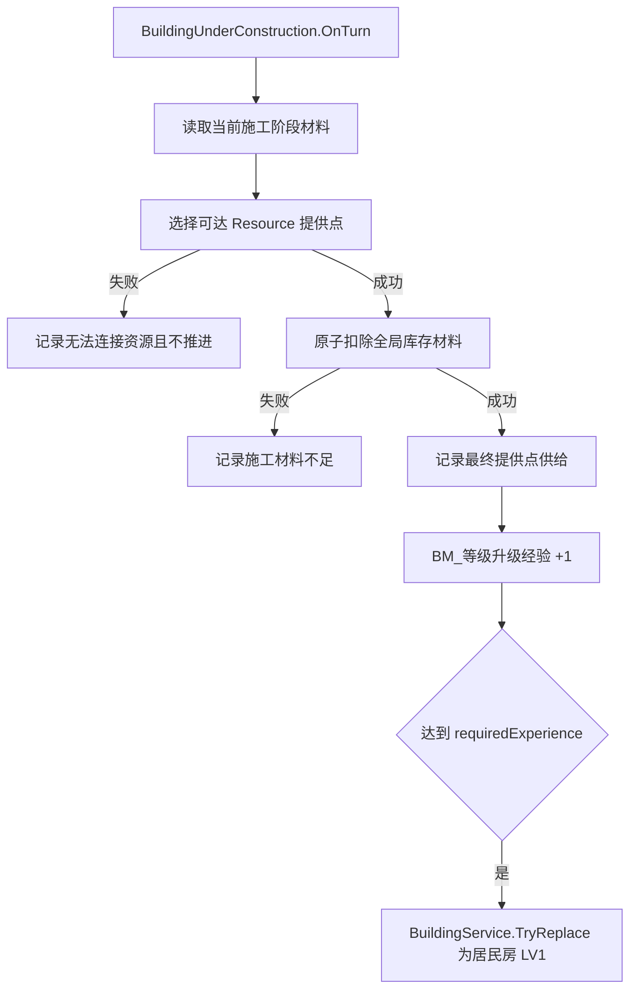
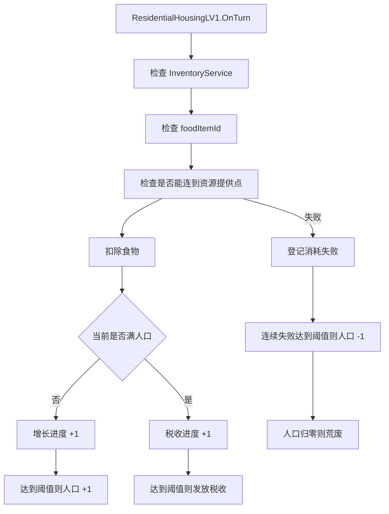
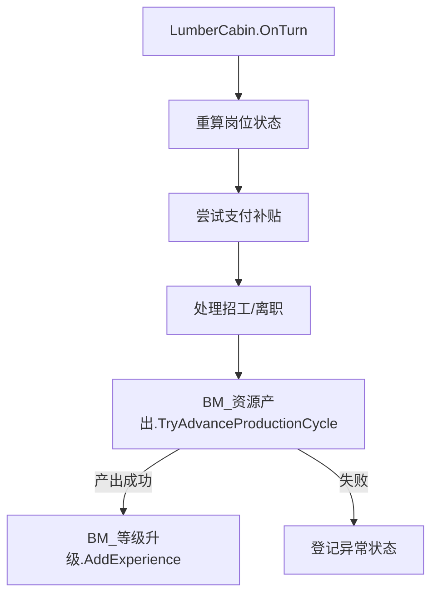

# 建筑说明

本文档说明 Landsong 当前仓库中的建筑实现现状。  
重点是**当前已经存在的建筑、它们各自的脚本职责、Prefab 差异、配置参数和编辑器接入方式**。

> 建筑开发的阅读顺序：先阅读 [AI_开发原则.md](AI_开发原则.md) 的“建筑系统入口”，再阅读 [AI_添加建筑规则.md](AI_添加建筑规则.md)；涉及占地、资源连接和放置范围时再阅读 [AI_地图系统.md](AI_地图系统.md)。本文件用于核对当前已有建筑与 Prefab 配置。

## 目的

- 快速了解仓库当前有哪些建筑类型。
- 说明各类建筑的脚本实现、Prefab 配置与运行方式。
- 为后续继续加建筑、调参数、修文档提供统一参考。

## 前置条件

当前建筑系统依赖这些基础对象：

- `GameSystem.prefab`
  - 挂载 `Landsong.GameSystem`
  - 挂载 `BuildingPlacementController`
  - 绑定 `itemCatalog`
  - 绑定 `technologyCatalog`
  - 绑定 `buildingCatalog`
- `BuildingCatalog.asset`
  - 当前登记 25 个建筑 Prefab
- `Assets/Landsong/Objects/Prefabs/建筑`
  - 当前建筑 Prefab 主目录
- `Game.unity`
  - 当前场景入口中实例化 `GameSystem` Prefab

## 建筑总览

### 当前 Prefab 目录中的主要建筑

当前可见建筑 Prefab 包括：

- `PlayerHomeLV1`
- `PlayerHomeLV2`
- `PlayerHomeLV3`
- `PlayerHomeLV4`
- `云中城LV0`
- `云中城LV1`
- `伐木小屋LV1`
- `伐木小屋LV2`
- `居民房lv0`
- `居民房LV1`
- `居民房LV2`
- `居民房LV3`
- `捕鱼小屋LV1`
- `捕鱼小屋LV2`
- `市场LV1`
- `树1` ~ `树8`
- `路`

说明：

- `BuildingCatalog.asset` 已经登记这些建筑目录中的 Prefab。
- `Game.unity` 不再直接保存固定初始建筑。初始建筑 Prefab Instance 位于各自的地图 Content Scene 的 `MapContentAuthoring` 层级下；当前 `TestMap.unity` 包含 `PlayerHomeLV1` 模板。
- Content Scene 中的 Prefab Instance 只用于策划预览，新游戏会通过 `BuildingService` 生成真正实例，读档则只恢复存档快照。

## 建筑分类说明

### 皇宫

#### `PlayerHomeLV1`

脚本：

- `PlayerHomeLV1`

作用：

- 固定提供 `10` 人口
- 通过 `BM_库存格容量` 提供 `5` 格库存
- 通过 `BM_科技点产出` 提供 `1` 科技点/回合
- 注册为王朝皇宫
- 作为资源提供点被住宅连接

实现要点：

- `CurrentPopulation = 10`
- `OnRegistered()` 中调用：
  - `EnsureInventorySlotCapacity()`
  - `EnsureTechnologyPointsPerTurn()`
  - `GameSystem.Dynasty.RegisterPalace(this)`
  - `GameSystem.Dynasty.SetPopulationContribution(this, 10)`
- Prefab 上 `isResourceProviderPoint = true`

适用文档结论：

- 如果未来要新增“皇宫系”建筑，优先把公共能力放到模块，王朝注册留在具体脚本。
- `PlayerHomeLV2/LV3/LV4` 当前实现较薄，主要用于皇宫注册，不等价于 LV1 的全部能力。

### 住宅

#### `居民房lv0.prefab`

脚本：

- `BuildingUnderConstruction`

定位：

- **施工态住宅**
- 不是正式运行的居民房逻辑

行为：

- 使用 `BM_施工材料消耗` 配置三个施工回合的材料消耗
- `BM_施工材料消耗` 自动声明需要 `Resource` 连接，因此放置时使用当前 Prefab 的 `buildingActionPower` 显示可达范围、提供点和最终路径
- 没有可达提供点仍允许放置；但回合施工时不会扣材料，也不会增加经验
- 使用 `BM_等级升级` 保存施工经验，当前 `requiredExperience = 3`
- 三次成功扣料后，由 `BuildingBase.ProcessTurn()` 触发自动升级并替换为 `居民房LV1`

说明：

- 旧的 `ResidentialHousingLV0` 专用脚本已不存在；现有 Prefab 已迁移至通用施工态实现。
- LV0 更接近“在建阶段”的建筑，而不是能正常供养人口的住宅。
- `ResourceConnection` 不是 Prefab 字段；它由施工模块的消费者声明和 `BuildingResourceProviderSystem` 在放置/运行时动态计算。

#### `ResidentialHousingLV1`

脚本：

- `ResidentialHousingLV1`

定位：

- 当前仓库中的**主要正式住宅逻辑**

核心效果：

- 初始提供人口：`initialPopulationContribution`
- 最大人口：`maxPopulationContribution`
- 每回合消耗食物：当前人口数量对应的 `foodItemId`
- 只有当住宅能连接到**可达的资源提供点建筑**时，才允许正常运营
- 每累计 `growthIntervalTurns` 次成功消耗后，人口 +1
- 满人口后，每累计 `taxIntervalTurns` 次成功消耗后，产出 `currentPopulation` 数量的税收物品
- 连续失败达到 `consumptionFailureDecayThreshold` 后，人口 -1
- 人口减到 `0` 后进入荒废

资源连接说明：

- 不是简单的“固定半径检查”
- 当前实现会：
  - 收集所有可用的 `IsResourceProviderPoint = true` 建筑 footprint
  - 使用 `GridManhattanPathfinder.FindReachable(...)`
  - 结合 `BuildingActionPower` 和 `GridMap` 通行规则做可达性判断
  - 在所有可达提供点中，优先选择 `resourceProviderPriority` 更高的建筑；同优先级时选择路径行动力代价更低的建筑
- 因此道路、障碍和可通行代价都会影响住宅是否能连接资源点
- 如果提供点实现了运行状态约束，例如市场未满岗位，则它不会参与本回合的供给选择。

运行状态：

- `isAbandoned`
- `growthConsumptionProgress`
- `taxConsumptionProgress`
- `consecutiveConsumptionFailures`
- `lastTurnHadResourceProvider`
- `lastTurnConsumptionFailed`
- `lastTurnProvidedTax`
- `lastAbnormalStatusId`

详情说明：

- `GetOverviewInfo()` 返回 `人口 当前/上限`
- `GetFunctionBlockEntries()` 会输出食物消耗
- `GetRuntimeStatuses()` 会输出：
  - 荒废
  - 消耗失败进度
  - 上次异常状态
  - 公共状态，例如道路不通

#### `ResidentialHousingLV2 / LV3 / LV4`

脚本：

- `ResidentialHousingLV2`
- `ResidentialHousingLV3`
- `ResidentialHousingLV4`

当前实现特征：

- 这些等级目前都是**简化版人口贡献建筑**
- 主要逻辑是：
  - `OnRegistered()` 向 `DynastyService` 注册人口贡献
  - `OnUnregistered()` 清除人口贡献

因此要注意：

- 这些等级当前并没有复刻 `ResidentialHousingLV1` 那一整套“食物消耗/增长/税收/荒废”逻辑
- 这些等级当前也没有实现 `IBuildingConnectionConsumer`，所以升级到 LV2+ 后不会继续要求 Resource 连接
- 如果设计上希望 LV2+ 也具备完整住宅运营逻辑，当前代码还没有统一到这一层

### 岗位生产建筑

#### `LumberCabin`

Prefab：

- `伐木小屋LV1.prefab`
- `伐木小屋LV2.prefab`

脚本：

- **两个等级当前都使用 `LumberCabin`**

这是当前架构最关键的事实之一：

- LV1 / LV2 不是两个不同脚本
- 是**同一个脚本 + 不同 Prefab 参数 / 不同模块配置**

核心能力：

- 实现 `IBuildingWorkforceFundingSource`
- 支持岗位吸引力计算
- 支持稳定工人数计算
- 支持自动补贴满岗位
- 支持立即招工
- 使用 `BM_资源产出` 做周期性资源生产
- 使用 `BM_等级升级` 做经验与升级

默认产出逻辑：

- 产出物：`原木`
- 周期：默认 `3` 回合
- LV1 默认产量表：
  - `2` 工人 -> `1`
  - `3` 工人 -> `2`
- LV2 Prefab 中：
  - `maxWorkers = 5`
  - 同样使用 `BM_资源产出`
  - 产量表以 Prefab 模块配置为准

岗位公式来源：

- `BuildingJobSystem`

重要参数：

- `maxWorkers`
- `initialWorkersOnPlaced`
- `baseJobAttraction`
- `singleRecruitCost`
- `autoFullWorkerSubsidyEnabled`
- `targetStableWorkers`

重要实现点：

- 放置成功后可尝试发放初始工人
- 每回合会：
  - 重算岗位状态
  - 尝试支付补贴
  - 处理招工/离职
  - 调用 `BM_资源产出.TryAdvanceProductionCycle(...)`
  - 若产出成功则给 `BM_等级升级` 加经验

运行状态：

- `currentWorkers`
- `stableWorkers`
- `jobAttraction`
- `jobAttractionWithoutSubsidy`
- `targetSubsidyGoldPerTurn`
- `paidSubsidyGoldThisTurn`
- `lastTurnRecruitedWorker`
- `lastTurnSubsidyGoldMissing`

运行状态 UI：

- `工人不足`
- `缺工`
- `补贴金币不足`
- 上一回合业务异常状态
- 公共状态，例如道路不通

#### `FishingHutBuilding`

Prefab：

- `捕鱼小屋LV1.prefab`
- `捕鱼小屋LV2.prefab`

脚本：

- `FishingHutBuilding`

实现结构与 `LumberCabin` 类似：

- 也是岗位建筑
- 也是 `IBuildingWorkforceFundingSource`
- 也是通过 `BM_资源产出` 做主资源生产
- 也是通过 `BM_等级升级` 做升级经验

额外差异：

- 支持特殊捕获
- 使用参数：
  - `enableSpecialCatch`
  - `specialCatchMinimumWorkers`
  - `specialCatchChancePercent`
  - `specialCatchAmount`
- 特殊结果会额外产出 `黄金鱼`

### 道路与装饰/资源点建筑

#### `Market`

Prefab：

- `市场LV1.prefab`

脚本：

- `Market`

核心效果：

- 固定需要 `3` 名工人；未满岗位时不作为资源提供点
- Prefab 配置 `isResourceProviderPoint = true`、`resourceProviderPriority = 10`
- 被其他建筑选为实际提供点且消费成功时，按 `物品数量 × ItemDefinition.BaseValue` 累计本回合经手价值
- 在整回合所有建筑处理完成后，向库存加入 `floor(经手总价值 × 10%)` 的金币

实现要点：

- 资源提供点的选择和供给记录由 `BuildingResourceProviderSystem` 统一处理；消费者不会按建筑处理顺序猜测提供点。
- `TurnService` 在回合开始时清空市场账本，在所有建筑处理完成后统一调用结算，因此市场排在住宅之前或之后都不会漏算。
- 市场通过 `BM_岗位运营` 获得岗位吸引力、招工与补贴能力；岗位 UI 通过统一解析入口读取模块。
- 伐木小屋、捕鱼小屋与农田也已在运行时通过同一岗位模块处理每回合岗位变化，再分别执行生产、特殊捕获或作物逻辑。
- 市场实现 `IBuildingTaxSource`，成功结算的金币会复用现有资源获得事件与飘字出口。

#### `RoadBuilding`

脚本：

- `Landsong.BuildingSystem.Buildings.RoadBuilding`

当前实现：

- 逻辑极薄
- 主要价值在于 Prefab 的 `BuildingDefinition`、占格和移动阻力配置
- 通常用于通行/连通性

#### `Building_Tree`

脚本：

- `Building_Tree`

当前行为：

- 随机生命值
- 双击造成伤害
- 生命值归零后拆除
- 拆除时向库存发放：
  - `原木`
  - `树苗`

说明：

- 当前树木不是“纯装饰”，它已经有可交互和收益逻辑。
- 该类自带私有 `TreeData` 保存当前生命值。

### 占位型/壳类建筑

#### `CloudspirePalaceLV0 / CloudspirePalaceLV1`

当前实现：

- 生命周期都是空壳
- `OnTurn()` 直接返回 `true`
- 更像占位或等待后续玩法补全的建筑

## 实现数据流

### 住宅施工态数据流

### 住宅数据流

### 伐木小屋数据流

## 配置参数建议

### 住宅系典型配置

#### `居民房lv0.prefab`

重点检查：

- `BM_施工材料消耗.turnCosts` 的三段施工消耗是否配置完整
- `BM_等级升级.requiredExperience = 3`
- `BM_等级升级.upgradeTargetPrefab` 是否指向 `居民房LV1.prefab`
- `buildingActionPower` 是否满足期望的资源连接距离；当前 Prefab 为 `100`
- 地图初始 PlayerHome/市场是否是有效 Resource 提供点

#### `居民房LV1.prefab`

重点检查：

- `initialPopulationContribution`
- `maxPopulationContribution`
- `foodItemId`
- `growthIntervalTurns`
- `consumptionFailureDecayThreshold`
- `taxItemId`
- `taxIntervalTurns`

### 伐木小屋系典型配置

#### `伐木小屋LV1.prefab`

重点检查：

- `maxWorkers = 3`
- `initialWorkersOnPlaced = 2`
- `baseJobAttraction = 55`
- `singleRecruitCost = 10`
- `BM_资源产出.productionIntervalTurns = 3`
- `BM_等级升级` 是否配置：
  - `autoUpgradeEnabled`
  - `requiredExperience`
  - `upgradeTargetPrefab`

#### `伐木小屋LV2.prefab`

重点检查：

- `maxWorkers = 5`
- `initialWorkersOnPlaced = 2`
- `baseJobAttraction = 55`
- `singleRecruitCost = 10`
- 产量表与升级目标是否按 LV2 预期设置

### 皇宫系典型配置

#### `PlayerHomeLV1.prefab`

重点检查：

- `isResourceProviderPoint = true`
- `BM_库存格容量`
- `BM_科技点产出`

### 后勤系典型配置

#### `市场LV1.prefab`

重点检查：

- `isResourceProviderPoint = true`
- `resourceProviderPriority = 10`（可按后续设计调整）
- `initialWorkersOnPlaced = 3`
- `baseJobAttraction = 100`
- `goldItemId = 金币`
- 已登记到 `BuildingCatalog.asset`

## 编辑器与使用步骤

### 查看一个建筑是“共享脚本”还是“独立脚本”

1. 打开对应 Prefab。
2. 看根节点上的脚本类型。
3. 再看 `BuildingDefinition` 和 `buildingModules`。

判断标准：

- 如果多个等级 Prefab 都指向同一个脚本，说明当前是“共享脚本 + 参数化”。
- 如果不同等级使用不同脚本，说明当前是“继承分级”。

### 新增建筑时的推荐流程

1. 从最接近的现有 Prefab 复制。
2. 决定复用还是新增脚本。
3. 配置 `BuildingDefinition`。
4. 配置 `buildingModules`。
5. 加入 `BuildingCatalog.asset`。
6. 在 Play 模式验证：
   - 能否放置
   - 能否注册
   - `GetOverviewInfo()` 是否正确
   - 详情面板是否显示功能块
   - 回合推进后是否更新状态
   - 存档恢复是否正常

## 排错

### 住宅一直显示无法连接资源

先查：

- 是否真的存在 `isResourceProviderPoint = true` 的建筑
- 资源提供点与住宅是否处于同一个 `GridMap`
- 道路/障碍是否阻断了可达路径
- `BuildingActionPower` 是否足够
- `GridMap.CanTraverse(...)` 与地形代价配置是否异常

### 居民房（在建）放置时没有资源范围

先查：

- Prefab 的 `BM_施工材料消耗` 是否存在且 `enabled = true`
- `BuildingActionPower` 是否大于 0
- `BuildingPlacementController` 的资源可达、可用提供点、最终提供点和最终路径通道是否完整绑定
- 当前运行的是否为已重新编译后的程序集；给模块新增接口时 Hot Reload 会要求 Unity 做完整重编译

只要施工模块启用，即使当前没有提供点，也应显示可达格；没有提供点只会让最终提供点和路径为空。

### 伐木小屋不产出

先查：

- `currentWorkers` 是否达到最小产出工人数
- `BM_资源产出` 是否存在
- `productionIntervalTurns` 是否过大
- 物品 ID 是否有效
- `InventoryService` 是否存在且能写入库存

### 伐木小屋无法自动升级

先查：

- 是否真的在成功产出后累加了经验
- `BM_等级升级.requiredExperience`
- `upgradeTargetPrefab`
- `upgradeCondition`
- `upgradeCosts`

### 皇宫放了但住宅仍然找不到资源点

先查：

- 是否放的是 `PlayerHomeLV1`，而不是没有资源点标记的其他建筑
- 对应 Prefab 的 `isResourceProviderPoint` 是否被改掉
- 路径是否被阻断

## 变更记录

### 2026-07-06

- 按当前仓库真实类名和 Prefab 配置重写。
- 修正“居民房 LV0 对应脚本”错误。
- 修正“伐木小屋 LV1/LV2 是两个脚本”错误。
- 补充资源点连接实际是可达性搜索，不是简单固定半径判断。
- 补充 `PlayerHomeLV1`、`FishingHutBuilding`、`Building_Tree`、`RoadBuilding` 的实现说明。
- 补充 Prefab 与 Catalog 的编辑器配置要点。

### 2026-07-11

- 新增 `市场LV1` Prefab：使用共享 `Market` 脚本，三工人资源提供点按实际经手资源的 `ItemDefinition.BaseValue` 总额在回合末结算 10% 金币。
- 资源提供点选择改为统一规则：先比优先级，再比可达路径行动力代价；完全并列时使用稳定键决胜。
- 修正文档中已过期的 `ResidentialHousingLV0` 专用脚本说明，现有 `居民房lv0.prefab` 使用通用 `BuildingUnderConstruction`。
- 更新 `BuildingCatalog.asset` 的实际登记数量为 25。

### 2026-07-13

- 同步 Content Scene 初始建筑机制；Game Scene 不再直接保存地图初始建筑。
- 居民房施工态的 `BM_施工材料消耗` 现在声明 Resource 连接，放置时显示范围/提供点/最终路径，运行时无提供点则不扣料、不加经验。
- 明确 `ResourceConnection` 是动态查询结果，`buildingActionPower` 是寻路预算而不是消费者开关。
- 记录当前 LV2～LV4 仍未继承 LV1 的完整住宅和 Resource 消费逻辑。
