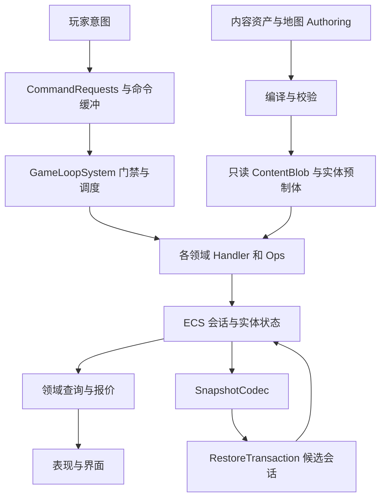

# 非 UI 架构说明与定向重构执行方案

审查日期：2026-09-12。对象：当前工作区源码、正式内容资产及 `Document` 中的设计文档。

本文保留 2026-09-12 实施前的静态审查、问题依据和原定批次，不作为当前缺陷仍然存在的断言。用户随后已授权实施：A–E 已完成，N01–N12 定向编辑器验证通过，最终 VerifyAll 为 40 套件 / 11627 断言 / 0 失败，四场景与研究 HUD 实际 Play 检查均通过。代码改动与验收结果统一见 [非 UI 重构执行记录](非UI重构执行记录.md)。

## 1. 结论与处理范围

**非 UI 部分不需要推倒重写。建议保留 ECS 权威状态、内容编译、命令调度、昼夜结算及存档恢复骨架，对“许可、奖励、效果计算”开展一次有边界的重构。**

目前不是缺少服务，而是部分已有服务的职责还没有命名清楚、约束没有统一。`ResearchOps`、`BuildingOps`、`InventoryOps` 等无状态方法已经承担领域服务的作用。把它们替换成若干持有独立字典的全局 Manager，会增加状态同步和存档问题。

需要处理的实际问题主要有四类：

1. 通用 `Entitlement(Definition, Level)` 同时表示建筑许可、永久 Buff、功能开关和若干完成标记，整数含义随内容种类变化。
2. 正常发放已有统一入口，但配置编译、运行时发放和存档导入没有共享完整的合法性约束。
3. 效果计算有多个入口，部分配置被允许填写，却没有进入对应的执行链。
4. 研究完成次数有两个读取来源，奖励事务与服务调用边界也需要进一步明确。

因此本文同时提供当前架构说明和分批执行方案。执行方案针对上述问题，不包含战斗框架替换、ECS 改 OOP、全面拆程序集、另建全局服务容器等工作。通用临时 Buff 实例系统属于有玩法需求后再实施的扩展，不是本次修复的前置条件。

## 2. 当前架构实际如何工作

### 2.1 数据、命令与生命周期

运行时事实保存在 ECS 组件和缓冲中。内容定义保存规则，不保存“这个玩家是否拥有”的状态；表现层读取结果和提交意图。稳定内容 ID、实体 `Identity`、会话 `SimulationOwner` 分别承担内容定位、实体持久身份和生命周期归属。

核心程序集 `Landsong.ECS` 不依赖 UI 或第三方 AI 执行逻辑；Authoring、AI 适配、Editor、Presentation、Application 各有边界。但部分核心数据声明仍引用 `Sirenix.OdinInspector` 的中文标注，不能把 asmdef 没有显式列出插件理解为完全不依赖 Odin。Simulation 与 Persistence 目前同属核心：恢复校验和经济预测需要调用领域逻辑，这种关系有实际用途，不应仅为了分层图更整齐而强行拆开。[S01][S02][S03]

应用侧由 GameApplicationFlow 管理场景切换与会话释放，EcsGameHost 提供显式地图和相机配置，SimulationLifetimeSystem 回收失去会话根的实体。当前依赖单默认 World、单活跃 Session；恢复事务同步运行于主线程，会根据事务前后的实体集合清理候选结果，不能跨 `await` 或同时创建无关实体。这是现有运行约束，不是支持多会话并行的通用框架。[S10][S19]

### 2.2 各领域的评价

| 部分 | 当前设计 | 判断与后续要求 |
| --- | --- | --- |
| 运行状态 | ECS 组件/缓冲为主要权威，Ops 通常显式接收 `EntityManager, root` | 保留；服务不能新增一份玩家状态 |
| 内容制作 | 强类型 Authoring 模块编译为统一规则和只读 Blob | 保留；补齐不同来源、不同效果的统一校验 |
| 玩家命令 | 命令缓冲、GameLoop 公共门禁、领域 Handler | 保留；公共服务不得绕过暂停、阶段和情报等门禁 |
| 建筑 | 建造/升级报价集中检查许可、成本和场地，执行复用检查 | 边界基本合理；蓝图服务只负责许可 |
| 库存与经济 | 资源事务、流水、确定顺序结算、候选状态预测 | 保留；奖励事务应明确包含哪些非库存状态 |
| 科技 | 查询、规划、队列、结算已集中到 ResearchOps | 保留流程；统一完成状态及恢复规则 |
| 奖励与许可 | 正常授权已汇入 Sim.Grant，共用 Entitlement | 需要具名领域入口和统一导入校验 |
| Buff 与其他效果 | 永久 Buff、政策、人才、建筑范围等由多个聚合入口计算 | 本次最需要治理的领域；存在配置与执行不一致 |
| 存档与恢复 | 版本化编码、内容签名、稳定 ID 重映射、隔离恢复后发布 | 保留框架；补许可表自身与跨表不变量 |
| 战斗与 AI | ECS 负责战斗事实，第三方 AI 通过适配程序集参与决策 | 本次抽查未发现必须替换核心的理由；效果重构须保留黄昏冻结规则 |
| 性能 | 稳定排序、实体扫描和完整快照预测有明确成本 | 属于需要测量的优化点，不能据此宣称当前帧率有问题 |

覆盖深度并不相同：许可、科技、奖励和效果链做了跨文件追踪；其他部分审查状态归属、依赖和关键事务，未对每个战斗分支、地图组合或整局行为做动态验证。

### 2.3 当前建筑蓝图已经基本符合“统一发放”

`Entitlement` 在会话根上保存 `Definition, Level`。`Sim.Grant` 对同一定义取最高等级；`Sim.HasGrant` 判断持有等级是否大于等于所需等级。[S03]

| 行为 | 当前实际规则 |
| --- | --- |
| 发放某建筑三级蓝图 | 记录最高许可等级 3，自动覆盖一、二级 |
| 再发同建筑一级蓝图 | 保持等级 3，不降级、不叠加数量 |
| 建造 | 查询一级许可，再检查资源、数量限制、位置等条件 |
| 升级二级建筑 | 查询三级许可，再检查成本、状态等条件 |
| 直接建造高级建筑 | 当前普通建造创建一级建筑；高级许可用于后续升级 |

没有发现“升级只检查当前等级、没有检查下一等级”的问题。[S04]

正常运行的授权来源共有七处调用：开局奖励、通用奖励、任务领奖完成、科技完成、远征成功、夜间奖励提交、人才任职的“内容许可”效果。它们均调用 `Sim.Grant`；存档恢复和事务回滚是专用写入，不属于额外发奖入口。[S03][S05]

当前扫描的正式资产中有 41 条蓝图奖励：一级 31 条、二级 6 条、三级 4 条，未发现现有配置超出建筑最高等级。这不代表所有允许配置的奖励来源都经过了同等校验。

### 2.4 科技并非一个解锁布尔值

应区分：科技功能是否开放、前置科技是否完成、是否可排队、研究进度、队列顺序、完成次数、首次奖励是否结算。当前 ResearchOps 已有对应查询和流程。[S06]

当前正常顺序为：命令排队 → 回合结算分配科研点 → 满进度时尝试首次奖励 → 奖励成功才记录完成并移出队列。仓库不足时保留满进度，阻止该项完成；取消研究保留已有进度。可重复科技只有首次完成发放首奖，是已有玩法规则。

`Entry`、`Queue`、`Completed`、`Quote`、`Path`、`Fingerprint` 当前是只读查询，未发现打开科技面板就初始化研究记录或改变进度的问题。真正需要改进的是完成次数同时来自 `ResearchEntry.Completions` 和科技 `Entitlement.Level`，见问题 N05。

### 2.5 “Buff”目前包含不同生命周期的效果来源

| 来源 | 权威状态 | 如何生效/失效 |
| --- | --- | --- |
| 永久 Buff 内容 | Buff 类型的 Entitlement | 获得后持有；同定义取最高许可，无通用撤销或到期实例 |
| 政策 | PolicyChoice 与当前条件 | 被采用且条件满足时生效，换政策或条件失效应停止贡献 |
| 人才与特性 | Talent、TraitEntry、任职及付薪状态 | 随招聘、岗位、付薪、特性激活等状态变化 |
| 王室与朝局 | CourtState、君主和特性 | 包括继承、动荡、遗产等；已有临时期限字段 |
| 建筑范围效果 | 建筑实体、等级、位置与工人条件 | 按范围和叠加规则查询；来源建筑变化影响结果 |
| 当夜军事属性 | NightPreparation 等冻结数据 | 在既定阶段读取冻结结果，不能任意改成每帧实时重算 |

项目并不是完全没有临时效果；缺少的是可复用的、带来源与目标的通用效果实例模型。现有永久 Buff 不能直接表达“持续三回合”“某个人离职即失效”“移出建筑范围即失效”。[S07][S08][S09]

## 3. 对服务化思路的具体建议

**采用领域服务查询与统一授权是合理方向，但不建议把所有状态都命名成蓝图。** 以下名称表达职责，落地时可以沿用 `*Ops`，无需仅为名字批量改动文件。

| 提议 | 建议边界 | 不应承担的工作 |
| --- | --- | --- |
| 蓝图服务 | `HasBlueprint(building, requiredLevel)`、`GrantBlueprint`；负责建筑定义、等级范围和持有规则 | 不决定是否有钱、位置是否可用或当前是否允许建造 |
| 功能服务 | `IsFeatureUnlocked`、`UnlockFeature` | 不与建筑数量上限、科技研究完成混成同一开关 |
| 科技服务 | 查询进度/前置/完成次数；提交研究命令；内部结算 | 不另存 `TechBlueprint.IsUnlocked/IsResearched` 字典 |
| 永久 Buff 服务 | 永久持有查询、受校验的发放；为效果查询提供一个来源 | 不接管政策选择、人才雇佣或建筑存在性 |
| 效果查询 | 根据目标、属性、阶段聚合有效来源，返回数值及来源说明 | 不发奖、不研究、不修改权威状态 |
| 奖励服务 | 统一奖励批次的合法性、事务、来源和提交结果 | 不把所有奖励强行采用同一种溢出或重复领取策略 |
| 前置条件查询 | 按类型查询建筑许可、科技完成或既有完成标记 | 不再让业务代码自己猜测 `Entitlement.Level` 的含义 |

服务接收当前模拟上下文。短期直接使用现有 `EntityManager, root` 即可；若引入 `SimulationContext`，它只封装当前操作上下文，不持有另一份库存、科技或 Buff 状态。

经济预测会在同一个 World 中构造候选 root，暂时隔离真实会话后运行相同结算；存档恢复也有候选状态。全局单例如果缓存旧 root、Entity、DynamicBuffer 或未隔离的效果结果，会破坏这一机制。因此新增服务不应自行全局查找并长期缓存会话，更不能在预测中发出真实存档、外部通知或不可回滚事件。[S10]

建筑等级默认继续采用“最高许可覆盖低等级”，这与当前内容和文档一致。若以后明确设计成逐级收集的独立卡片，应改成 `(建筑定义, 精确等级)` 集合；不能只把 `>=` 改成 `==`。旧存档只记录最高等级，兼容迁移需展开 `1..最高等级` 才能保留旧规则下已有权限。

## 4. 发现的问题与证据

优先级“先修”表示应在继续扩展相关内容前处理；“随后治理”表示当前正式流程有可用实现，但边界容易被后续代码绕过。没有证据表明这些问题已经造成当前玩家存档损坏。

### N01｜先修：固定产出加成的通配目标不生效

作者字段明确允许“指定建筑（空＝全部）”。编译后空建筑是 `Secondary=-1`，生产结算却只接受 `term.Secondary == 当前建筑定义`，因此通配条目不会生效。[S11]

这是配置契约与执行实现的确定矛盾。目前正式 Buff 的固定产出条目绑定采石场，因此这项资产没有触发通配错误。修复必须覆盖“指定建筑”和“全部建筑”两个分支，不能只调整显示文字掩盖规则。

### N02｜先修：允许配置的效果来源与实际消费链不一致

固定产出配置允许 Buff、Policy、RoyalTrait、Talent、TalentSlot；实际固定产出计算只遍历 Buff 许可。配置在政策或人才上可能成功编译，但不会进入这段正式生产计算。[S11]

普通数值主要走 `Sim.Modifier`，军事额外在 `MilitaryOps` 中收集科技和运营建筑；情报、科研固定加成、范围效果又有独立路径。这些专用计算有合理的目标和时机差异，但允许哪些来源、如何判断生效缺少统一契约，已经产生上述遗漏。[S03][S07][S09][S12]

补查还发现以下同类错位，均须进入支持表和对应回归：

| 配置能力 | 当前执行入口的限制 |
| --- | --- |
| Buff/人才等可配置科研固定加成、阴谋风险 | CourtOps 的这两项只使用王室/政策聚合，未收集永久 Buff 和在岗人才 |
| Buff/政策等可配置自然死亡风险 | 当事人的死亡风险只使用其自身激活特性，没有读取这些全局来源 |
| TalentSlot 可配置多种通用修正 | Sim.Modifier 使用岗位检查人才资格，但实际读取人才定义与特性，没有读取岗位定义的修正规则 |

这些证据说明支持声明与执行集合不一致；最终应支持“全局风险”还是只允许“个人风险”，需要写入规则契约，不能盲目把所有来源都相加。当前两项正式 Buff 分别是损耗减免和指定采石场的固定产出，不能据这些扩展缺口声称它们的正常效果全部失效。

治理时先建立“效果类型 × 来源 × 目标 × 生效阶段”支持表：应该支持的补实现，明确不支持的在 Authoring 编译时报错。不能为消除所有分支，直接把政策、建筑和人才都永久 Grant 一遍。

### N03｜先修：奖励的等级和内容类型校验不一致

通用 `WriteRewards` 主要校验目标内容种类，将 `GrantedLevel` 写入 `Rule.Amount`。开局、科技、任务另有正等级/建筑上限检查；远征、敌人、访客、掉落等来源没有共享同一套完整检查。[S13]

因此可以配置出合法目标但等级为零、负数或超过建筑上限的奖励：部分来源会拒绝，部分来源会进入执行。运行时又通过 `max(1, Amount)` 把非法低值改成一级，超上限值则可能直接存入许可。这里是源码可推导的校验缺口；当前 41 条蓝图资产未发现命中。

人才的“内容许可”效果同样直接 Grant，目标字段缺少对应的领域类型限制；计算结果为零也可能变成一级授权。当前正式资产未发现使用这类效果，属于尚未被内容触发的风险。[S14]

应建立统一授权校验，同时供内容编译、奖励提交和导入使用。错误应指向来源资产、条目、目标和非法数值，不能默默修正成另一项合法奖励。

### N04｜先修：存档恢复缺少许可表自身校验

现有恢复会验证内容签名、重映射内容 ID，并在验证后进入 RestoreTransaction。但 `Grants` 主要进行 Definition 重映射，研究校验只检查研究行与许可的关联，没有完整检查许可定义、唯一性、合法类型、正等级和各类型上限。[S15]

例如已解码快照中加入重复的 Buff 许可，当前许可校验不会专门拒绝；`Sim.Modifier` 又按每条许可累加，因此可推导出重复效果。非法负定义也没有被许可专用校验拦截。本轮未执行构造快照复现。

修复应放在统一的状态导入与验证边界。恢复是导入事实，不是重新播放奖励；不能靠重放 Grant 顺带发奖或补发科技首次奖励。新增根组件/缓冲还必须登记到 RestoreTransaction 的完整回滚覆盖中。

### N05｜先修：科技完成次数有双重读取来源

`ResearchOps.Completed` 取研究行完成次数与科技许可等级的最大值。`ValidateState` 只要求完成研究行有足够许可，没有反向要求科技许可与研究记录一致。[S06]

当前正常研究会同步写两处，没有发现正常研究链重复发首奖。但是只有科技许可、没有研究行的状态也会视为完成；可重复科技许可若为 `int.MaxValue` 且研究行为空，可越过现有这项校验，并在后续完成次数 `checked(+1)` 时溢出。这是非法输入防护缺口，不是已经复现的正常局故障。

推荐目标：`ResearchEntry.Completions` 成为科技完成次数的唯一领域权威。旧版只有科技许可的合法状态，在导入阶段按明确规则归一化为研究行；运行期间不再到两处取最大值。过渡期如保留科技许可用于旧格式兼容，应视为派生投影，并校验其与研究完成次数一致。

涉及科技前置、情报、军事加成、夜间条件等消费者必须一起迁移到科技查询。否则只修改 `Completed` 会让其他仍读 `HasGrant` 的系统得到不同答案。

### N06｜随后治理：通用授权表承载了太多业务含义

同一 `Level` 当前可以表示建筑最高许可等级、科技完成次数、永久 Buff 等级、功能许可、任务领奖完成或远征成功。存储结构复用本身不必立刻废弃；问题在于业务调用只写 `Grant/HasGrant`，无法从接口看出约束。[S03][S05]

第一步保留已有表和快照布局，引入 `GrantBlueprint`、`UnlockFeature`、`GrantPermanentBuff`、`RecordQuestClaim` 等具名操作，并将裸写入限制到内部。任务完成、远征成功是事实记录，不应包装成给玩家发了一张“任务蓝图”。

后续只有在独立生命周期、撤销、次数或数据结构要求不同的情况下才拆状态表。接口有不同领域含义，并不意味着必须立刻创建等量的程序集、单例和仓库。

### N07｜随后治理：效果等级与作用域缺少完整定义

当前普通 Buff 修正项多数没有逐级字段，许可等级不等于效果强度或层数。不能因此宣称“高级普通 Buff 效果全部提前生效”。但 `PassiveIntelligence.Level` 可以配置，非建筑情报来源却固定按等级 1 查询，没有使用持有等级；高级情报条目的生效语义不完整。[S12]

效果接口需要区分固定值、比例值、建筑目标、物品目标、全局目标及等级筛选。例如固定产出有“物品＋建筑”两个维度，不能只用一个 `target` 整数完成所有匹配。当前范围效果还支持求和、同类最高、组内最高，应保留这些差异。[S09]

### N08｜随后治理：统一写入口还不等于完整奖励事务

`ProgressionOps.Reward` 先尝试所有物品，成功后才 Grant；正常容量失败能回滚库存且不会提前泄漏许可。这部分设计应保留。[S05]

但 InventoryTransaction 的范围是库存、待入库及流水；夜间奖励提交另外备份许可和战报用于异常回滚。两处对“整个奖励批次”的边界不同。如果新服务引入校验异常、完成记录和提交事件，需要把这些状态一起纳入事务，而不能认为调用了统一 Grant 就已经原子化。[S16]

奖励策略也要保留区别：科技首次奖励要求整批可放入；夜间奖励可进入待入库；完成标记和首次奖励有来源特定的重复提交规则。应统一提交机制，明确策略参数，不统一成无条件允许溢出或一律重新发放。

### N09｜随后治理：通用工具反向承担上层领域职责

`Sim` 同时负责 root、实体检索、内容访问、随机数、ID、事件、人口、授权和全局效果；其中 Modifier 又调用 CourtOps、SocialOps、DynastyOps。上层领域普遍依赖 Sim，Sim 又认识这些领域，形成源码职责上的互相依赖。[S03]

这不是程序集循环，也没有据此发现无限递归。风险是新增一种效果需要持续修改通用工具，并且难以单独确认调用代价。建议把基础访问与授权、效果聚合分开；ProgressionOps 中奖励、前置条件和任务职责也可沿同样边界拆出。拆分应服务于 N01–N08，不以文件数量为验收标准。

### N10｜明确契约：外部查询和内部执行不是同一个入口

研究 `Editable` 检查白天、节点准备与科技功能许可；暂停和情报模式等由 GameLoop 的外层控制。因此新服务如果公开直接执行 `ResearchOps.Command/Plan`，可能绕过原有玩家命令约束。[S02][S06]

建议外部只提交领域命令，由统一命令边界处理；查询返回可用性和具体原因；内部结算操作单独限制可见性与调用方。不得把玩家“白天可编辑”的限制直接复用到回合结算，后者合法运行于 Settlement。

另一个需要写明的策略是自定义目录：通用 FeatureOps 在找不到功能定义时返回 false，ResearchOps 找不到科技功能定义时按兼容策略返回 true。正式目录正常；整理服务时应显式保留或配置这一差异，不能悄悄改变扩展目录行为。[S17]

### N11｜边界补强：禁用实体可能被释放检查遗漏

SimulationLifetimeSystem 与 GameApplicationFlow.Released 使用默认 ECS 查询，不包含 Disabled 实体。如果一个长期禁用的运行实体失去 owner，它可能不被清理，释放检查也可能看不到它。[S19]

当前生产代码相关禁用主要发生在同步 RestoreTransaction 内，尚未证实正常退出有这类泄漏。建议补包含 Disabled 的所有权清理/审计，以及“禁用实体的根被销毁后再进入新会话”的回归。事务中的临时禁用必须保持现有隔离语义，不能让清理过程误删正在准备恢复的原实体。

### N12｜边界补强：入夜准备的部分修改发生在事务前

NightEntryOps.Begin 在捕获快照和构造恢复事务之前调用 `ReconcileQuestContainers`。如果当时存在失效承接槽的任务，协调过程可扣罚并销毁任务；之后入夜预览取消或准备失败，不会回滚这一步。[S20]

正常命令通常已经提前协调任务，不能因此断言每次取消入夜都会扣钱。需要明确“开始入夜准备”是否允许这样的真实副作用。建议把这一协调纳入候选事务，或在进入准备前以独立领域操作完成并明确其语义；默认采用前者，以保持预览取消不改变玩法状态的契约。

## 5. 建议的效果查询模型

先收拢查询，不先建设通用效果编辑器或全量 Buff 实例系统。

一次效果查询至少明确：当前会话、目标实体/建筑定义/物品定义、效果类型、读取阶段。结果包含固定贡献、比例贡献、最终采用的来源及被排除原因。数值与解释由同一份贡献计算产生。

来源适配可以复用现有 Ops：永久 Buff 读取许可，政策查询 PolicyActive，人才查询付薪/任职/特性，王室查询 CourtState，范围效果复用 SpatialOps。效果聚合层不负责修改这些来源的状态，也不反向调用奖励服务。

第一阶段按需计算即可，不增加长生命周期缓存。如果后续测量证明需要缓存，应明确依赖版本和失效时机：授权、研究完成、换政策、任职/付薪、特性变化、建筑移动/运营状态、回合变化、存档恢复、会话释放。候选预测与真实会话不能共用未隔离的缓存。

如未来确实需要毒、祝福、持续数回合等通用实例，再引入带稳定实例 ID、效果定义、来源、目标、开始/结束时机、层数和叠加组的 ECS 数据。永久获得和临时激活仍是不同操作；同定义重发究竟取最高、刷新期限还是叠层，由规则决定。

## 6. 分批执行方案

以下是原定批次及依赖，实际落盘与验收状态以 [执行记录](非UI重构执行记录.md) 为准。默认保留现行最高等级蓝图、科技首次发奖、奖励溢出策略、确定性结算顺序与当夜军事冻结规则。原计划逐批验证；实际关联约束与事务有交叉实现，未运行的检查不能补记为已通过。按用户要求不安排 Player 或构建测试。

### 批次 A：统一约束，修正已确定的边界缺陷

范围：N01、N03、N04、N11、N12，以及 N05 的极值保护；明确 N02 当前支持表，来源聚合扩充留到批次 C。

1. 提取统一许可与奖励校验：定义有效、类型允许、等级为正、建筑等级不超过上限、功能/完成标记遵循各自约束。Buff 等级上限应从其实际契约定义，不能误套建筑等级上限。
2. 让所有配置来源使用同一校验；人才“内容许可”明确允许类型与数值要求。运行时先对整批奖励做预检，并把最小许可回滚保障前移到本批，避免后一个许可拒绝时留下前一个许可。完成这些保护后，再删除用 `max(1, …)` 掩盖非法配置的行为；保留明确的旧版导入规则。
3. 增加许可导入校验：重复、无效定义、非法类型/等级和极值，并保留现有研究行到许可的单向关系。此批不直接把“只有科技许可、没有研究行”一律判为非法；反向一致性收紧与批次 D 的版本识别和归一化一起实施，顺序是先迁移、后验证新不变量。
4. 修正固定产出通配目标。对目前没有执行支持的来源增加明确编译拒绝；批次 C 补齐约定支持的聚合后，再解除对应限制。同步记录受影响资产，确保现有正式内容不因限制被意外阻断。
5. 补 N11 的禁用实体所有权清理边界；将 N12 的入夜前任务协调纳入候选事务，并校验确认指纹与任务容量结果仍一致。

验收：同一非法奖励放到开局、科技、任务、远征、敌人/掉落等来源都能被拒绝；后一个奖励非法或提交失败时，前面的库存和许可不残留；当前正式资产全部通过；同一固定产出分别配置全建筑和指定建筑得到预期值；非法快照拒绝后原会话快照与实体归属不变；重复 Buff 不能通过导入叠加；既有合法兼容状态在本批仍可读取。

边界验收：禁用孤儿被清理且不干扰正在运行的同步恢复；已有失效任务时取消入夜或注入准备失败，玩法快照保持不变；成功入夜时任务惩罚只提交一次。

### 批次 B：建立具名服务边界，收拢奖励提交

依赖：批次 A 的统一约束。

1. 增加蓝图、功能、永久 Buff、完成标记的具名查询和内部修改入口；初期继续复用 Entitlement 存储。
2. 迁移全部正常发放来源和许可查询调用方，裸 Grant 成为内部存储操作；恢复/回滚走专用导入，不重放发奖。
3. 在批次 A 的预检与最小回滚保护上提取 RewardBatch：明确来源、目标、溢出策略、是否首次、完成标记。把库存、许可、相关记录及提交事件一起纳入完整事务设计。
4. 外部修改继续经过命令边界。查询只读，事件在整批成功后发布；失败不得留下完成标记、流水或可被外部观察的半批结果。

验收：蓝图重复发放不降级、不叠数量；当前等级＋1 升级检查保持；科技仓库不足不完成、不授权；夜间奖励仍进入待入库并保持幂等；在提交中间注入失败后，库存、许可、流水和相关完成状态均回滚；暂停/阶段/情报门禁不能被新外部接口绕过。

### 批次 C：收拢效果来源和解释

依赖：批次 B 的永久 Buff 查询与授权边界。

1. 建立效果支持表和查询上下文，区分固定值、比例值、目标及生效时机。
2. 依次迁移生产、军事、科研、情报到共同的来源与匹配规则；保留范围效果叠加算法，保留军事冻结边界。
3. 按支持表覆盖政策、人才、特性、岗位及科技来源；无法解释或没有执行意义的配置在编译时拒绝。
4. 将 Sim.Modifier 降为过渡转发后移除，避免新旧聚合入口长期各自演化。来源说明与实际值使用相同结果。

验收：采用/取消政策、付薪/未付薪、任职/离职、特性激活、建筑移动/停用后效果随规则变化；来源同定义不会被无意重复统计；固定产出与比例加成顺序不变；等级情报条目符合所选契约；组内最高与求和不混用；黄昏后当夜属性不被实时查询覆盖；经济预测不改变真实状态或 RNG。

### 批次 D：科技完成状态归一化，收紧源码职责

依赖：批次 B 的具名条件查询；批次 C 不再直接扫描科技许可。

1. 使 ResearchEntry 成为唯一完成次数权威；将合法旧版仅有许可的状态在导入时归一化，拒绝冲突及极值输入。
2. 科技许可若暂留，只由兼容适配生成和校验，业务不再直接读取。迁移前置、夜间条件、情报、军事、远征可见性等相关消费者。
3. 如改变持久化布局，新增明确快照版本与迁移，保留已有 v22/v23 冻结读取及 v24 规则；不得直接改旧二进制布局。若不改布局，也要有对应版本的导入测试。
4. 分离 Sim 的基础访问、授权和效果职责；按实际迁移需要拆 ProgressionOps 的奖励/前置/任务职责，不开展无关批量改名。

验收：正常科技、取消保留进度、队列规划、前置暂停、首次奖励和重复完成规则保持；所有完成查询回答一致；合法旧存档迁移不重新发奖；空研究表的全套查询前后快照相同；极值/冲突状态被拒绝；恢复、重试、预测都使用正确会话上下文。

### 批次 E：编辑器集成验收和文档收口

在各批定向验证基础上，运行项目现有适用的编辑器验证入口，覆盖新局 → 发放许可 → 建造/升级 → 科研 → 政策/人才效果 → 回合结算 → 保存/恢复 → 会话退出与再次进入。

确认命令门禁、快照兼容、失败回滚、预测隔离及领域效果解释一致；检查完成后更新本文件、领域说明和实际验收记录。新测试只覆盖跨领域不变量、失败注入和已发现缺陷，不为方法改名或一行转发增加镜像测试。

这一阶段取得实际结果后才可以将各项标记为验收完成；实现落盘与静态复核不替代验收。整个方案不要求构建测试。

## 7. 保留的设计与暂缓事项

- 保留 ECS 权威、稳定 ID 和 SimulationOwner；只读查询可以访问 ECS，不能把 UI 固定对象引用的禁止动态查找要求误套为禁止 ECS 数据查询。
- 保留库存事务和按稳定顺序的经济结算。前一建筑产出可能影响后一建筑，不能在未定义新结算语义时直接并行化。
- 保留 SnapshotCodec 与 RestoreTransaction。需要补数据约束，不需要重写整套存档；新状态必须纳入回滚和兼容验证。
- 保留独立 AI 适配和战斗时序。本轮没有发现用全局 Manager 替换它们能解决许可/效果问题的依据。
- 暂缓通用临时 Buff 实例、全量服务容器、精确等级卡片、多会话并行 World、全局事件总线和大规模状态表拆分，除非明确玩法或测量证明有必要。
- 实体全表扫描、稳定排序和全快照预测是可测量的成本。已有性能基线可作为后续比较起点，本轮没有重新测量，不能据此宣布实际场景超预算或承诺某种索引收益。[S18]

## 8. 源码依据与阅读入口

行号是本次审查时的位置，仅用于定位；后续修改后以方法名为准。链接指向当前工作区文件。

| 编号 | 文件与重点位置 |
| --- | --- |
| S01 | [核心程序集](../Assets/Landsong/Scripts/ECS/Landsong.ECS.asmdef)、[内容编译](../Assets/Landsong/Scripts/ECS/Authoring/ContentCompilation.cs)、[AI 边界](../Assets/Landsong/Scripts/ECS/AI/TacticalDecisionBoundarySystem.cs) |
| S02 | [GameLoopSystem](../Assets/Landsong/Scripts/ECS/Simulation/GameLoopSystem.cs)：初始化、命令门禁和 Handler 调度；[ProgressionCommandHandler](../Assets/Landsong/Scripts/ECS/Simulation/ProgressionCommandHandler.cs) |
| S03 | [SimulationAccess](../Assets/Landsong/Scripts/ECS/Simulation/SimulationAccess.cs)：68 行 HasGrant、134 行 Grant、140 行 Modifier；[Components](../Assets/Landsong/Scripts/ECS/Simulation/Components.cs)：403 行 Entitlement/ResearchEntry |
| S04 | [BuildingActions](../Assets/Landsong/Scripts/ECS/Simulation/BuildingActions.cs)：29 行建造许可、82 行升级许可；[BuildingOperations](../Assets/Landsong/Scripts/ECS/Simulation/BuildingOperations.cs)：67 行 Build、135 行 Upgrade |
| S05 | [ProgressionOperations](../Assets/Landsong/Scripts/ECS/Simulation/ProgressionOperations.cs)：9 行 Prerequisites、20 行 Reward、209 行任务完成；[ExpeditionOperations](../Assets/Landsong/Scripts/ECS/Simulation/ExpeditionOperations.cs)：107 行成功记录 |
| S06 | [ResearchOperations](../Assets/Landsong/Scripts/ECS/Simulation/ResearchOperations.cs)：30 行功能许可、38 行查询、43 行 Completed、114 行 Settle、133 行 ValidateState |
| S07 | [CourtOperations](../Assets/Landsong/Scripts/ECS/Simulation/CourtOperations.cs)：183 行 DefinitionModifier、185 行 PolicyActive、187 行 Modifier、254 行科研加成；[DynastyOperations](../Assets/Landsong/Scripts/ECS/Simulation/DynastyOperations.cs)：18 行 PassiveModifier |
| S08 | [Components](../Assets/Landsong/Scripts/ECS/Simulation/Components.cs)、[CourtOperations](../Assets/Landsong/Scripts/ECS/Simulation/CourtOperations.cs)：CourtState、TemporaryUntil、DisorderUntil 与人才/特性状态 |
| S09 | [MilitaryOperations](../Assets/Landsong/Scripts/ECS/Simulation/MilitaryOperations.cs)：10 行 Modifier、29 行 Stats；[SpatialQuoteOperations](../Assets/Landsong/Scripts/ECS/Simulation/SpatialQuoteOperations.cs)：19 行 Quote |
| S10 | [EconomyForecastOperations](../Assets/Landsong/Scripts/ECS/Simulation/EconomyForecastOperations.cs)：18 行 Create；[RestoreTransaction](../Assets/Landsong/Scripts/ECS/Persistence/RestoreTransaction.cs)：构造、Commit、Dispose 和 RootState |
| S11 | [ModifiersContentModule](../Assets/Landsong/Scripts/ECS/Authoring/ModifiersContentModule.cs)：131 行 FlatProductionModifier；[ContentModuleCompiler.Modifiers](../Assets/Landsong/Scripts/ECS/Authoring/ContentModuleCompiler.Modifiers.cs)：172 行 FlatProduction；[EconomyOperations](../Assets/Landsong/Scripts/ECS/Simulation/EconomyOperations.cs)：181 行固定产出计算 |
| S12 | [IntelligenceOperations](../Assets/Landsong/Scripts/ECS/Simulation/IntelligenceOperations.cs)：36 行 Sources、65 行非建筑等级；[ModifiersContentModule](../Assets/Landsong/Scripts/ECS/Authoring/ModifiersContentModule.cs)：137 行 PassiveIntelligence |
| S13 | [ContentModuleCompiler.Rewards](../Assets/Landsong/Scripts/ECS/Authoring/ContentModuleCompiler.Rewards.cs)：19 行起奖励编译；[ContentModuleCompiler](../Assets/Landsong/Scripts/ECS/Authoring/ContentModuleCompiler.cs)：34 行开局奖励；[TechnologyContentValidation](../Assets/Landsong/Scripts/ECS/Authoring/TechnologyContentValidation.cs)、[QuestContentValidation](../Assets/Landsong/Scripts/ECS/Authoring/QuestContentValidation.cs) |
| S14 | [ContentModuleCompiler.People](../Assets/Landsong/Scripts/ECS/Authoring/ContentModuleCompiler.People.cs)：65 行 TalentEffect；[DynastyOperations](../Assets/Landsong/Scripts/ECS/Simulation/DynastyOperations.cs)：69 行内容许可效果 |
| S15 | [SnapshotCodec](../Assets/Landsong/Scripts/ECS/Persistence/SnapshotCodec.cs)：152 行 Decode、179 行许可重映射、226 行 Restore、343 行 ValidateRestore；[ResearchOperations](../Assets/Landsong/Scripts/ECS/Simulation/ResearchOperations.cs)：133 行 ValidateState |
| S16 | [EconomyJournalOperations](../Assets/Landsong/Scripts/ECS/Simulation/EconomyJournalOperations.cs)：54 行 InventoryTransaction；[NightResultOperations](../Assets/Landsong/Scripts/ECS/Simulation/NightResultOperations.cs)：42 行 Commit |
| S17 | [FeatureOperations](../Assets/Landsong/Scripts/ECS/Simulation/FeatureOperations.cs)：9 行 Unlocked；[ResearchOperations](../Assets/Landsong/Scripts/ECS/Simulation/ResearchOperations.cs)：30 行 Unlocked |
| S18 | [既有性能基线](ECS/性能基线/README.md)、[当前限制](ECS/当前限制.md)、[开发规范](开发规范.md)、[现有架构决策](架构决策.md) |
| S19 | [GameApplicationFlow](../Assets/Landsong/Scripts/Application/GameApplicationFlow.cs)：203 行 Cleanup、245 行 Released；[EcsGameHost](../Assets/Landsong/Scripts/Application/EcsGameHost.cs)、[SimulationLifetimeSystem](../Assets/Landsong/Scripts/ECS/Simulation/SimulationLifetimeSystem.cs)：12 行 Cleanup |
| S20 | [NightEntryOperations](../Assets/Landsong/Scripts/ECS/Simulation/NightEntryOperations.cs)：21 行事务前协调；[QuestFailureOperations](../Assets/Landsong/Scripts/ECS/Simulation/QuestFailureOperations.cs)：12 行 FailQuest |

与本次方案相关的玩法说明：[科技](科技系统/README.md)、[内容功能配置](ECS/内容功能配置.md)、[经济与岗位](建筑系统/经济与岗位.md)、[库存](库存系统/README.md)、[政策](政策系统/README.md)、[运行与存档](运行时与存档/README.md)。本次实施状态见 [非 UI 重构执行记录](非UI重构执行记录.md)；历史 UI 重构范围和验收继续见 [重构执行记录](重构执行记录.md)，两轮结果分别记录。
